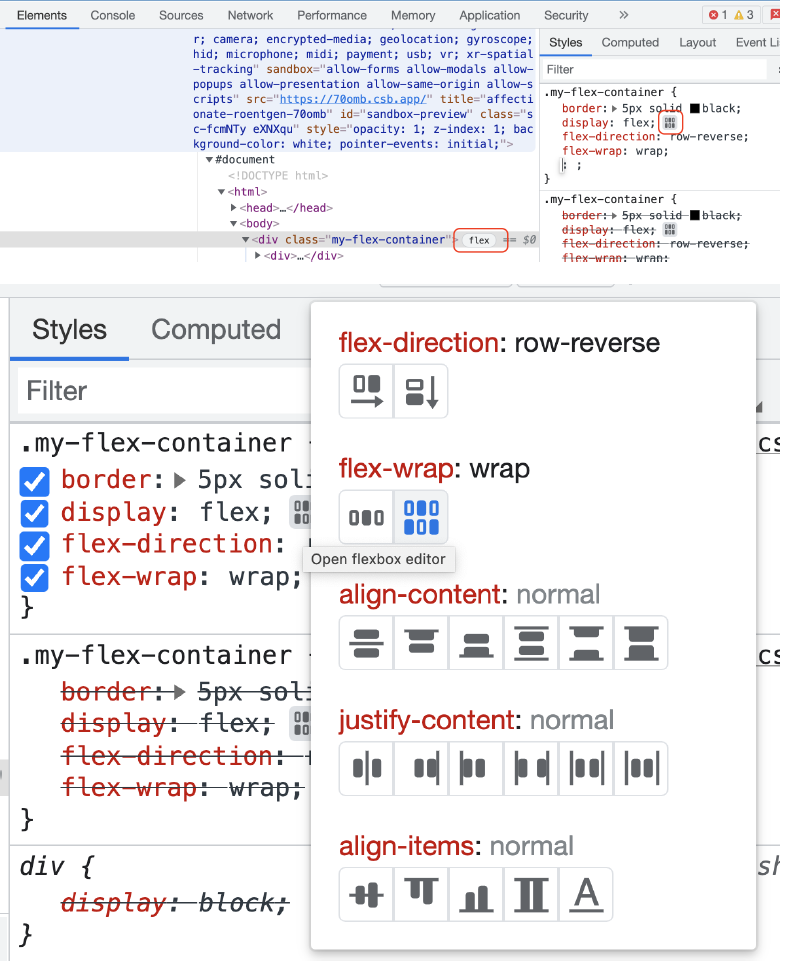

# Flex wrap

Vamos a tomar como punto de partida el ejemplo anterior.

Vamos a poner el flex-direction a row:

```diff
.my-flex-container {
  border: 5px solid black;
  display: flex;
- flex-direction: column-reverse;
+ flex-direction: row;
}
```

Ahora mismo los items estan tomando el espacio que necesitas, que pasaria si el ancho de los items es mas grande que el espacio disponible? Vamos a reducir el tamaño del contenedor

```diff
.my-flex-container {
  border: 5px solid black;
  display: flex;
  flex-direction: row;
+ width: 300px;
}
```

El ancho de los elementos es superior al del contenedor. Podemos modificar la propiedad de overflow para ver o ocultar el contenido fuera del contenedor

```diff
.my-flex-container {
border: 5px solid black;
display: flex;
flex-direction: row;
width: 400px;
+ overflow: scroll;
}
```

Esto podria ser valido en algunos escenarios, pero otras veces queremos que se muestre el elemento entero (Por ejemplos en moviles), como lo hacemos?

Flexbox nos permite saltar de linea cuando los items son mas grandes que contenedor:

```diff
.my-flex-container {
  border: 5px solid black;
  display: flex;
  flex-direction: row;
  width: 300px;
- overflow: scroll;
+ flex-wrap: wrap;
}
```

Vamos a modificar el ancho del contenedor para que la primera linea se muestren los 2 primeros elementos:

```diff
.my-flex-container {
  border: 5px solid black;
  display: flex;
  flex-direction: row;
-  width: 300px;
+  width: 400px;
  flex-wrap: wrap;
}
```

Si volvemos a eliminar el ancho fijado para que el contenador ocupe todo el ancho disponible y jugar con poner mas pequeña o mas grande la ventana del navegador para comprobar como se van adaptando los elementos al contenido disponible

```diff
.my-flex-container div {
    padding: 5px;
    color: white;
+    width: 300px;
}

.my-flex-container {
  border: 5px solid black;
  display: flex;
  flex-direction: row;
-  width: 400px;
  flex-wrap: wrap;
}
```

Y si queremos que los elementos se apilen hacia arriba?
What if we want to pile the elements the other way around?
Podemos usar _wrap-reverse_

```diff
.my-flex-container {
border: 5px solid black;
display: flex;
flex-direction: row;
width: 400px;
- flex-wrap: wrap;
+ flex-wrap: wrap-reverse;
}
```

Podriamos conseguir comportamientos retrocidos combiando valores como _flex-direction: row-reverse_ y _flex-wrap: wrap-reverse_ nos lo saltaremos pero es interesante jugar con esto cuando tengamos tiempo.

Ahora viene la pregunta, hay alguna herramiento para ayudarnos con el debuggin de flexbox? Si, la podemos ver:



Es muy comun que usemos _flex-direction_ y _flex-wrap_ en nuestros contenedores, hay un shorthand para esto _flex-flow_

```diff
.my-flex-container {
border: 5px solid black;
display: flex;
- flex-direction: row-reverse;
- flex-wrap: wrap;
+ flex-flow: row wrap
}
```
