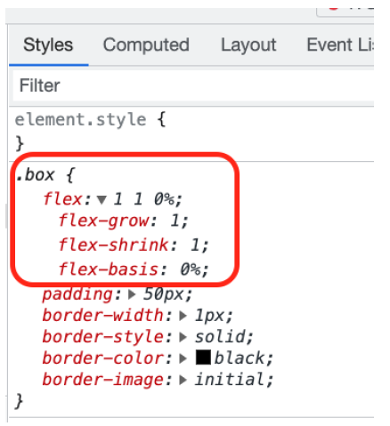

# 09 Flex grow shrink

Alguna veces queremos que algunos items tomen mas espacio disponible que otros.

Vamos a jugar con _flex-grow_ y _flex-shrink_

Limpiamos el _html_:

```diff
<body>
+ <div id="flex-container">
+   <div class="box" id="box1">BOX 1</div>
+   <div class="box" id="box2">BOX 2</div>
+   <div class="box" id="box3">BOX 3</div>
+ </div>
</body>
```

Y remplanzamos el css:

```css
body {
  margin: 0px;
  padding: 0px;
}
#flex-container {
  border: 3px solid red;
  display: flex;
  flex-direction: row;
}
.box {
  padding: 50px;
  border: 1px solid black;
}
```

Antes de empezar a jugar con grow y shrink, vamos a revisar algunos escenarios comunes que puede ser dificiles de afrontar:

Ahora disponemos de espacio para jugar pero vamos a modificar el _display_ a _inline-flex_

```diff
#flex-container {
  border: 3px solid red;
- display: flex;
+ display: inline-flex;
  flex-direction: row;
}
```

Ahora no tenemos espacio disponible !!

```diff
#flex-container {
border: 3px solid black;
display: inline-flex;
+ justify-content: space-between;
flex-direction: row;
}
```

Si volvemos a poner _display_ a _flex_ la propiedad _justify_ funcionará (tendremos espacio disponible para repartir).

Ahora toca jugar con _grow_ _shrink_:

```diff
#flex-container {
  border: 3px solid black;
- display: inline-flex;
+ display: flex;
- justify-content: space-between;
  flex-direction: row;
}
```

Vamos a indicar que todos los elementos tienen la capacidad de crecer (cuando tengamos espacio disponible)

```diff
.box {
+ flex: 1;
  padding: 50px;
  border: 1px solid black;
}
```

Con esta justificacion no podemos usar la propiedad de _justiy-content_ porque el elemento esta tomando todo el espacio disponible.

Si abrimos las dev tools, podemos comprobar que la clase box establece las propieades flex-grow = 1, flex-shrink = 1, y flex-basis 0%



Vamos a establecer a cada caja unas propiedades diferentes.

Primero vamos a eliminar la propiedad _flex_ attribute de la clase _box_:

```diff
.box {
- flex: 1;
  padding: 50px;
  border: 1px solid black;
}
```

Por defecto las 3 cajas tienen definido _flex-grow_ a 0, modificamos box1 y box2 para establecerlo a 1:

```css
#box1 {
  flex-grow: 1;
}
#box2 {
  flex-grow: 1;
}
```

Que pasaría si añadimos 2 en una de las cajas?

Otra opción interesante es indicar el tamaño mínimo, y
el factor de crecimiento, por ejemplo:

- Podemos indicar que box1 tendrá una capacidad de crecimiento de 1 y un flex-basis de 400px.

- Podemos indicar que box2 tendra un factor de crecimiento de 100

```diff
#box1 {
+ flex-basis: 400px;
  flex-grow: 1;
}
#box2 {
- flex-grow: 1;
+ flex-grow: 100;
}
```

Es muy interesante comprobar como se modifica los tamaños haciendo que el ventana del navegador crezca o disminuya.

La propiedad _flex-shrink_ trabaja de forma similar pero en vez de hacer referencia al capacidad de crecimiento, hace referencia a la capacidad de reducirse.

Vamos a comprobarlo con un ejemplo:

```diff
#box1 {
- flex-basis: 400px;
+ flex-basis: 200px;
- flex-grow: 1;
+ flex-shrink: 1;
}

#box2 {
+ flex-basis: 200px;
- flex-grow: 100;
+ flex-shrink: 2;
}
```

Algunos aspectos interesantes a tener en cuenta:

- Como no hace referencia a la capacidad de crecer, no ocupa inicialmente todo el espacio disponible.

- Inicialmente los elementos (box1, box2) tienen el mismo tamaño, pero cuanto antes se queden sin espacio, la caja2 empezará a reducirse más rápido.

Si quieres jugar con un escenario extraño configura diferentes factores de crecimiento y encogimiento....
