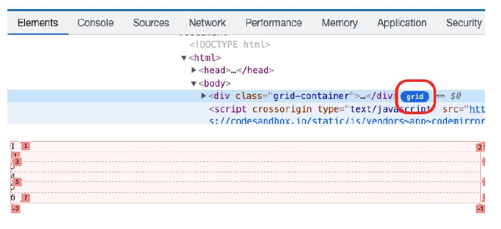

# Hello CSS Grid

Vamos a empezar abriendo el Visual Studio para empezar a jugar.

Y ahora creamos este Html:

```diff
<head>
<title>Parcel Sandbox</title>
<meta charset="UTF-8" />
+ <link rel="stylesheet" type="text/css" href="./src/styles.css" />
</head>
<body>
+ <div class="grid-container">
+   <div class="item">1</div>
+   <div class="item">2</div>
+   <div class="item">3</div>
+   <div class="item">4</div>
+   <div class="item">5</div>
+   <div class="item">6</div>
+ </div>
</body>
```

E indicamos al contenedor que es un display grid:

```css
.grid-container {
  display: grid;
}
```

Bueno... no es muy elegante, Que pasa?

Las herramientas de desarrollo de Chrome tienen un buen soporte para CSS Grid, abrámoslo y comprobemos qué tenemos:



Por defecto tenemos una columan con 6 filas.

Es hora de empezar a configurar :)
