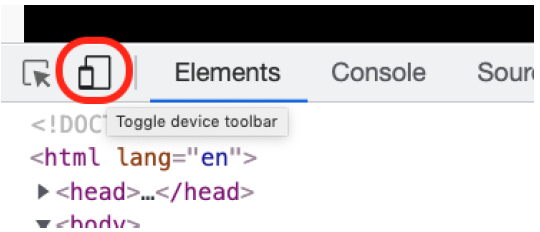

# Tooling

El diseño responsivo puede significar dirigirse a 100 de dispositivos con diferentes resoluciones, ... y mochas veces no es facil tenerlo todos fisicamente.

Vamos a ver como hay herramientas que nos van a hacer la vida más facil...

## Chrome dev tools

Chrome (y otros navegadores nos permite simular varias resoluciones de dispositivos
utilizando la barra de herramientas _toggle-device-toolbar_. (comprobar con el sitio de lemoncode tv).

**VERY IMPORTANT** Esto no es un emulador, sólo establecerá la resolución, pero el motor del navegador será el de tu escritorio, algunas funciones que pueden funcionar bajo esta simulación pueden no funcionar en el dispositivo real.

## Responsively

¿No sería bueno poder ver una amplia gama de resoluciones / dispositivos al mismo tiempo, ... Responsively es una herramienta interesante

https://responsively.app/

Puede instalarlo como una extensión del navegador o como una aplicación independiente.

# Browser stack

¿Y si pudiéramos probar nuestro código en los dispositivos reales? Podría haber un servicio que reflejara los resultados en nuestro navegador y mejor aún que habilitara alguna devtool relacionada con ese dispositivo, pues eso es lo que _BrowserStack_ ofrece:

https://www.browserstack.com/