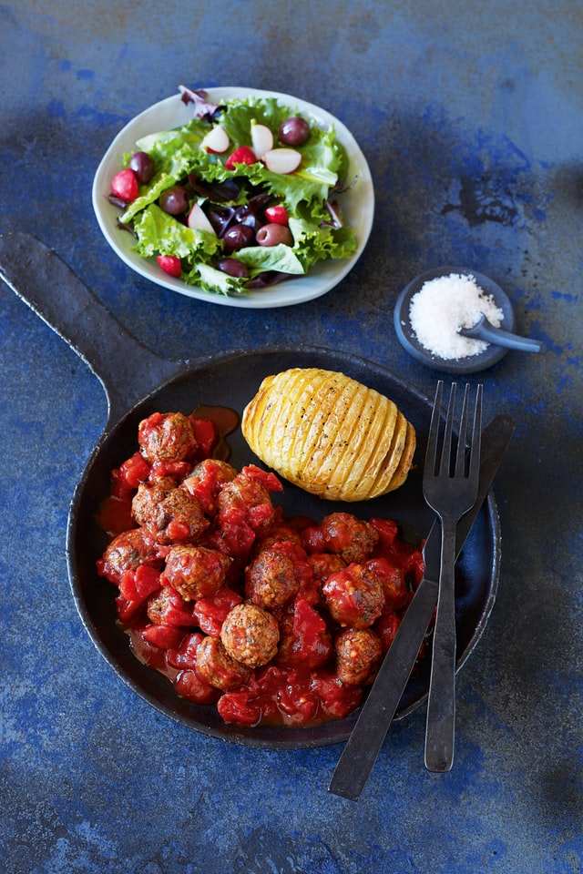
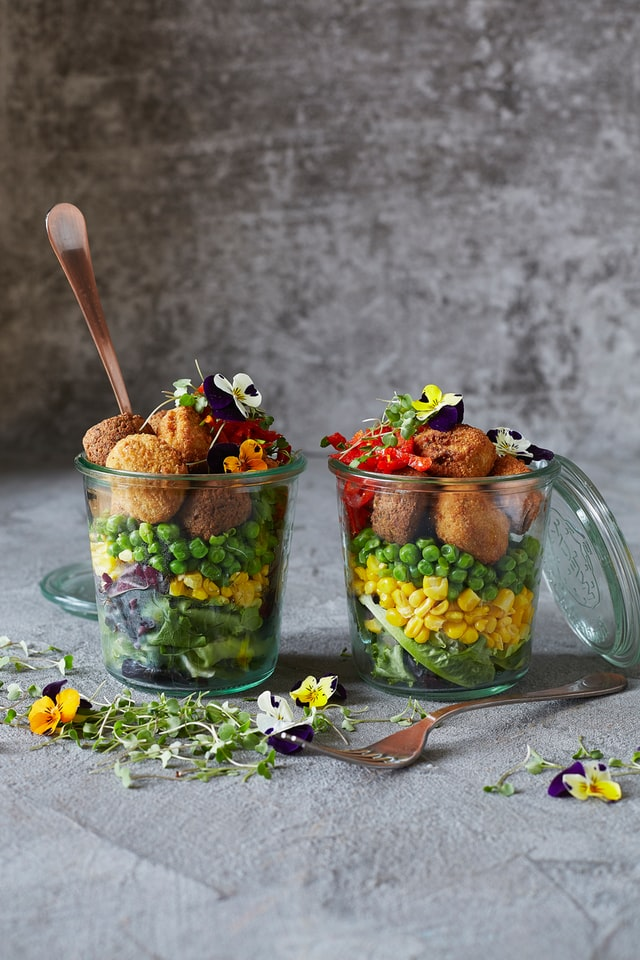
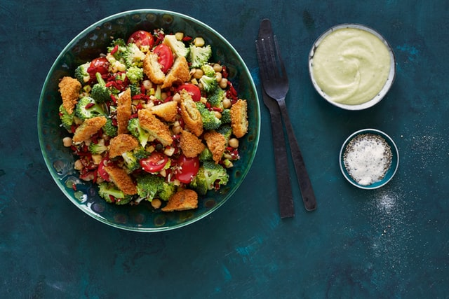

# Usando los @imports

Vamos a partir del HTML y CSS del ejemplo **02-variables-and-functions**

```html
<!DOCTYPE html>
<html lang="en">
  <head>
    <meta charset="UTF-8" />
    <meta name="viewport" content="width=device-width, initial-scale=1.0" />
    <meta http-equiv="X-UA-Compatible" content="ie=edge" />
    <title>Cards Flexbox</title>
    <link rel="stylesheet" href="css/style.css" type="text/css" />
  </head>
  <body>
    <div class="container">
      <main class="main-content">
        <h2>Últimas Recetas</h2>
        <article class="card">
          
          <div class="card-content">
            <h3>Auténtica pizza italiana</h3>
            <p>Publicado el: <span>6 marzo, 2020</span></p>
            <a href="#" class="button">Leer más</a>
          </div>
        </article>
        <article class="card">
          
          <div class="card-content">
            <h3>Albóndigas con pisto</h3>
            <p>Publicado el: <span>6 marzo, 2020</span></p>
            <a href="#" class="button">Leer más</a>
          </div>
        </article>
        <article class="card">
          
          <div class="card-content">
            <h3>Ensalada con croquetas</h3>
            <p>Publicado el: <span>6 marzo, 2020</span></p>
            <a href="#" class="button">Leer más</a>
          </div>
        </article>
        <article class="card">
          
          <div class="card-content">
            <h3>Pollo con verduras</h3>
            <p>Publicado el: <span>6 marzo, 2020</span></p>
            <a href="#" class="button">Leer más</a>
          </div>
        </article>
        <article class="card">
          
          <div class="card-content">
            <h3>Brochetas de pollo al curry</h3>
            <p>Publicado el: <span>6 marzo, 2020</span></p>
            <a href="#" class="button">Leer más</a>
          </div>
        </article>
        <article class="card">
          
          <div class="card-content">
            <h3>Hamburguesa con guacamole</h3>
            <p>Publicado el: <span>6 marzo, 2020</span></p>
            <a href="#" class="button">Leer más</a>
          </div>
        </article>
      </main>

      <footer>
        <!-- Don't change: Unsplash -->
        <a
          style='background-color:black;color:white;text-decoration:none;padding:4px 6px;font-family:-apple-system, BlinkMacSystemFont, "San Francisco", "Helvetica Neue", Helvetica, Ubuntu, Roboto, Noto, "Segoe UI", Arial, sans-serif;font-size:12px;font-weight:bold;line-height:1.2;display:inline-block;border-radius:3px'
          href="https://unsplash.com/@fryfamilyfoodco?utm_medium=referral&amp;utm_campaign=photographer-credit&amp;utm_content=creditBadge"
          target="_blank"
          rel="noopener noreferrer"
          title="Download free do whatever you want high-resolution photos from The Fry Family Food Co."
          ><span style="display:inline-block;padding:2px 3px"
            ><svg
              xmlns="http://www.w3.org/2000/svg"
              style="height:12px;width:auto;position:relative;vertical-align:middle;top:-2px;fill:white"
              viewBox="0 0 32 32"
            >
              <title>unsplash-logo</title>
              <path d="M10 9V0h12v9H10zm12 5h10v18H0V14h10v9h12v-9z"></path></svg></span
          ><span style="display:inline-block;padding:2px 3px">The Fry Family Food Co.</span></a
        >
      </footer>
    </div>
  </body>
</html>
```

```scss
@import url("https://fonts.googleapis.com/css2?family=Roboto");

body {
  box-sizing: border-box;
  font-family: "Roboto", Helvetica, sans-serif;
  background-color: #f2f2f2;
}

$baseSize: 14px;

h1,
h2 {
  font-size: $baseSize + 10px;
}

h3 {
  font-size: $baseSize + 4px;
}

footer {
  padding: 1rem;
  display: flex;
  justify-content: center;
}

.container {
  max-width: 1100px;
  margin: 0 auto;
}

.main-content > h2 {
  flex: 0 1 100%;
  text-align: center;
}

.card {
  margin-bottom: 1.4rem;
  background-color: #fff;
  border-radius: 5px;
  transition: 0.3s;

  &:hover {
    box-shadow: 0 8px 16px 0 rgba(0, 0, 0, 0.2);
  }

  img {
    width: 100%;
    height: 300px;
    object-fit: cover;
    border-top-left-radius: 5px;
    border-top-right-radius: 5px;
  }
}

.card-content {
  text-align: center;
  padding: 0 1rem 1rem;

  h3 {
    font-weight: bold;
    line-height: 1.2rem;
    text-transform: uppercase;
  }

  span {
    color: #bc5b40;
  }
}

.button {
  background-color: #d9d900;
  color: #fff;
  padding: 0.8rem 0.9rem;
  text-decoration: none;
  margin-top: 1rem;
  display: inline-block;

  &:hover {
    background-color: #4c8fb6;
  }
}

@media screen and (min-width: 480px) {
  .main-content {
    display: flex;
    flex-wrap: wrap;
    justify-content: space-between;
  }

  .card {
    flex: 0 1 calc(50% - 1rem);
  }
}

@media screen and (min-width: 768px) {
  .card {
    flex: 0 1 calc(33% - 1rem);
  }
}
```

### Compilar Sass desde node-sass

Como vimos durante el curso, necesitamos compilar el fichero de Sass para poder utilizarlo directamente en el HTML, por tanto, vamos a hacer uso de `npx` para poder ejecutar sin instalar el paquete `node-sass` y llevar a cabo esta tarea.

Antes que nada, levantamos nuestro proyecto con Live Server como hemos hecho anteriormente.

Seguidamente ejecutamos en la consola la siguiente línea:

```
npx node-sass -w style.scss -o css
```

Con esto lo que estamos diciendo es que Node Sass deberá estar en modo vigilante sobre el fichero `style.scss` de modo que al guardar el fichero, lance un proceso de compilación. Y con el atributo `-o css` le estamos diciendo que la salida de ese fichero css generado, lo haga en una carpeta llamada css.

Si ahora entramos en el fichero `style.scss` y le damos a guardar, veremos en la consola cómo nos avisa que el fichero ha cambiado y está compilando la salida a css.

Una vez hecho esto, ya tenemos todo listo.

## Utilizando los @import

Vamos a crear una hoja de estilos **reset** con el nombre `init.scss`

```scss
html,
body,
div,
span,
object,
iframe,
h1,
h2,
h3,
h4,
h5,
h6,
p,
blockquote,
pre,
abbr,
address,
cite,
code,
del,
dfn,
em,
img,
ins,
kbd,
q,
samp,
small,
strong,
sub,
sup,
var,
b,
i,
dl,
dt,
dd,
ol,
ul,
li,
fieldset,
form,
label,
legend,
table,
caption,
tbody,
tfoot,
thead,
tr,
th,
td,
article,
aside,
canvas,
details,
figcaption,
figure,
footer,
header,
hgroup,
menu,
nav,
section,
summary,
time,
mark,
audio,
video {
  margin: 0;
  padding: 0;
  border: 0;
  outline: 0;
  font-size: 100%;
  vertical-align: baseline;
  background: transparent;
}
```

Y ahora lo importaremos en el fichero `style.scss`

```diff
+ @import "init";
@import url("https://fonts.googleapis.com/css2?family=Roboto");
···
```

Si guardamos los cambios y vemos el fichero css generado, vemos que se han agregado las reglas del fichero `init.scss`

Ahora vamos a crear un fichero de colores llamado `_colors.scss`

```scss
$backgroundMainColor: #f2f2f2;
$mainColor: black;
$buttonColor: #d9d900;
$hoverColor: #4c8fb6;
```

Y seguidamente lo importaremos en `style.scss` para actualizar las variables.

```diff
@import "init";
+ @import "colors";
@import url("https://fonts.googleapis.com/css2?family=Roboto");

body {
···
-  background-color: #f2f2f2;
+  background-color: $backgroundMainColor;
}

.card-content {
···
  span {
-    color: #bc5b40;
+    color: $emColor;
  }
}

.button {
-  background-color: #d9d900;
+  background-color: $buttonColor;
···
  &:hover {
-    background-color: #4c8fb6;
+    background-color: $hoverColor;
  }
}
```

Una vez hemos guardado todos los ficheros, si nos fijamos en la carpeta css generada, vemos como para el fichero `init.scss` se ha generado un fichero `init.css` y para el fichero `_colors.scss` no. Ha sido integrado en el fichero `style.css`. Los partials no generan sus propios ficheros.
