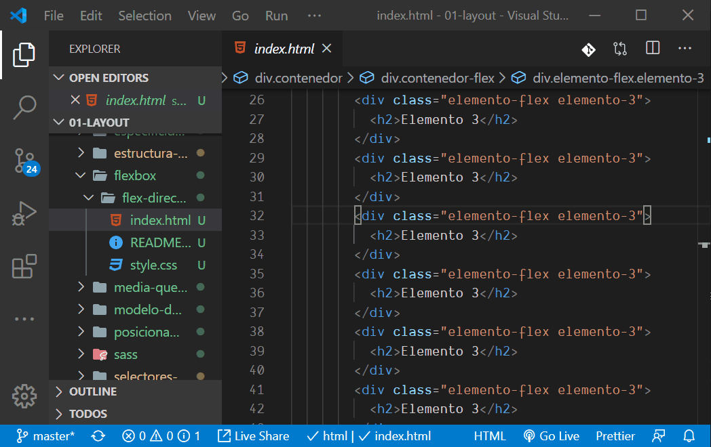

# 02 Layout

## Módulo CSS

### Tabla de contenidos

- Conceptos CSS
  - Selectores simples
  - Especificando propiedades
  - Usando la cascada
  - Especificidad
  - Herencia
  - Border, margin y padding
  - Font Family
  - Posicionamiento
- Flexbox
  - Fundamentos Flexbox
  - Order
  - Grow, shrink y basis
  - Proyecto final
- Grid CSS
  - Fundamentos Grid CSS
  - Atajos básicos
  - Grid semántico
  - Alineación
- Diseño responsivo
  - Transformaciones básicas
  - Transformaciones con imágenes
  - Media Queries
  - Media Query Print
- Sass
  - Variables
  - Usando reglas
  - Usando imports
  - Usando mixins
  - Directivas de control y funciones

### Índice de vídeos

- Selectores (15')
- Especificando valores (9')
- Cascada y herencia (10')
- Modelo de caja (4')
- Posicionamiento (5')
- Flexbox I (11')
- Flexbox II (9')
- Flexbox III (9')
- Grid I (3')
- Grid II (7')
- Grid III (8')
- Media Queries (5')
- Sass I (13')
- Sass II (9')
- Sass III (10')

## Antes de comenzar

Para poder ejecutar estos ejemplos desde VSCode recomiendo instalar la extensión [Live Server](https://marketplace.visualstudio.com/items?itemName=ritwickdey.LiveServer), que nos permitirá ejecutar los ejemplos sin necesidad de instalar e inicializar configuraciones.

Cuando vayamos a visualizar un ejemplo, sólo deberemos situarnos sobre el fichero `html` en cuestión y hacer clic sobre el botón **Go Live** (barra de estado a la izquierda) o hacer clic con el botón derecho del ratón sobre el fichero y seleccionar **Open with Live Server**

También puedes seguir los ejemplos en Codesandbox, Codepen o similar.
