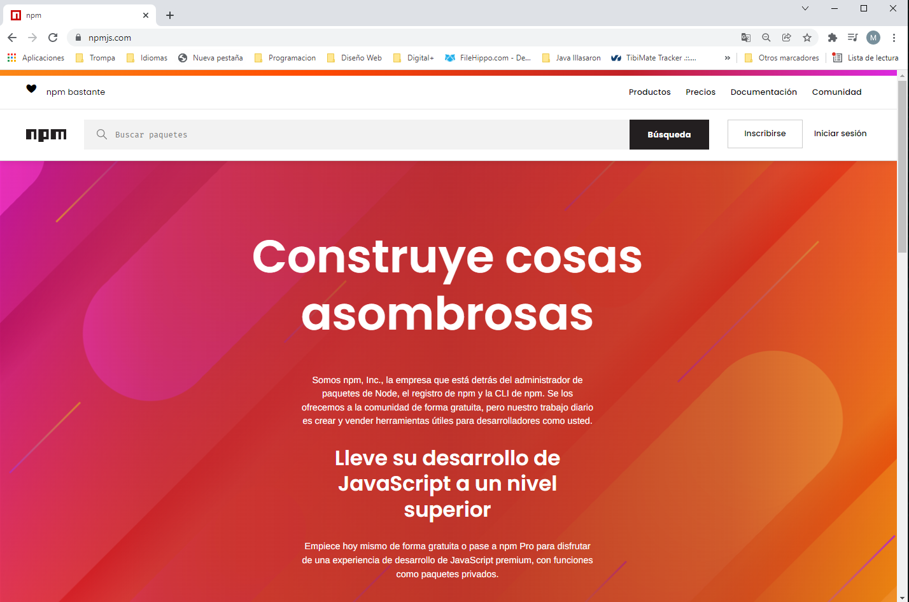
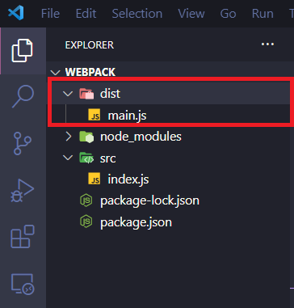

## Zero Config

¿Es posible usar _webpack_ en modo _Zero Config_? Bueno en teoría sí, nos va a permitir añadir un _bundle_ con cero configuración siguiendo algunas convenciones pero ojo... esto es muy limitado.

Aunque esto suena muy bien, solo funcionará para casos muy simples (solo demostraciones o pruebas rápidas), p. Ej. No puedes transpilar usando babel con _zero config_.

Vamos a ver en esta demostración cómo podemos ejecutar una muestra simple.

### Pasos para construirlo

#### Prerrequisitos

Instala [Node.js and npm](https://nodejs.org/en/) si aún no están instalados en tu computadora.

> Los ejemplos de este repositorio se han realizado con _node v20.9.0_ y _npm v10.1.0_. Te recomendamos utilizar al menos estas versiones (o superiores) para evitar comportamientos no esperados con los ejemplos.

#### Pasos

- Navega a la carpeta donde has creado tu proyecto vacío.
- Ejecuta _npm init_, te pedirá que respondas alguna solicitud de información sobre el proyecto (una vez que lo hayas completado con éxito, generaremos un archivo **`package.json`**).

```bash
$ npm init -y
```

> Al usar "y" estamos de acuerdo con los valores predeterminados (ten cuidado si has creado un nombre de carpeta que contenga caracteres en mayúsculas o espacios en blanco, fallará).

Este fichero **`package.json`** va a ser muy importante, vamos a tener las dependencias que necesitamos para que nuestra aplicación funcione, los _scrips_ para hacer una _build_ o para arrancar el proyecto.

Si abrimos nuestro navegador y entramos en https://www.npmjs.com/ vemos que es un administrador de paquetes de _node_, donde encontraremos librerías como _React_, _TypeScript_,... donde nos mostrará cómo debemos instalarlas y veremos documentación de las mismas.



- En primero lugar vamos a instalar **`webpack`** y **`webpack-cli`** localmente, como una dependencia de desarrollo (la razón para instalarlo localmente y no globalmente es para que sea fácil de configurar, por ejemplo, se puede iniciar en una máquina limpia sin tener que instalar nada globalmente excepto **`nodejs`**).

```bash
$ npm install webpack webpack-cli --save-dev
```

- Para iniciar **`webpack`**, modifica el archivo **`package.json`** y agrega la siguiente propiedad **`"build": "webpack --mode development"`** debajo del objeto scripts. Nos permite lanzar **`webpack`** desde la línea de comandos a través de _npm_ escribiendo **`npm run build`**.

> En _webpack 5_ ahora es obligatorio informar el modo en el que estamos trabajando en desarrollo o producción (minificado, etc...) en la línea de comando donde lo llamamos.

Ahora, nuestro archivo **`package.json`** debería de verse así:

_./package.json_

```diff
{
  ...
  "scripts": {
+   "build": "webpack --mode development",
    "test": "echo \"Error: no test specified\" && exit 1"
  },
  ...
}
```

- Con esta configuración, webpack buscará, de forma predeterminada, un punto de entrada ubicado en **`./src/index.js`**, creemos un archivo ficticio:

_./src/index.js_

```tsx
console.log("Hello webpack zero config!");
```

- Ahora si ejecutamos

```bash
$ npm run build
```

> Nota: Si el script fuera start o test no haría falta poner _run_ delante.

Obtendremos el _bundle_ bajo la ruta **`./dist`** y con un archivo llamado **`main.js`** que es el nombre que le da por defecto.



Hasta ahora todo va bien, en esta versión, esta función es buena para demostraciones rápidas, pero no para ser utilizada en escenarios del mundo real, se espera que en versiones posteriores esta configuración cero sea mejorada.

# ¿Te apuntas a nuestro máster?

Si te ha gustado este ejemplo y tienes ganas de aprender Front End
guiado por un grupo de profesionales ¿Por qué no te apuntas a
nuestro [Máster Front End Online Lemoncode](https://lemoncode.net/master-frontend#inicio-banner)? Tenemos tanto edición de convocatoria
con clases en vivo, como edición continua con mentorización, para
que puedas ir a tu ritmo y aprender mucho.

También puedes apuntarte a nuestro Bootcamp de Back End [Bootcamp Backend](https://lemoncode.net/bootcamp-backend#inicio-banner)

Y si tienes ganas de meterte una zambullida en el mundo _devops_
apuntate nuestro [Bootcamp devops online Lemoncode](https://lemoncode.net/bootcamp-devops#bootcamp-devops/inicio)
