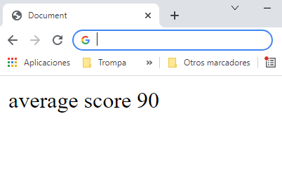

## Boiler plate

En el paso anterior vimos que el _zero config_ es algo limitado, vamos a empezar a trabajar de verdad con _webpack_ y para ello tendremos que definir un fichero de configuración.

En este ejemplo vamos a crear un ejemplo desde cero:

- Crearemos el proyecto inicial, utilizando _npm init_
- Instalaremos las dependencias necesarias.
- Definiremos un fichero de configuración para indicarle a _Webpack_ como queremos hacer el _bundling_ de nuestro proyecto.
- Crearemos el típico punto de entrada de "Hola mundo".

### Requisitos previos...

Para poder seguir estos ejemplos te hace falta tener instalado _nodejs_ en el _readme_ del ejemplo puedes encontrar el enlace
donde te lo puedes descargar e instalar (si desarrollas Front puede que ya lo tengas instalado en tu máquina).

> Enlace: [Node.js](https://nodejs.org/).

#### Pasos

- Partimos de una carpeta vacía en la que crearemos nuestro proyecto.
- Navegamos a esa carpeta.
- Ejecutamos **`npm init -y`**, eso nos crear un fichero _package.json_ es decir la configuración de un proyecto de _node_.

```bash
npm init -y
```

> Al usar "y" estamos de acuerdo con los valores predeterminados (ten cuidado si ha creado un nombre de carpeta que contenga caracteres en mayúsculas o espacios en blanco, fallará).

- Vamos a instalar **`webpack`** y **`webpack-cli`** localmente, como una dependencia de desarrollo (la razón para instalarlo localmente y no globalmente es para que sea fácil de configurar, por ejemplo, se puede iniciar en una máquina limpia sin tener que instalar nada globalmente excepto **`nodejs`**), desde el terminal ejecutamos el siguiente comando:

```bash
npm install webpack webpack-cli --save-dev
```

- El siguiente paso es añadir un comando en el _package.json_ para poder lanzar **`webpack`** usando nuestra configuración y poder ver así nuestro proyecto en funcionamiento, modificamos el archivo **`package.json`** y agregamos la siguiente propiedad **`"build": "webpack --mode development"`** justo debajo de la entrada _scripts_: una vez que hayamos introducido este, podemos lanzar **`webpack`** desde la línea de comandos ejecutando **`npm run build`**.

- También vamos a añadir en el _package.json_ que va a ser de tipo _module_ (esto es para que podamos usar las nuevas características de JavaScript, como por ejemplo _import_ y _export_).

Ahora, nuestro archivo **`package.json`** debería de verse así:

_./package.json_

```diff
{
+ "type": "module",
  ...
  "scripts": {
+   "build": "webpack --mode development",
-    "test": "echo \"Error: no test specified\" && exit 1"
  },
  ...
}
```

> A partir de Webpack 5, éste nos ofrece un punto de entrada de configuración cero, esto significa: si no vas a transpilar tu código y tienes un punto de entrada bajo la ruta _./src/index.js_, este funcionará por defecto. Esto es bueno para conseguir algún código de prueba rápido en marcha, pero en un proyecto real no es suficiente, iremos por el camino largo en esta muestra (crear y configurar el webpack.config.js).

- En nuestro proyecto, vamos a programar utilizando el estándar de **`ES6`** pero cuando nos movamos a producción queremos que el código esté en **`ES5`** (una versión más antigua de JavaScript), así nos aseguramos
  compatibilidad en navegadores antiguos, la librería que nos va a realizar esto es [Babel](https://babeljs.io/), arrancamos por instalar **`babel-cli`**, **`babel-core`** más **`babel-preset-env`**(es una configuración que Babel te da por defecto con los _setting_ más comunes que se usan para transpilar el código)

Para verlo más claro en un ejemplo, imaginemos que tenemos un usuario y queremos saludarlo, vamos a usar _backticks_ e _interpolación_ esto no está disponible en el estándar ES5.

```js
const userName = "Víctor";

const hello = `Hello ${userName}`;
```

A la hora de transpilarlo, tenemos dos posibles opciones para generar el código _antiguo_:

```js
var hello = "Hello " + userName;

var hello = "Hello ".concat(userName);
```

Yo podría decirle la opción que prefiero, pero Babel ya nos da una configuración recomendada para transpilar de **`ES6`** a **`ES5`**, está
configuración la tenemos en el paquete npm que nos hemos bajado, en concreto él: **`babel-preset-env`**.

- Vamos a instalarnos las dependencias y definirlo como dependencias de desarrollo en el archivo **`package.json`**:

```bash
npm install @babel/cli @babel/core @babel/preset-env --save-dev
```

- Necesitamos instalar un **`"loader"`** para que **`webpack`** pueda hacer uso del transpilador **`"babel-core"`**,
  un _loader_ hace de puente entre _webpack_ y la herramienta final que usemos.

```bash
npm install babel-loader --save-dev
```

El área de dependencias de desarrollo de nuestro **`package.json`** debería tener el siguiente aspecto
(puede que tengas versiones más modernas de cada librería)

_./package.json_

```diff
{
...
  "devDependencies": {
+    "@babel/cli": "^7.23.0",
+    "@babel/core": "^7.23.2",
+    "@babel/preset-env": "^7.23.2",
+    "babel-loader": "^9.1.3",
+    "webpack": "^5.89.0",
+    "webpack-cli": "^5.1.4"
  }
}
```

- Vamos a crear un archivo JavaScript llamado **`students.js`** que incluirá la sintaxis ES6.

_./src/students.js_

```javascript
// Usemos algunas características de ES6
const averageScore = "90";
const messageToDisplay = `average score ${averageScore}`;

document.write(messageToDisplay);
```

- Vamos a saltar a la configuración de _webpack_, creamos un fichero de configuración que llamaremos **`webpack.config.js`**, e indicamos el punto de entrada: apuntamos al fichero _js_ que hemos creado justo en el paso anterior,
  esto es necesario porque le hemos indicado un nombre no standar al punto de entrada, si el fichero se hubiese llamada _index.js_ y hubiera estado bajo la carpeta _src_ no sería necesario indicarlo.

Lo mismo pasa con el bundle de salida, si no indicamos nada, el nombre predefinido será _main.js_

Manos a la obra, abrimos el archivo **`webpack.config.js`** y definimos como valor para _entry_ la ruta al fichero **`./src/students.js`**.

_./webpack.config.js_

```javascript
export default {
  entry: ["./src/students.js"],
};
```

- Perfecto, ya tenemos el punto de entrada ¿Qué hacemos ahora con el _JavaScript_? ¿No queríamos pasarle _babel_ para convertirlo a ES5? Es hora de ponernos a definir _loaders_, si, esas herramientas que procesan fichero a fichero y realizan transformaciones.

- En la configuración de _webpack_ podemos definir los _loaders_ que vamos a usar en la sección _module >> rules_, dentro de rules tenemos un array que contiene objetos con una configuración, en cada objeto indicamos:
  - A que extensión aplican (en nuestro caso quiero que aplique a todas las extensiones que terminan en _.js_), esto lo hacemos en la propiedad _test_ y usamos expresiones regulares (así podemos introducir patrones más potentes, como por ejemplo quiero que ese loader se ejecute tanto para extension _.js_ como _.jsx_).
  - En nuestro caso le vamos indicar que no husmee dentro de la carpeta _node-modules_ (por temas de rendimiento), y que transpile de ES6 a ES6 usando **`babel-loader`**.

El código resultante sería el siguiente:

_./webpack.config.js_

```diff
export default {
  entry: ['./src/students.js'],
+ module: {
+   rules: [
+     {
+       test: /\.js$/,
+       exclude: /node_modules/,
+       loader: 'babel-loader',
+     },
+   ],
+ },
};
```

Una duda que te puede venir a la cabeza es ¿Qué es eso de _babel-loader_? Digamos que _webpack_ no sabe manejarse directamente con _babel_, y tenemos que usar un módulo intermedio que hace de puente entre _webpack_ y
_babel_, esto lo veremos en más casos, por ejemplo cuando queremos transpilar _sass_ usaremos un paquete de _sass_ y un _loader_ intermedio
de _webpack_.

- Aunque esto no tiene que ver con _webpack_, para poder transpilar con _babel_ tenemos que añadir un fichero de configuración (en este caso le indicamos que utilize los presets estándares, esto te va a a valer para el 99% de tus desarrollos, si necesitas una configuración más fina puedes chequear la documentación del propio _babel_):

_./.babelrc_

```javascript
{
  "presets": ["@babel/preset-env"]
}
```

> Más información sobre esta configuración: https://babeljs.io/docs/en/babel-preset-env También puedes establecer este ajuste directamente en el webpack: https://blog.craftlab.hu/all-the-new-things-setting-up-webpack-4-with-babel-7-39a5225b8168

- Vamos a ejecutar webpack desde la línea de comandos, escribe **`npm run build`** y presiona enter.

```bash
npm run build
```

- Si todo ha ido bien, podemos ver que se ha creado una carpeta con el nombre _dist_ y dentro hay un archivo llamado **`main.js`**.
- Si abrimos el archivo **`main.js`** podemos comprobar que contiene (entre un montón de código de _boiler plate_) la versión transpilada a es5 de **`students.js`**.

_./dist/main.js_

```javascript
...
/***/ "./students.js":
/*!*********************!*\
  !*** ./students.js ***!
  \*********************/
/*! no static exports found */
/***/ (function(module, exports) {

eval("var averageScore = \"90\";\nvar messageToDisplay = \"average score \".concat(averageScore);\ndocument.write(messageToDisplay);\n\n//# sourceURL=webpack:///./students.js?");

/***/ }),
...
```

- Más adelante veremos cómo levantar un servidor web ligero y probar esto, pero como prueba rápida, vamos a crear un archivo _HTML_ que llamaremos **`index.html`**, e
  incluir una etiqueta de script que apuntará a nuestro archivo **`main.js`** generado. El archivo completo sería tal que así:

_./src/index.html_

```html
<!DOCTYPE html>
<html lang="en">
  <head>
    <meta charset="utf-8" />
    <meta http-equiv="X-UA-Compatible" content="IE=edge" />
    <meta name="viewport" content="width=device-width, initial-scale=1" />
    <title>Webpack 5.x by sample</title>
  </head>
  <body>
    <script src="../dist/main.js"></script>
  </body>
</html>
```

> IMPORTANTE: Esta no es la mejor manera de incluir un archivo HTML y enlazarlo con webpack, aprenderemos a hacer esto de una manera apropiada más adelante.

- Ahora podemos hacer clic en el archivo _html_ y ver nuestro pequeño trozo de código en funcionamiento.



# ¿Te apuntas a nuestro máster?

Si te ha gustado este ejemplo y tienes ganas de aprender Front End
guiado por un grupo de profesionales ¿Por qué no te apuntas a
nuestro [Máster Front End Online Lemoncode](https://lemoncode.net/master-frontend#inicio-banner)? Tenemos tanto edición de convocatoria
con clases en vivo, como edición continua con mentorización, para
que puedas ir a tu ritmo y aprender mucho.

También puedes apuntarte a nuestro Bootcamp de Back End [Bootcamp Backend](https://lemoncode.net/bootcamp-backend#inicio-banner)

Y si tienes ganas de meterte una zambullida en el mundo _devops_
apuntate nuestro [Bootcamp devops online Lemoncode](https://lemoncode.net/bootcamp-devops#bootcamp-devops/inicio)
