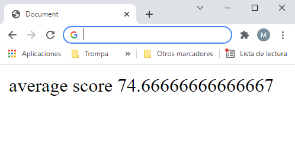

## Manejando imports

En el paso anterior vimos como transpilar de ES6 a ES5 en un mismo fichero, pero ¿Qué pasa si tengo varios ficheros (módulos) y estoy usando _imports_? Vamos a ver como resuelve esto _webpack_.

Tomamos como punto de partida el ejemplo anterior, vamos a añadir un nuevo archivo de JavaScript que contendrá un simple algoritmo para calcular la puntuación media un _array_ de notas.

### Pasos

- Añadimos un nuevo archivo llamado **`averageService.js`**. Este archivo contendrá una función que calculará el valor promedio de un _array_ dado, esta función será exportada (haciéndola visible a otros módulos que necesiten usarla). Por lo tanto, añade el siguiente contenido a **`averageService.js`**:

_./src/averageService.js_

```javascript
export function getAvg(scores) {
  return getTotalScore(scores) / scores.length;
}

function getTotalScore(scores) {
  return scores.reduce((score, count) => score + count);
}
```

- Es hora se actualizar **`students.js`** e importar el archivo anterior invocando la función _getAvg_ del mismo:

_./src/students.js_

```diff
-  // Usemos algunas características de ES6
+  import { getAvg } from './averageService.js';

+  const scores = [90, 75, 60, 99, 94, 30];
-  const averageScore = "90";
+  const averageScore = getAvg(scores);

  const messageToDisplay = `average score ${averageScore}`;

  document.write(messageToDisplay);
```

- Por último, vamos a ejecutar _webpack_ desde el terminal ejecutando el siguiente comando:

```bash
npm run build
```

Como vemos no nos ha generado en la carpeta _dist_ un fichero **`students.js`** ni un **`averageService.js`**, **`webpack`** se va a ir encargando de concatenar los ficheros en uno sólo. Y como resultado obtenemos dentro de la carpeta _dist_ un fichero llamado **`main.js`** (más adelante veremos que podemos trocear este _bundle_ en varios ficheros).

Es hora de probar el **`index.html`** en el navegador y comprobar que la nueva función de cálculo de media está en marcha y ha sido incluida en el archivo **`main.js`**.



### Apéndice - Módulo de uso alternativo

En nuestro ejemplo anterior hemos cubierto un solo uso nombrado de exportación, pero hay otras formas de usar módulos:

### Exportación por defecto

Una forma popular es usar **`export default`** como la palabra clave de exportación. Esto indicará que, por defecto, sólo habrá una **exportación única por módulo**. Entonces, podremos usar directamente un importar _alias_ (omitiendo las llaves {}) y esto apuntará a nuestro elemento exportado por defecto (función _averarge_ en nuestro ejemplo).

- Uso de la exportación por defecto en **`averageService.js`**:

_./src/averageService.js_

```diff
- export function getAvg(scores) {
+ export default function getAvg(scores) {
return getTotalScore(scores) / scores.length;
}

function getTotalScore(scores) {
  return scores.reduce((score, count) => {
    return score + count;
  });
}
```

- Uso de importar por defecto en **`students.js`**:

_./src/students.js_

````diff
- import {getAvg} from "./averageService.js";
+ import getAvg from "./averageService.js";

const scores = [90, 75, 60, 99, 94, 30];
const averageScore = getAvg(scores);

const messageToDisplay = `average score ${averageScore}`;

document.write(messageToDisplay);
````

### Múltiple named exports

Consideremos dos funciones, **`getAvg`** y **`getTotalScore`**, por el bien de este ejemplo. Podemos exportar ambas usando exportaciones nombradas, sólo añadiendo la palabra clave **export** en cada función.

- Uso de múltiples exportaciones en **`averageService.js`**:

_./src/averageService.js_

```diff
- export default function getAvg(scores) {
+ export function getAvg(scores) {
return getTotalScore(scores) / scores.length;
}

- function getTotalScore(scores) {
+ export function getTotalScore(scores) {
  return scores.reduce((score, count) => {
    return score + count;
  });
}
```

Ahora, podemos importarlos de varias maneras en **`students.js`**:

- Importar ambos elementos en el ámbito actual:

_./src/students.js_

```diff
- import getAvg from "./averageService.js";
+ import { getAvg, getTotalScore } from "./averageService.js";

const scores = [90, 75, 60, 99, 94, 30];
const averageScore = getAvg(scores);
+ const totalScore = getTotalScore(scores);

- const messageToDisplay = `average score ${averageScore}`;
+ const messageToDisplayAvg = `average score ${averageScore} `;
+ const messageToDisplayTotal = `total score ${totalScore}`;

- document.write(messageToDisplay);
+ document.write(messageToDisplayAvg);
+ document.write(messageToDisplayTotal);
```

- Importa el contenido de todo el módulo usando el comodín `*` y un _name_ para nuestro módulo. Este _name_ contendrá todos los elementos exportados en nuestro ámbito actual (se utiliza _name_ como espacio de nombres):

_./src/students.js_

```diff
- import {getAvg, getTotalScore} from "./averageService.js";
+ import * as averageService from "./averageService.js";

const scores = [90, 75, 60, 99, 94, 30];
- const averageScore = getAvg(scores);
- const totalScore = getTotalScore(scores);
+ const averageScore = averageService.getAvg(scores);
+ const totalScore = averageService.getTotalScore(scores);

const messageToDisplayAvg = `average score ${averageScore} `;
const messageToDisplayTotal = `total score ${totalScore}`;

document.write(messageToDisplayAvg);
document.write(messageToDisplayTotal);
```

# ¿Te apuntas a nuestro máster?

Si te ha gustado este ejemplo y tienes ganas de aprender Front End
guiado por un grupo de profesionales ¿Por qué no te apuntas a
nuestro [Máster Front End Online Lemoncode](https://lemoncode.net/master-frontend#inicio-banner)? Tenemos tanto edición de convocatoria
con clases en vivo, como edición continua con mentorización, para
que puedas ir a tu ritmo y aprender mucho.

También puedes apuntarte a nuestro Bootcamp de Back End [Bootcamp Backend](https://lemoncode.net/bootcamp-backend#inicio-banner)

Y si tienes ganas de meterte una zambullida en el mundo _devops_
apuntate nuestro [Bootcamp devops online Lemoncode](https://lemoncode.net/bootcamp-devops#bootcamp-devops/inicio)
