## Integrando CSS en nuestro proceso de bundling

Empecemos a trabajar con estilos.

En este ejemplo, crearemos un archivo CSS personalizado (contendrá una clase CSS simple que configurará un color de fondo en rojo). Instalaremos los paquetes **`style-loader`** y **`css-loader`** y configuraremos webpackconfig.

### Pasos

- Vamos a tomar como punto de partida el ejemplo anterior.
- Instalemos las dependencias

```bash
npm install
```

- Ahora creamos un archivo CSS simple que agregará un fondo rojo, lo llamaremos mystyles.css

_./src/mystyles.css_

```css
.red-background {
  background-color: indianred;
}
```

- Pasamos a utilizar este estilo directamente en nuestro archivo HTML: si probamos usarlo en un tag de HTML veremos cómo estos no se aplican, tenemos que pasar por configurar webpack.

_./src/index.html_

```diff
<!DOCTYPE html>
<html lang="en">

<head>
  <meta charset="utf-8">
  <meta http-equiv="X-UA-Compatible" content="IE=edge">
  <meta name="viewport" content="width=device-width, initial-scale=1">
  <title>Webpack 5.x by sample</title>
</head>

<body>
+  <h1>Hello Webpack</h1>
+  <div class="red-background"> Red background stuff </div>
</body>
</html>
```

Si hacemos un _npm run build_, ¿ creéis que nuestro archivo mystyles.css formará parte de nuestro código para producción? Pues la respuesta es **NO**, porque _webpack_ actúa como una tela de araña y no estamos referenciando mystyles.css en ningún sitio.

- Agreguemos este estilo a nuestro punto de entrada:

_./webpack.config.js_

```diff
export default {
-  entry: './src/students.js'],
+ entry: ['./src/students.js', './src/mystyles.css'],
.....
```

- Si volviésemos a ejecutar nuestra _build_:

```bash
npm run build
```

¿Qué pasaría?, nos daría un error. Diría,.. Ojo que yo soy **`webpack`** pero necesito un **`loader`** para leer los archivos css y otro para que lo introduzca en el HTML.

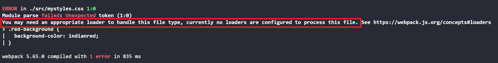

Para solucionar esto, vamos a instalar dos _loaders_.

- **`css-loader`** este nos permite leer el archivo _.css_.
- **`style-loader`** nos inyecta los estilos en nuestra aplicación.

```bash
npm install style-loader css-loader --save-dev
```

- Es hora de configurar nuestro **`webpack.config.js`**. Para configurarlo correctamente, agregamos a **`rules`** una nueva sección en la que haremos uso de nuestros nuevos **`loaders`**. Como hicimos en el apartado anterior usaremos test con una expresión regular para que **`webpack`** maneje los archivos **`css`**, sin entrar en **`node_modules`** y a diferencia de antes utilizaremos **use** para introducir varios **`loaders`**. Éstos actuarán en orden inverso de agregación, es decir, primero usará **`css-loader`** (para que lea el archivo **`css`**), luego el **`style-loader`**(para que nos inyecte el estilo).

_./webpack.config.js_

```diff
  module: {
    rules: [
      {
        test: /\.js$/,
        exclude: /node_modules/,
        loader: 'babel-loader',
      },
+     {
+       test: /\.css$/,
+       exclude: /node_modules/,
+       use: ['style-loader', 'css-loader'],
+     },
    ],
  },
```

> Recuerda que tienes que detener e iniciar su **`webpack-dev-server`** siempre que realizes cambios en su archivo webpack.config

- Ahora podemos simplemente ejecutar la aplicación y verificar cómo se muestra el fondo rojo en el div que hemos elegido.

```bash
npm start
```

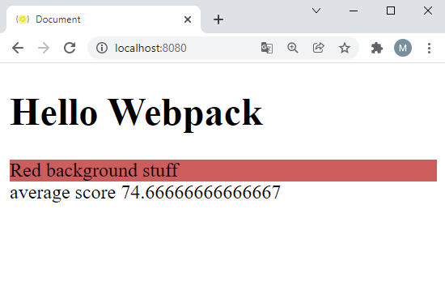

- Si ahora construimos de nuevo nuestra _build_:

```bash
npm run build
```

- Vemos como resultado que no tenemos ningún archivo _css_.

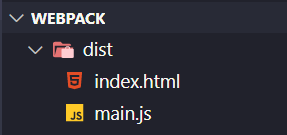

- Pero nos preguntaremos, sí veo el resultado de aplicar el estilo pero ¿dónde ha ido a parar nuestro css? Para nuestra alegría vemos que **`myStyles.css`** se ha incrustado en el archivo **`main.js`**.

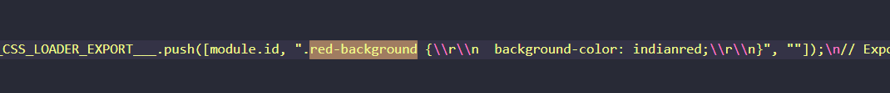

¿Como podríamos decirle a webpack? Créame al menos dos bundles uno para el código de la aplicación y otro para los _css_:

- Crearemos dos grupos principales: _app_ y appStyles.

- Cuando tenemos varios entry points los almacenamos en un objeto en vez de un _array_. Y en cada propiedad del objeto referenciamos el nombre y el archivo que hace referencia.

_./webpack.config.js_

```diff
export default {
-  entry: ['./src/students.js', './src/mystyles.css'],
+  entry: {
+    app: './src/students.js',
+    appStyles: './src/mystyles.css',
+  },
```

- Si ahora construimos de nuevo nuestra _build_:

```bash
npm run build
```

- Sino referenciamos nuestros outputs se llamaran de la misma forma que los nombramos en los _entry points_ y desaparecerá nuestro _main.js_ en _dist_. Ahora tendremos dos _bundles_:
  - _app_ (contendrá nuestra aplicación).
  - _appStyles_ (inyectará los estilos).

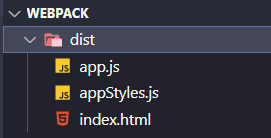

- Pero si lo hacemos de esta forma, **`HtmlWebpackPlugin`** genera un **`hash`** a nuestro index.html para referenciar a nuestros archivos JavaScript.

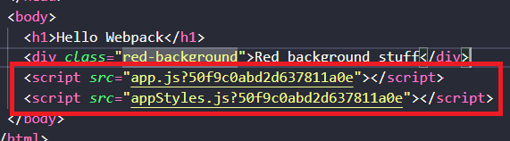

Esto no está mal, pero es mejor práctica que ese hash este directamente incluido en los nombres de los
ficheros generados, veamos cómo hacer esto:

- Creamos un _output_ donde ponemos el nombre de nuestro entry point y le indicamos que nos genere un _hash_ aleatorio.

_./webpack.config.js_

```diff
entry: {
    app: "./students.js",
    appStyles: "./mystyles.css",
  },
+ output: {
+   filename: '[name].[chunkhash].js',
+ },
```

- Fíjate que ya no necesitaríamos usar el _flag_ **`hash`** de **`HtmlWebpackPlugin`**, ya
  que esto lo hemos resuelto en el paso anterior, y _**`HtmlWebpackPlugin`**_ se integra bien
  con esa aproximación.

_./webpack.config.json_

```diff
...
  plugins: [
    //Generate index.html in /dist => https://github.com/ampedandwired/html-webpack-plugin
    new HtmlWebpackPlugin({
      filename: 'index.html', //Name of file in ./dist/
      template: 'index.html', //Name of template in ./src
-     hash: true,
    }),
  ],
```

- Creamos nuestra _build_ y vemos que los archivos generados en el _dist_ intercalan un hash
  en su nombre.

```bash
npm run build
```

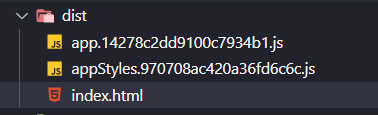

Ahora nos surge otra problemática: cada vez que modifiquemos un archivo y creemos de nuevo nuestra _build_ se irán generando nuevos ficheros con nombres diferentes, gracias al _hash_, y se irán acumulando en nuestra carpeta dist y esto no es buena idea, ya que acabaremos con mucha basura y no sabremos que ficheros son los
que debemos subir a producción y cuales las versiones antiguas. Lo que queremos es que cada vez que creemos nuestro _bundle_ se borre la carpeta _dist_ y vuelva a crearla con nuestra _build_.

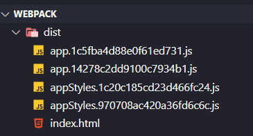

Para solucionarlo _Webpack_ nos aporta [_clean_](https://webpack.js.org/configuration/output/#outputclean) que nos permite borrar el interior de la carpeta _dist_ cada vez que generamos el bundle.

- Para esto lo único que tenemos que añadir es el siguiente comando dentro de _output_ en nuestro _webpack.config.js_:

_./webpack.config.js_

```diff
.....
  entry: {
    app: "./src/students.js",
    appStyles: "./src/mystyles.css",
  },
  output: {
    filename: "[name].[chunkhash].js",
+   clean: true,
  },
.......
```

- Y si ejecutamos nuestra _build_.

```bash
npm run build
```

Ahora vemos que los estilos están encuentran en un archivo _js_, ¿qué pasa si queremos mantenerlo como un archivo css separado? Haciendo uso de [**`MiniCssExtractPlugin`**](https://webpack.js.org/plugins/mini-css-extract-plugin/) podemos conseguirlo. ¡Vamos al lio!

- Vamos a instalar este plugin

```bash
npm install mini-css-extract-plugin --save-dev
```

- Para utilizar de forma correcta esta librería tenemos que hacer uso de un _loader_ y un _plugin_.Vamos a añadimos sustituimos el **`style-loader`** por el **`MiniCSSExtractPlugin.loader`**.

_webpack.config.js_

```diff
import HtmlWebpackPlugin from "html-webpack-plugin";
+ import MiniCssExtractPlugin from "mini-css-extract-plugin";

export default {
```

- Configuramos el _loader_ para la extensión _.css_.

_webpack.config.js_
```diff
  module: {
    rules: [
      {
        test: /\.js$/,
        exclude: /node_modules/,
        loader: 'babel-loader',
      },
      {
        test: /\.css$/,
         exclude: /node_modules/,
-        use: [ 'style-loader', 'css-loader'],
+       use: [
+          MiniCssExtractPlugin.loader,
+         "css-loader"
+        ]
      },
    ],
  },
  .....
```

- Ahora en vez de inyectar los estilos se va a crear un nuevo archivo _css_ y _HTMLwebpackplugin_ nos lo añade a nuestro _HTML_.

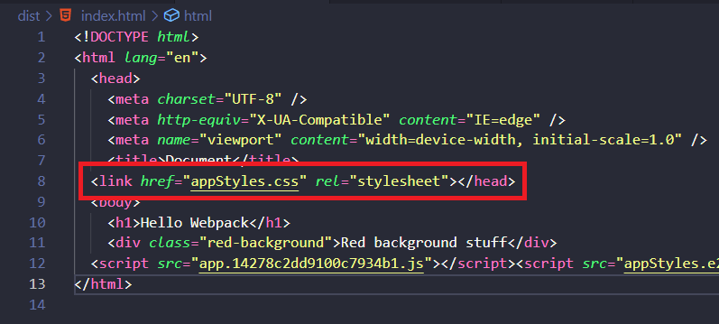

- Finalmente, agregamos el objeto del _plugin_ a la sección de _plugins_ de nuestro _webpack.config.js_:

_webpack.config.js_
```diff
plugins: [
    //Generate index.html in /dist => https://github.com/ampedandwired/html-webpack-plugin
    new HtmlWebpackPlugin({
      filename: 'index.html', //Name of file in ./dist/
      template: 'index.html', //Name of template in ./src
      scriptLoading: "blocking", // Just use the blocking approach (no modern defer or module)
    }),
+   new MiniCssExtractPlugin({
+     filename: "[name].css",
+     chunkFilename: "[id].css"
+   }),
  ],
```

- Creamos la _build_ nuevamente, 

```bash
npm run build
```

Y vemos que el _appStyles.js_ se divide en dos archivos **`appStyles.js`** y **`appStyles.css`**

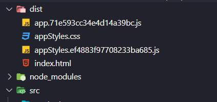

Pero ahora nos preguntaremos, ¿por qué se sigue generando el _appStyles.js_? Y es porque tenemos en webpack.config.js como _entry point_ a appStyles que hace referencia a _mystyless.css_ y nos va a seguir sacando el archivo _JavaScript_.

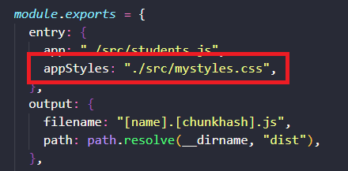

¿Y si lo quito?

_webpack.config.js_
```diff
.....
module.exports = {
  entry: {
    app: "./src/students.js",
-    appStyles: "./src/mystyles.css",
  },
  output: {
    filename: "[name].[chunkhash].js",
    clean: true
  },
.....
```

Si generamos la build, _Webpack_ no sabe llegar a mystyles.css porque no hay ningún sitio que haga referencia a nuestros estilos y no aparecería en el _bundle_. ¿Cómo podríamos solucionar esto?

- En **`students.js`** importamos los estilos y de esta forma tenemos referenciado **`mystyle.css`**.

_./src/students.js_

```diff
import { getAvg } from "./averageService.js";
+ import "./mystyles.css";

const scores = [90, 75, 60, 99, 94, 30];
const averageScore = getAvg(scores);

const messageToDisplay = `average score ${averageScore}`;

document.write(messageToDisplay);

```

- Ahora si ejecutamos la _build_, veremos que la carpeta dist se borra y sólo obtenemos el nuevo contenido generado sin _appStyles.js_.

```bash
npm run build
```

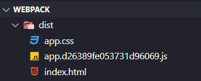

## Sumario

1. Hemos creado un archivo **`CSS`**.
2. Instalamos **`style-loader`** y **`css-loader`**.
3. Configuramos **`webpackconf.js`**.
4. Vimos como **`clean-webpack-plugin`** nos generaba una nueva carpeta **`dist`** cada vez que generamos una **`build`** o utilizamos **`rimraf`** que nos haría lo mismo.
5. Y por último, usamos **`miniCssExtractPlugin`** si queremos que nuestro _bundle_ tenga archivos _css_ en vez de los _javascript_ resultantes.

# ¿Te apuntas a nuestro máster?

Si te ha gustado este ejemplo y tienes ganas de aprender Front End
guiado por un grupo de profesionales ¿Por qué no te apuntas a
nuestro [Máster Front End Online Lemoncode](https://lemoncode.net/master-frontend#inicio-banner)? Tenemos tanto edición de convocatoria
con clases en vivo, como edición continua con mentorización, para
que puedas ir a tu ritmo y aprender mucho.

También puedes apuntarte a nuestro Bootcamp de Back End [Bootcamp Backend](https://lemoncode.net/bootcamp-backend#inicio-banner)

Y si tienes ganas de meterte una zambullida en el mundo _devops_
apuntate nuestro [Bootcamp devops online Lemoncode](https://lemoncode.net/bootcamp-devops#bootcamp-devops/inicio)
