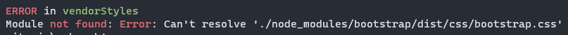

## Añadiendo Twitter Bootstrap

Crear nuestro CSS de aplicación es algo muy interesante, pero hay ocasiones en las que nos hace falta consumir CSS de librerías de terceros ¿Cómo podemos integrarlas en nuestro proceso? En este ejemplo vamos a ver como integrar el CSS de la librería _Twitter Bootstrap_ en nuestra aplicación.

[Documentación](https://getbootstrap.com/docs/5.0/getting-started/introduction/)

### Pasos

- Vamos a empezar instalando **`Boootstrap`**:

```bash
npm install bootstrap --save
```

- Ahora, importamos la biblioteca **`CSS`** para incluirla en nuestro proyecto:

_./webpack.config.js_

```diff
export default {
  entry: {
    app: './students.js',
+   vendorStyles: ['./node_modules/bootstrap/dist/css/bootstrap.css'],
  },
```

- Modificamos nuestro index.html e incluimos un componente específico de **`Bootstrap`**, en este caso vamos a instalar un [Card](https://getbootstrap.com/docs/5.0/components/card/).

_./src/index.html_

```diff
<body>
    <h1>Hello Webpack</h1>
    <div class="red-background">Red background stuff</div>

+    <div class="card" style="width: 18rem">
+      <div class="card-body">
+        <h5 class="card-title">Card title</h5>
+        <p class="card-text">
+          Some quick example text to build on the card title and make up the
+          bulk of the card's content.
+        </p>
+        <a href="#" class="btn btn-primary">Go somewhere</a>
+      </div>
+    </div>
  </body>
```

- Si ahora arrancamos nuestra aplicación:

```bash
npm start
```

- Nos daría un error:



- Esto nos ocurre porque en el **`loader`** tenemos excluido **`node_modules`** y ahora sí necesitamos tratar un fichero que está en dicha carpeta.
- Vamos a hacer un pequeño cambio en nuestra configuración de _webpack_. En vez que nos cree nuestro archivo **`css`** el **`bundling`** con **`MiniCssExtractPlugin`**, vamos a cambiarlo por **`style-loader`** para que la salida sea un archivo _javascript_, así simulamos que estamos trabajando en desarrollo.

_webpack.config.js_

```diff
{
  test: /\.css$/,
-  exclude: /node_modules/,
-  use: [MiniCssExtractPlugin.loader, "css-loader"],
+  use: ["style-loader", "css-loader"],
}
```

- Si arrancamos nuestra aplicación:

```bash
npm start
```

- Y nuestra navegador ya mostrará el componente **`card`** de **`Bootstrap`**:


## Sumario

1. Instalamos **`Bootstrap`**.
2. Añadimos un nuevo **`entry point`** en **`webpack.config.js`** para poder hacer uso de la librería.
3. Introducimos un **`card`** en el HTML.
4. Borramos de **`webpack.config.js`** el **`exclude`** a **`node_modules`** para que pueda mirar dentro de la carpeta y encontrar a **`Bootstrap`**.

# ¿Te apuntas a nuestro máster?

Si te ha gustado este ejemplo y tienes ganas de aprender Front End
guiado por un grupo de profesionales ¿Por qué no te apuntas a
nuestro [Máster Front End Online Lemoncode](https://lemoncode.net/master-frontend#inicio-banner)? Tenemos tanto edición de convocatoria
con clases en vivo, como edición continua con mentorización, para
que puedas ir a tu ritmo y aprender mucho.

También puedes apuntarte a nuestro Bootcamp de Back End [Bootcamp Backend](https://lemoncode.net/bootcamp-backend#inicio-banner)

Y si tienes ganas de meterte una zambullida en el mundo _devops_
apuntate nuestro [Bootcamp devops online Lemoncode](https://lemoncode.net/bootcamp-devops#bootcamp-devops/inicio)