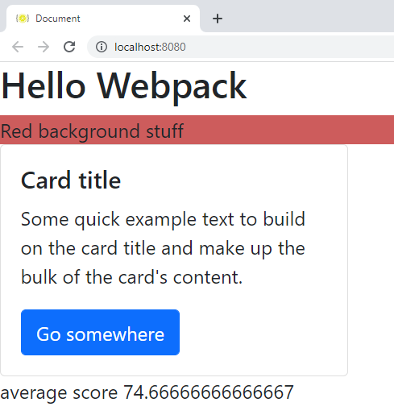
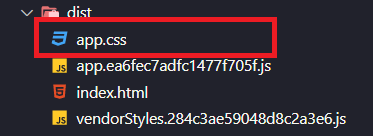
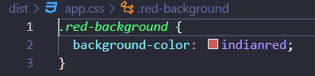

## Incorporando soporte SASS a nuestra aplicación

Los estilos en cascada tienen muchas limitaciones, por este motivo aparecieron herramientas que nos permiten escribir un código más avanzado, para más tarde ser compilados a nuestro conocido **`css`**. **`Sass`** es un preprocesador **`CSS`**, en el cual podemos utilizar desde variables, funciones, mixins, herencia,... etc. permitiendo que nuestro código sea mucho más legible y dinámico.

En este ejemplo vamos a renombrar el archivo **`css`** a la extensión **`scss`** y agregaremos una variable de **`SASS`**. Introduciremos un **`loader`** que pueda hacer el prepoceso de **`SASS`** y volveremos a configurar **`webpack.config.json`** para que todo funcione correctamente.

### Pasos

- Empezamos renombrando **`mystyles.css`** a **`mystyles.scss`**.
- Abre **`mystyles.scss`** y agrega un código simple de _sass_ (en este caso creamos una variable que contendrá el color que utilizamos en la propiedad):

_./src/mystyles.scss_

```diff
+ $back-color: indianred;

.red-background {
- background-color: indianred;
+ background-color: $back-color;
}
```

- Vamos a renombrar la importación.

_./src/students.js_

```diff
import { getAvg } from "./averageService.js";
- import "./mystyles.css";
+ import "./mystyles.scss";

const scores = [90, 75, 60, 99, 94, 30];
const averageScore = getAvg(scores);

const messageToDisplay = `average score ${averageScore}`;

document.write(messageToDisplay);
```

- Instalamos [sass-loader](https://github.com/webpack-contrib/sass-loader) y [sass](https://github.com/sass/sass), recuera los loaders hacen de puente entre _webpack_ y la herramienta que realmente el trabajo
  (en este caso el paquete _sass_):

```bash
npm install sass sass-loader --save-dev
```

Tenemos que actualizar el archivo **`webpack.config.js`**.

- Agregamos una nueva entrada (_scss_) para el **`loader`** de **`sass`** recién instalado. Es interesante que
  nos demos cuenta de que estamos encadenando _loaders_, primero preprocesamos el **`scss`** y luego aplicamos los **`loaders`** anteriores al **`css`** resultante (recordaros aquí que el orden importa, se ejecutan
  empezando por el último elemento del array).

_./webpack.config.js_

```diff
 module: {
    rules: [
      {
        test: /\.js$/,
        exclude: /node_modules/,
        loader: "babel-loader",
      },
+      {
+        test: /\.scss$/,
+        exclude: /node_modules/,
+        use: ["style-loader", "css-loader", "sass-loader"],
+      },
      {
        test: /\.css$/,
        use: ["style-loader", "css-loader"],
      },
    ],
  },
```

- Si ejecutamos nuestra aplicación (**`npm start`**), veremos el mismo resultado que obteníamos en **`Twitter Bootstrap`**, eso si aplicando el valor de la variable SASS.

```bash
npm start
```

- Esto nos muestra la salida de nuestro navegador:



Vamos a cambiar **`style-loader`** por **`MiniCssExtractPlugin`** para que cree un archivo **`css`** cuando genere nuestro **`bundle`**. Si utilizamos **`style-loader`** nos incrustará el **`css`** dentro de un archivo **`javascript`** y será mucho menos legibles los resultados.

- Configuramos **`webpack.config.js`**:

_./webpack.config.js_
```diff
.....
{
	test: /\.scss$/,
	exclude: /node_modules/,
-	use: ["style-loader", "css-loader", "sass-loader"],
+	use: [MiniCssExtractPlugin.loader, "css-loader", "sass-loader"],
},
.....
```

- Generamos nuestra **`build`**:

```bash
npm run build
```

- Como resultado nos generaría un archivo **`css`**.



- Y si vemos el interior del archivo quedaría transpilado a puro **`css`**.

_./dist/app.css_



## Sumario

1. Renombramos nuestra hoja de estilos de **`css`** a **`scss`**, añadimos una variable donde guardamos un color y la aplicamos.
2. Cambiamos las importaciones de los archivos **`css`**.
3. Instalamos **`sass-loader`** y **`sass`** que también nos hacía falta que funcionara el **`loader`**.
4. Añadimos los **`loaders`** al **`webpack.config.json`**.
5. Cambiamos **`style-loader`** por **`MiniCssExtractPlugin`** para que la salida del **`bundle`** contenga un archivo **`css`**.

# ¿Te apuntas a nuestro máster?

Si te ha gustado este ejemplo y tienes ganas de aprender Front End
guiado por un grupo de profesionales ¿Por qué no te apuntas a
nuestro [Máster Front End Online Lemoncode](https://lemoncode.net/master-frontend#inicio-banner)? Tenemos tanto edición de convocatoria
con clases en vivo, como edición continua con mentorización, para
que puedas ir a tu ritmo y aprender mucho.

También puedes apuntarte a nuestro Bootcamp de Back End [Bootcamp Backend](https://lemoncode.net/bootcamp-backend#inicio-banner)

Y si tienes ganas de meterte una zambullida en el mundo _devops_
apuntate nuestro [Bootcamp devops online Lemoncode](https://lemoncode.net/bootcamp-devops#bootcamp-devops/inicio)
