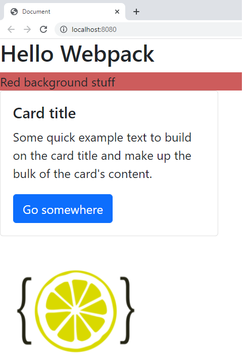
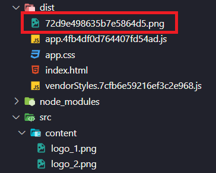
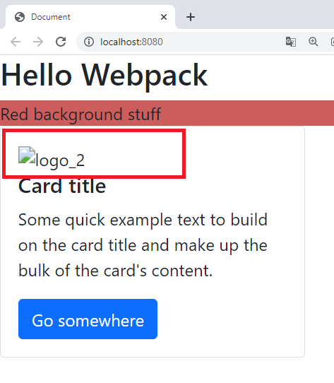
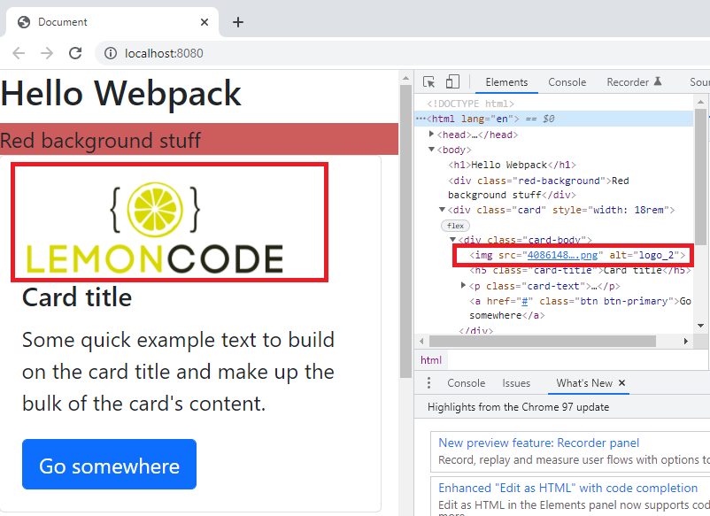

## Manejando imágenes

Hasta ahora hemos trabajado con ficheros de código, vamos a ver cómo podemos referenciar recursos estáticos y que estos se acaben volcando a la carpeta _dist_ de nuestra aplicación.

En el siguiente punto vamos a incluir imágenes en nuestro proyecto de dos formas: vía _JavaScript_ y vía _HTML_. En el lado de _JavaScript_, veremos que es algo sencillo (usando un **`loader`** ya incluido en _webpack_) y para el HTML usaremos otro **`loader`**: el **`html-loader`**.

### Pasos

- Vamos a agregar al **`index.html`** un elemento **`div`** con una **`id`** dada:

_./src/index.html_

```diff
<!DOCTYPE html>
<html lang="en">
  <head>
    <meta charset="UTF-8" />
    <meta http-equiv="X-UA-Compatible" content="IE=edge" />
    <meta name="viewport" content="width=device-width, initial-scale=1.0" />
    <title>Document</title>
  </head>
  <body>
    <h1>Hello Webpack</h1>
    <div class="red-background">Red background stuff</div>

    <div class="card" style="width: 18rem">
      <div class="card-body">
        <h5 class="card-title">Card title</h5>
        <p class="card-text">Some quick example text to build on the card title and make up the bulk of the card's content.</p>
        <a href="#" class="btn btn-primary">Go somewhere</a>
      </div>
    </div>
+    <div id="imgContainer"></div>
  </body>
</html>
```

- Continuamos creando una carpeta llamada **content** dentro de **src** y agregamos dos imágenes: **`logo_1`** y **`logo_2`**.
- Vamos a **`index.js`** e importamos **`logo_1`** y añadimos la imagen al DOM mediante código _javascript_:

_./src/index.js_

```diff
import { getAvg } from "./averageService.js";
+ import logoImg from './content/logo_1.png';
import "./mystyles.scss";

const scores = [90, 75, 60, 99, 94, 30];
const averageScore = getAvg(scores);

const messageToDisplay = `average score ${averageScore}`;

document.write(messageToDisplay);

+ const img = document.createElement('img');
+ img.src = logoImg;

+ document.getElementById('imgContainer').appendChild(img);
```

- A partir de **`webpack 5`**, ya no es necesario usar **`loaders`** de terceros para cargar imágenes, directamente podemos añadir la entrada de la extensión e indicarle que es de tipo **`asset/resource`**, vamos a actualizar nuestro **`webpack.config.js`**, indicándole que hacer cuando se encuentro con un fichero
  _png_ o _jpg_.

_webpack.config.js_

```diff
  module: {
    rules: [
      ...
+     {
+       test: /\.(png|jpg)$/,
+       type: 'asset/resource',
+     },
    ],
  },
```

> [Reference](https://webpack.js.org/guides/asset-modules/)

- A continuación, agregamos algunos estilos para las imágenes :

_./src/mystyles.scss_

```diff
$back-color: indianred;

.red-background {
  background-color: $back-color;
}

+ img {
+  width: 200px;
+ }
```

- Y ejecutamos **`npm start`**. Deberíamos poder ver la imagen en el navegador.

```bash
npm start
```



- Vamos a ejecutar la **`build`** y vemos que ha hecho **`webpack`**.

```bash
npm run build
```

- Si te fijas, en el **`bundle`**, el nombre que le pone al fichero de imagen es una secuencia de caracteres que nada tiene que ver con el nombre original, esto se debe a que _webpack_ le va dando nombre únicos para evitar colisiones con otros ficheros de imágenes.



Eso está bien, pero ¿y si ya tuviéramos la imagen referenciada dentro de una etiqueta **``**?

- Agregamos **`logo_2.png`** en el archivo **`index.html`**:

_./src/index.html_

```diff
.....
  <body>
    <h1>Hello Webpack</h1>
    <div class="red-background">Red background stuff</div>

    <div class="card" style="width: 18rem">
      <div class="card-body">
+       
        <h5 class="card-title">Card title</h5>
        <p class="card-text">Some quick example text to build on the card title and make up the bulk of the card's content.</p>
        <a href="#" class="btn btn-primary">Go somewhere</a>
      </div>
    </div>

    <div id="imgContainer"></div>
  </body>
</html>
```

- Ahora, si ejecutamos la aplicación (**`npm start`**), parece que funciona, se muestra la segunda imagen...

```bash
npm start
```

Peeero si inspeccionamos el elemento _img_ en el navegador podemos ver que apunta a una ruta que en dist no tendríamos...

Vamos a probar el paquete de _dist_, para ello hacemos un build:

```bash
npm run build
```

Vamos al terminal, nos metemos en la carpeta _dist_

_cd dist_

Si hacemos un _ls_ ya vemos que algo nos huele mal, sólo hay un fichero de imagen.

Vamos a instalar de manera global (si no lo tenemos ya) un servidor web ligero:

_npm install lite-server -g_

> Ojo aquí si estás en linux o mac puede que te haga falta meter el prefijo _sudo_

Y lo lanzamos

_lite-server_

Si abrimos el navegador y vamos a la dirección que indica _lite-server_ (normalmente localhost:3000) veremos que la imagen no se ve.



- Esto sucede porque no tenemos ningún **`loader`** que esté buscando referencias dentro del **`HTML`** y extraiga esas imágenes al bundle de producción, **`webpack`** nos da solución para esto y utilizaremos **`html-loader`**.
- Vamos a instalarlo y añadirlo a nuestra configuración de **`webpack.config.js`**, en este caso
  le diremos que cuando se encuentre con un fichero con extensión _html_ ejecute el _html-loader_:

Si estamos en la carpeta _dist_ subimos un nivel:

```bash
cd ..
```

```bash
npm install html-loader --save-dev
```

_./webpack.config.js_

```diff
      ...
+     {
+      test: /\.html$/,
+      loader: 'html-loader',
+     },
    ],
  },
```

- Comprobamos que en efecto al hacer un _build_ se copia a _dist_ la imagen referenciada.

```bash
npm run build
```


- Y ejecutamos **`npm start`** para ver que se muestra correctamente la imagen.

```bash
npm start
```



Antes de abandonar este ejemplo, vamos a ver como hacer que webpack recargue en el navegador web si hay cambios
(este era el funcionamiento por defecto en Webpack 4, en 5 tenemos que añadir la siguiente configuración):

_./webpack.config.js_

```diff
  devServer: {
    port: 8080,
+    open: true,
+    hot: true,
+    static: {
+      directory: path.join(__dirname, "src"),
+    },
  },
```

## Sumario

1. Manejo de imágenes vía **`javascript`**.
   1. Añadimos un **`<div>`** para la imagen.
   2. Creamos una carpeta llamada **content** dentro de **src** y agregamos dos imágenes: **`logo_1`** y **`logo_2`**.
   3. Importamos una imagen a **`index.js`** y añadimos código para mostrarla en el **`DOM`**.
   4. Configuramos **`webpack.config.js`** y añadimos un estilo a las imágenes.
2. Manejo de imágenes vía **`HTML`**.
   1. Agregamos una etiqueta **`img`** al código **`HTML`**.
   2. Instalamos **`html-loader`** y lo añadimos a **`webpack.config.js`**.

# ¿Te apuntas a nuestro máster?

Si te ha gustado este ejemplo y tienes ganas de aprender Front End
guiado por un grupo de profesionales ¿Por qué no te apuntas a
nuestro [Máster Front End Online Lemoncode](https://lemoncode.net/master-frontend#inicio-banner)? Tenemos tanto edición de convocatoria
con clases en vivo, como edición continua con mentorización, para
que puedas ir a tu ritmo y aprender mucho.

También puedes apuntarte a nuestro Bootcamp de Back End [Bootcamp Backend](https://lemoncode.net/bootcamp-backend#inicio-banner)

Y si tienes ganas de meterte una zambullida en el mundo _devops_
apuntate nuestro [Bootcamp devops online Lemoncode](https://lemoncode.net/bootcamp-devops#bootcamp-devops/inicio)
