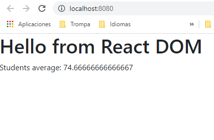
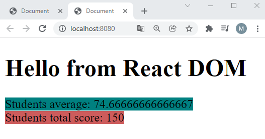
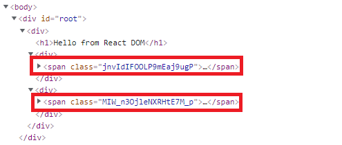
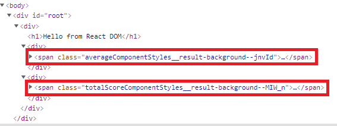
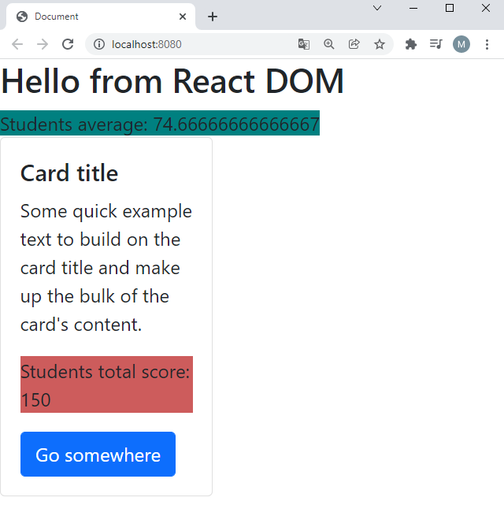
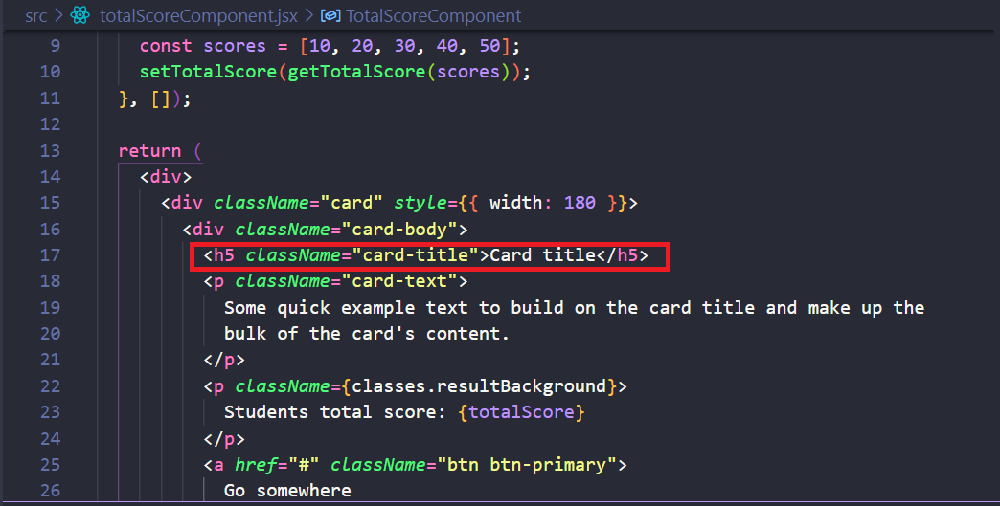

## Transformando CSS a módulos

En una aplicación web de tamaño medio o grande, manejarnos con **`CSS`** puede llegar a ser una pesadilla, ya que los selectores se crean a nivel global y es muy fácil sobrescribir uno por equivocación, una solución para esto puede ser utilizar **`CSS Modules`**, está tecnología te permite que cuando importemos ficheros **`CSS`** en, por ejemplo, un **`JSX`** automáticamente les añada un prefijo que los haga único por módulo y evitar así colisiones.

**`CSS Modules`** se combina a la perfección con **`Webpack`**, permitiéndonos usar nombres amistosos cuando desarrollamos y automáticamente pasándolos a nombre únicos con prefijo cuando se genera el **`bundle`**.

### Pasos

- Lo primero, vamos a entender bien para que hace falta _CSS Modules_, para ello
  vamos a crear dos componentes y vamos a hacer que haya un conflicto de _CSS_, es decir
  tendremos una colisión de nombres.

- Podemos comenzar creando un archivo de estilos, lo llamaremos **`averageComponentStyles (archivo SASS)`**.

_./src/averageComponentStyles.scss_

```scss
$background: teal;

.result-background {
  background-color: $background;
}
```

- Quédate con el nombre de selector _result-background_ más adelante usaremos el
  mismo en otro componente.

- Vamos a usar ese estilo en **`averageComponent`**:

_./src/averageComponent.jsx_

```diff
import React from 'react';
import { getAvg } from './averageService';

export const AverageComponent: React.FunctionComponent = () => {
  const [average, setAverage] = React.useState<number>(0);

  React.useEffect(() => {
    const scores: number[] = [90, 75, 60, 99, 94, 30];
    setAverage(getAvg(scores));
  }, []);

  return (
    <div>
-     <span>Students average: {average}</span>
+     <span className="result-background">Students average: {average}</span>
    </div>
  );
};
```

- Ejecutamos el ejemplo

```bash
npm start
```

- Si ejecutamos podemos ver que el estilo no se aplica, tenemos que integrarlo
  en nuestro proceso de _bundling_.



¿Qué tendremos que hacer para que muestre el estilo?

- Podríamos añadir un nuevo _entry point_ en **`webpack-config-js`** (Este código
  es sólo para ver que se podría hacer, pero no lo dejaremos en el ejemplo).

_./webpack.config.js_

```diff
.....
module.exports = {
  context: path.resolve(__dirname, "./src"),
  resolve: {
    extensions: [".js", ".jsx"],
  },
  entry: {
    app: "./index.jsx",
+    appStyles: "./averageComponentStyles.scss",
  },
  output: {
    filename: "[name].[chunkhash].js",
    path: path.resolve(__dirname, "dist"),
  },
.....
```

- Pero en nuestro caso, añadiremos un _import_ en **`averageComponent`**,
  esto tiene más sentido ya que es un estilo a aplicar sólo en ese componente:

_./src/averageComponent.jsx_

```diff
import React from "react";
import { getAvg } from "./averageService";
+ import "./averageComponentStyles.scss";

export const AverageComponent = () => {
  const [average, setAverage] = React.useState(0);

  React.useEffect(() => {
    const scores = [90, 75, 60, 99, 94, 30];
    setAverage(getAvg(scores));
  }, []);

  return (
    <div>
      <span className="result-background">Students average: {average}</span>
    </div>
  );
};
```

- Ahora si hacemos **`npm start`** vemos lo cambios.

```bash
npm start
```


- A continuación, vamos a crear otro componente que llamaremos **`TotalScoreComponent`** (en este componente vamos a mostrar el total de unas puntuaciones y haremos uso
  de la función _getTotalScore_ que tendremos que exponer hacia el exterior),

_./src/totalScoreComponent.jsx_

```jsx
import React from "react";
import { getTotalScore } from "./averageService";

export const TotalScoreComponent = () => {
  const [totalScore, setTotalScore] = React.useState(0);

  React.useEffect(() => {
    const scores = [10, 20, 30, 40, 50];
    setTotalScore(getTotalScore(scores));
  }, []);

  return (
    <div>
      <span className="result-background">
        Students total score: {totalScore}
      </span>
    </div>
  );
};
```

- Ahora vamos a definir los estilos asociados a ese componente:

_./src/totalScoreComponentStyles.scss_

```scss
$background: indianred;

.result-background {
  background-color: $background;
}
```

> NOTA: declaramos el mismo nombre de la clase para **`TotalScoreComponent`** a propósito.

- Y los importamos los estilos en el componente **`TotalScoreComponent`** .

_./src/totalScoreComponent.jsx_
```diff
import React from "react";
import { getTotalScore } from "./averageService";
+ import './totalScoreComponentStyles.scss';

export const TotalScoreComponent = () => {
  const [totalScore, setTotalScore] = React.useState(0);

  React.useEffect(() => {
    const scores = [10, 20, 30, 40, 50];
    setTotalScore(getTotalScore(scores));
  }, []);

  return (
    <div>
      <span className="result-background">
        Students total score: {totalScore}
      </span>
    </div>
  );
};
```

_./src/averageService.js_

```diff
export function getAvg(scores) {
  return getTotalScore(scores) / scores.length;
}

- function getTotalScore(scores) {
+ export function getTotalScore(scores) {
  return scores.reduce((score, count) => score + count);
}
```

- Importamos **`totalScoreComponent`** a **`index.js`** y agregamos el componente:

_./src/index.jsx_

```diff
import React from 'react';
import { createRoot } from "react-dom/client";
import { AverageComponent } from './averageComponent';
+ import { TotalScoreComponent } from './totalScoreComponent';

const root = createRoot(document.getElementById("root"));
root.render(
  <div>
    <h1>Hello from React DOM</h1>
    <AverageComponent />
+   <TotalScoreComponent />
  </div>
);
```

- Si ejecutamos el proyecto, vemos que ambos estilos **`css`** se superponen.

```bash
npm start
```

- Como resultado, al llamarse igual los dos estilos prevalece el último introducido, **`averageComponentStyles`** se reemplaza por **`totalScoreComponentStyles`**. ¿Cómo solucionar esto? ¡Módulos de CSS al rescate!


- El objetivo de los **`CSS Modules`** es aislar diferentes archivos **`scss`** para que no haya colisión entre nombres. Tratando a los estilos como módulos e importándolo donde se necesiten.

- Para poder usar esto en nuestro proyecto, debemos modificar la regla en la que invocamos
  al _css-loader_ ya no nos vale la forma simple (un _string_ indicando el loader a usar),
  si no que tenemos pasar a notación de objeto para pasarle configuración adicional
  (en este caso empezamos por decirle que active los módulos)

_./webpack.config.js_

```diff
...
  module: {
    rules: [
      ...
      {
        test: /\.scss$/,
        exclude: /node_modules/,
        use: [
          MiniCssExtractPlugin.loader,
-         'css-loader',
+         {
+            loader: "css-loader",
+            options: {
+              modules: true,
+            },
+          },
    	   "sass-loader",
        ],
      },
    ],
 .....
```

> **IMPORTANTE**: Acuérdate de detener e iniciar el servidor para que los cambios en **`webpack.config.js`** sean efectivos.

- Vamos a actualizar **`averageComponent`**, en este caso al hacer el _import_ usamos
  un _import sintético_ y en el objeto _classes_ tenemos todos los selectores
  disponibles.

Vamos a intentar usarlo tal cual:

_./src/averageComponent.jsx_

```diff
import React from 'react';
import { getAvg } from './averageService';
- import "./averageComponentStyles.scss";
+ import classes from "./averageComponentStyles.scss";

export const AverageComponent: React.FunctionComponent = () => {
  ...

  return (
    <div>
-     <span className="result-background">
+     <span className={classes.result-background}>
        Students average: {average}
      </span>
    </div>
  );
};
```

¿Por qué da error esto? Resulta que en _JavaScript_ y _Typescript_ una variable
no puede tener guiones en su nombre, y en _CSS_ no podemos usar mayúsculas, vamos
a aplicar un _hack_ temporal para solucionar esto, en este caso utilizaremos la
notación de _array_ y un el nombre de la propiedad como un string para poder
referenciar al selector (más adelante veremos una solución más elegante para este problema)

_./src/averageComponent.jsx_

```diff
export const AverageComponent: React.FunctionComponent = () => {
  ...

  return (
    <div>
-     <span className="classes.result-background">
+     <span className={classes['result-background']}>
        Students average: {average}
      </span>
    </div>
  );
};
```

- Y vamos a actualizar **`totalScoreComponent`**:

_./src/totalScoreComponent.jsx_

```diff
import React from 'react';
import { getTotalScore } from './averageService';
+ import classes from './totalScoreComponentStyles.scss';

export const TotalScoreComponent: React.FunctionComponent = () => {
  ...

  return (
    <div>
-     <span className="result-background">
+     <span className={classes['result-background']}>
        Students total score: {totalScore}
      </span>
    </div>
  );
};
```

- De esta manera ya evitamos colisiones de nombres globales cuando manejemos **`CSS`**.

```bash
npm start
```



- Si ahora nos vamos a inspeccionar el _HTML_ desde nuestro navegador podemos
  ver que ha creado unos nombres de selector únicos, pero (mostrar el inspector
  del navegador) esto tiene pinta de que puede ser un poco duro de depurar, más
  adelante veremos cómo mejorar esto.

- Esto está muy bien, pero esto de tener que poner entre corchetes nombres de selectores
  es algo un poco engorroso, ¿Y si le decimos a _Webpack_ que transforme los nombres de
  variables CSS a _camelCase_ cuando lo vayamos a usar en _JavaScript_? De esta manera
  alo así como **`classNames['result-background']`**, pasaría a invocarse como **`classNames.resultBackground`**.

- Vamos a añadir ese setting en la sección options de _css-loader_:

_./webpack.config.js_

```diff
.....
        use: [
          MiniCssExtractPlugin.loader,
          {
            loader: "css-loader",
            options: {
-             modules: true,
+             modules: {
+               exportLocalsConvention: "camelCase",
+             },
            },
          },
          ...
        ],
.....
```

> **IMPORTANTE**: Recuerda detener e iniciar el servidor para que sean efectivos los **`updates`**.

- Actualizamos los componentes, por fin podemos quitarnos de en medio los corchetes:

_./src/averageComponent.tsx_

```diff
...
  return (
    <div>
-     <span className={classes['result-background']}>
+     <span className={classes.resultBackground}>
        Students average: {average}
      </span>
    </div>
  );
};
```

_./src/totalScoreComponent.tsx_

```diff
...

  return (
    <div>
-     <span className={classes['result-background']}>
+     <span className={classes.resultBackground}>
        Students total score: {totalScore}
      </span>
    </div>
  );
};
```

- Ejecutemos npm start otra vez:

```bash
npm start
```

- Y vemos que todo sigue funcionando correctamente permitiéndonos usar _camel case_
  para referencia el CSS en nuestro JavaScript

- Perfecto, vamos a por el siguiente problema que nos encontramos... en tiempo de
  desarrollo yo no quiero tener nombres de clases CSS aleatorias, me hace falta
  que tengan un sentido para yo poder ir depurando y ver donde tocar.

- Vamos a indicarle a _Webpack_ que para los nombre de clases _CSS_ queremos que nos
  añada como prefijo el nombre y ruta del fichero de estilos en el que estamos trabajando,
  el nombre de la clase, y un hash que nos asegure que ese nombre es único.



Para ello vamos a introducir una propiedad nueva a la configuración:

- **localIdentName**: pone como prefijo en el nombre del fichero, y a continuación introduce dos barras bajas, después añadimos el nombre de la clase **`css`** y dos guiones para separarlo por un valor de **`hash`** donde se calcula un valor único en base al path y el nombre del fichero (si queremos podemos especificar nuestra propia función hash).

_./webpack.config.js_
```diff
  {
    loader: "css-loader",
    options: {
      modules: {
        exportLocalsConvention: "camelCase",
+       localIdentName: '[path][name]__[local]--[hash:base64:5]',
      },
    },
  },
```

> [localIdentName](https://webpack.js.org/loaders/css-loader/#localidentname) 

- Si echamos un vistazo a la consola del navegador, podemos ver cómo **`webpack`** transforma los nombres de las clases **`css`**, agregando sufijos.



- Finalmente, hagamos un ejemplo en el que necesitamos agregar estilos a un clase de **`Bootstrap`**, es decir modificar estilos globales dentro de un fichero de _css module_.

- En nuestro **`./src/totalScoreComponent.jsx`** vamos a usar una _card_ de _Bootstrap_:

_./src/totalScoreComponent.jsx_

```diff
.....
  return (
    <div>
-      <span className={classes.resultBackground}>
-        Students total score: {totalScore}
-      </span>
+      <div className="card" style={{ width: 180 }}>
+        <div className="card-body">
+          <h5 className="card-title">Card title</h5>
+          <p className="card-text">
+            Some quick example text to build on the card title and make up the
+            bulk of the card's content.
+          </p>
+ 		  <p className={classes.resultBackground}>
+        	 Students total score: {totalScore}
+      	  </p>
+          <a href="#" className="btn btn-primary">
+            Go somewhere
+          </a>
+        </div>
+      </div>
    </div>
  );
};
```

- Ejecutamos **`npm start`**:

```bash
npm start
```

Si no aparece nada, vamos a ver si sigue la entrada a Bootstrap en nuestro webpack.config.js

_./webpack.config.js_

```diff
  entry: {
    app: "./index.jsx",
+   vendorStyles: ['../node_modules/bootstrap/dist/css/bootstrap.css'],    
    appStyles: "./averageComponentStyles.scss",
  },
```



Fíjate que para la extensión CSS usamos configuración de _css-loader_
sin CSS modules, es decir queremos que esos estilos sean globales ¿Qué pasa si tenemos _css_ globales y otros _css_ que queremos que estén bajo el paraguas de css modules? Podríamos añadir dos entradas con extensión _css_ en la sección de loaders en la que le indicamos que ignore _node_modules_
en la otra (usando _include_) le indicamos que sólo mire _node_modules_

- Ahora imaginemos que queremos estilar la cabecera del _card_ de _Bootstrap_ que
  queremos estilar, en concreto queremos aplicar el color **`indianred`** a la
  clase global **`card-title`**.:

_./src/totalScoreComponent.jsx_



_./src/totalScoreComponentStyles.scss_

```diff
$background: indianred;

.result-background {
  background-color: $background;
}

+ .card-title {
+   color: $background;
+ }

```

- Al ejecutar **`npm start`** vemos que no cambia nada, ¿por qué? Esto es debido a que **`CSS modules`** transforma los nombres de las clases locales a '[nombre] ** [local] \_** [hash: base64: 5]' y no lo reconocería como una clase de **`bootstrap`**. Debemos indicar que la **`card`** es un estilo global, para que cuando construya la **`build`**, no lo transforme ([más información](https://webpack.js.org/loaders/css-loader/#-css-modules-https-github-com-css-modules-css-modules-)). Lo conseguimos de la siguiente forma:

_./src/totalScoreComponentStyles.scss_

```diff
$background: indianred;

.result-background {
  background-color: $background;
}

- .card-title {
+ :global(.card-title) {
  color: $background;
}

```

- Si ejecutamos el proyecto ahora, podemos ver que el cambio se ha aplicado globalmente.

```bash
npm start
```

- Aquí vemos el resultado que ha cambiado el color de la cabecera:


## Sumario

1. Actualizamos **`webpack.config.js`** con la configuración de **`CSS Modules`**.
2. Agregamos un archivo **`scss`** con estilos de **`averageComponent`**.
3. Creamos otro componente y su archivo **`scss`** con el mismo nombre de clase.
4. Añadimos un **`loader`** a **`webpack.config.js`** para que tratara a los archivos **`css`** como módulos.
5. Mejoramos la apariencia de los nombres resultantes, que nos generaba **`webpack`**, al crear la _build_.

# ¿Te apuntas a nuestro máster?

Si te ha gustado este ejemplo y tienes ganas de aprender Front End
guiado por un grupo de profesionales ¿Por qué no te apuntas a
nuestro [Máster Front End Online Lemoncode](https://lemoncode.net/master-frontend#inicio-banner)? Tenemos tanto edición de convocatoria
con clases en vivo, como edición continua con mentorización, para
que puedas ir a tu ritmo y aprender mucho.

También puedes apuntarte a nuestro Bootcamp de Back End [Bootcamp Backend](https://lemoncode.net/bootcamp-backend#inicio-banner)

Y si tienes ganas de meterte una zambullida en el mundo _devops_
apuntate nuestro [Bootcamp devops online Lemoncode](https://lemoncode.net/bootcamp-devops#bootcamp-devops/inicio)
