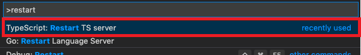
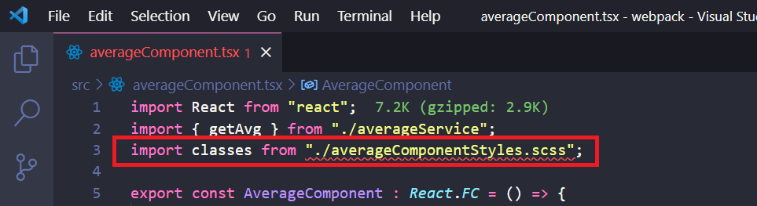
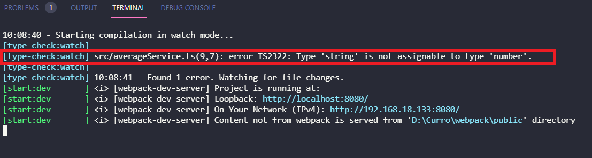
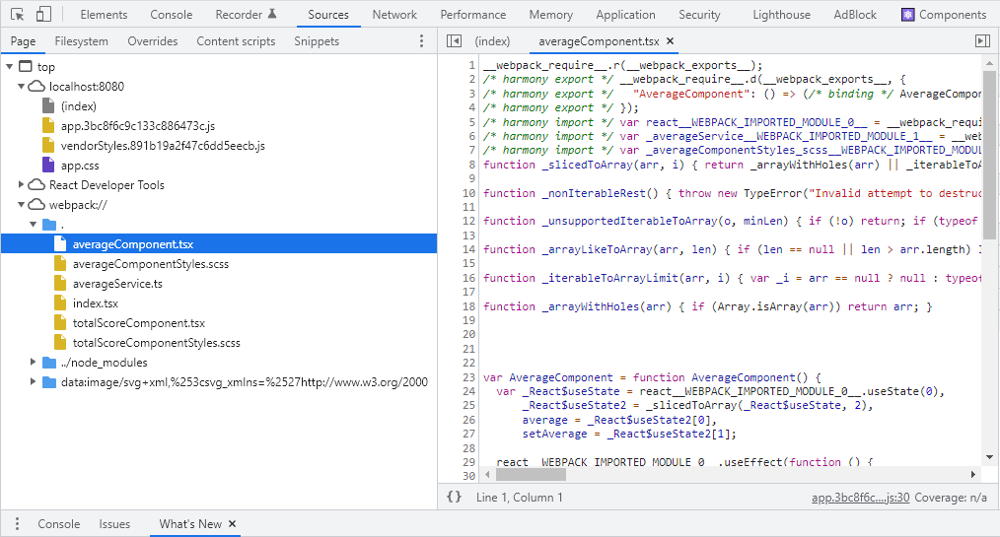

## Soporte a TypeScript

[**TypeScript**](https://www.typescriptlang.org/docs/) es un súper lenguaje de **`ES6`** , tiene una estructura muy intuitiva y se parece a otros lenguajes de programación fuertemente tipados pero, necesita un proceso de transpilación previo a la publicación de nuestra aplicación web ya que los navegadores no lo entienden.

La forma en que se introducía el transpilado de **`webpack`** en el proceso de **`build`** era utilizando un **`loader`** específico para este lenguaje, pero desde que **`Babel`** anuncio su integración con **`TypeScript`** esta aproximación se ha quedado obsoleta, las razones:

- El proceso puede ser lento (aunque algunos _loaders_ tienen algunas funciones de ejecución paralela).
- El escenario ideal era pasar de **`TS`** a **`ES6`** usando **`tsc (Typecript)`** y luego dejar que **`Babel`** hiciera lo suyo con la transpilación.

Ahora mismo hay una solución muy interesante:

- Puedes usar **`Babel`**, un compilador de **`JavaScript`**, que además nos permite transpilar nuestro código de **`TypeScript`** a un código que cualquier navegador pueda entender (si queremos hasta JavaScript ES5): no comprobará errores, pero se ejecutará muy rápido.

> [Más información sobre Babel](https://babeljs.io/)

- Si necesitas ejecutar la verificación de tipos en paralelo puedes hacer uso de
  la herramienta **`tsc`** de **`TypeScript`**.

### Pasos

- Vamos a instalar **`TypeScript`**:

```bash
npm install typescript --save-dev
```

- Vamos a instalar [**`Babel preset`**](https://babeljs.io/docs/en/babel-preset-typescript) para **`TypeScript`**:

```bash
npm install @babel/preset-typescript --save-dev
```

- Vamos a actualizar **`.babelrc`** para añadir los **`presets`** de **`TypeScript`**:

_./.babelrc_

```diff
{
  "presets": [
    "@babel/preset-env",
    "@babel/preset-react",
+   "@babel/preset-typescript"
  ]
}
```

- Creamos un archivo **`tsconfig.json`**, donde guardaremos las opciones de configuración necesarias para compilar nuestro código y le diremos al proyecto que está trabajando con **`TypeScript`**.

> Si quieres ver más información acerca de que opciones tienes en el tsconfig puedes chequear la
> [Documentación oficial del lenguaje](https://www.typescriptlang.org/docs/handbook/tsconfig-json.html)

_./tsconfig.json_

```
{
  "compilerOptions": {
    "target": "es6",
    "module": "es6",
    "moduleResolution": "node",
    "declaration": false,
    "noImplicitAny": false,
    "allowSyntheticDefaultImports": true,
    "sourceMap": true,
    "jsx": "react",
    "noLib": false,
    "skipLibCheck": true,
    "esModuleInterop": true
  },
  "include": ["src/**/*"],
  "exclude": ["node_modules"]
}
```

> NOTA: Algunas veces al añadir este archivo de configuración nos da un error, se soluciona pulsando _View -> Command Palette..._ o para **Mac**: Cmd + Shift + P, para **Windows**: Ctrl + Shift + P, escribimos **_restart_** y le damos a enter:



- Actualicemos la extensión del punto de entrada a **`tsx`**, además de resolver las extensiones:

_./webpack.config.js_

```diff
export default {
  context: path.join(basePath, "src"),
  resolve: {
-    extensions: [".js", ".jsx"]
+    extensions: [".js",".ts", ".tsx"]
  },
  entry: {
-    app: "./index.jsx",
+    app: "./index.tsx",
    vendorStyles: ["../node_modules/bootstrap/dist/css/bootstrap.css"]
  },
```

- Actualizamos **`webpack.config`** para procesar las extensiones **`ts/tsx`**.

_./webpack.config.js_

```diff
  module: {
    rules: [
      {
-        test: /\.jsx?$/,
+        test: /\.tsx?$/,
        exclude: /node_modules/,
        loader: "babel-loader"
      },
      {
        test: /\.scss$/,
```

- Vamos a renombrar todos los archivos **`js/jsx`** a **`ts/tsx`**:

  - averageComponent.jsx >> averageComponent.tsx

  - averageService.js >> averageService.ts

  - index.jsx >> index.tsx

  - totalScoreComponent.jsx >> totalScoreComponent.tsx

- Instalamos los **`typings`** para **`React`** y **`React DOM`**:

```bash
npm install @types/react @types/react-dom --save-dev
```

- Ahora podemos hacer uso de las ventajas de **`TypeScript`**, por ejemplo:

_./src/averageService.ts_

```diff
- export function getAvg(scores) {
+ export function getAvg(scores : number[]) {

  return getTotalScore(scores) / scores.length;
}

- export function getTotalScore(scores) {
+ export function getTotalScore(scores : number[]) {
  return scores.reduce((score, count) => score + count);
}
```

- Incluso tipamos los Componentes de **`React`**:

_./src/totalScoreComponent.tsx_

```diff
- export const TotalScoreComponent = () => {
+ export const TotalScoreComponent : React.FC = () => {
  	const [totalScore, setTotalScore] = React.useState(0);
```

_./src/averageComponent.tsx_

```diff
- export const AverageComponent = () => {
+ export const AverageComponent : React.FC = () => {
  const [average, setAverage] = React.useState(0);
```

- Probamos que todo funciona correctamente:

```bash
npm start
```

- Aunque no se queja al transpilar, si echamos un vistazo a las importaciones, podemos ver que hay errores marcados en **`VSCode`**: **`TypeScript`** no sabe cómo importar un archivo **`scss`**, simplemente lo vamos a declarar como un módulo.



_./src/declaration.d.ts_

```tsx
declare module "*.scss";
```

- Todo esto se ve muy bien, pero ¿qué sucede si introducimos un error **`ts`** en nuestro código?

_./src/averageService.ts_

```diff
export function getAvg(scores: number[]) {
  return getTotalScore(scores) / scores.length;
}

export function getTotalScore(scores: number[]) {
  return scores.reduce((score, count) => score + count);
}

+ const a : number = "this is a string";
```

¡Vaya!, el compilador no lo identifica, **`Babel`** no realiza la verificación de tipo. ¿Qué podemos hacer? ¿Confiar en nuestro IDE? o simplemente ejecutar el chequeo de tipos de **`TypeScript`** por nuestra cuenta (para ello podemos lanzar el proceso **`tsc`** como paso previo al build), en este caso nos podemos preguntar, ¿qué pasaría con el rendimiento si lanzamos _tsc_ y después _babel_? nuestro proceso de _bundling_ sería lento.

Para solucionar este problema vamos a ejecutar **`TypeScript`** y **`babel`** en paralelo, ¿y cómo lo haríamos?

- Primero instamos **`npm-run-all`**, un paquete que nos permitirá ejecutar tareas en paralelo.

```bash
npm install npm-run-all --save-dev
```

- Vamos a mejorar nuestro **`package.json`**, crearemos un nuevo comando solo para ejecutar
  el chequeo de tipos, y otro comando para ejecutar el proceso de build de _webpack_, después
  añadimos _run-p_ para ejecutar ambos en paralelo.

_./package.json_

```diff
"scripts": {
-	 start": "webpack serve --mode development",
+    "start": "run-p -l type-check:watch start:dev",
+    "type-check": "tsc --noEmit",
+    "type-check:watch": "npm run type-check -- --watch",
+    "start:dev": "webpack serve --mode development",
    "build": "webpack --mode development"
  },
```

- Ahora que estamos actualizando nuestra configuración de **`package.json`**, y teniendo en cuenta que en este ejemplo hemos introducido errores de compilación a propósito, vamos a reducir la verbosidad de la salida de **`webpack`** para encontrar rápidamente esos errores:

_./webpack.config.js_

```diff
...
   devServer: {
    port: 8080,
    open: true,
    hot: true,
    static: {
      directory: path.join(__dirname, "src"),
    },
+   devMiddleware: {
+     stats: "errors-only",
+   },
   },
```

[Referencia](https://webpack.js.org/configuration/dev-server/#devserverstats-)

- Ahora si ejecutamos el comando de inicio obtendremos el error en nuestra terminal:

```bash
npm start
```



- Ya tenemos todo el proceso completo, pero.... ¿Qué pasa si queremos depurar nuestra aplicación? Nos podemos encontrar con una sorpresa desagradable, sólo podemos poner **`breakpoints`** en código transpilado (es decir en código **`ES6`**), ¿Hay alguna manera de decirle al navegador que nos permita depurar con los ficheros **`TypeScript`**? La respuesta es sí, vamos a ver cómo generar ficheros **`map`**.

> [Documentación](https://developer.mozilla.org/en-US/docs/Tools/Debugger/How_to/Use_a_source_map)



_./webpack.config.js_

```diff
...
+ devtool: 'eval-source-map',
  devServer: {
    port: 8080,
    devMiddleware: {
      stats: "errors-only",
    },
  },
```

> Si quieres saber más sobre qué tipos de ficheros map y opciones ha disponibles puedes chequear [la documentación oficial](https://webpack.js.org/configuration/devtool/)

- ¡¡¡ Ahora podemos poner _breakpoints_ directamente en los ficheros TS !!!

  

## Sumario

1. Instalamos **`TypeScript`** y **`Babel preset-typescript`**.
2. Actualizamos **`.babelrc`** para agregar ajustes preestablecidos de **`Typescript`**.
3. Creamos un **`tsconfig`** (para configurar nuestro **`TypeScript`**).
4. Actualizamos **`webpack.config.js`** para procesar **`ts/tsx`**.
5. Renombramos todos los archivos **`js/jsx`** a **`ts/tsx`**.
6. Añadimos los **`typing`** de `**React**` y **`React DOM`** para **`TypeScript`**.
7. Empezamos a utilizar los tipados (variables básicas, etc.).
8. Creamos una declaración para transformar las hojas de estilos a módulos.
9. Instalamos **`npm-run-all`** (ejecutar comandos en paralelo).
10. Actualizamos el comando **`start`** del **`package.json`** para proveer soporte **`TypeScript`**.
11. Reducimos la verbosidad de la salida por consola de **`webpack`**.
12. agregar **`sourcemaps`** para que nos facilite las cosas a la hora de depurar.

# ¿Te apuntas a nuestro máster?

Si te ha gustado este ejemplo y tienes ganas de aprender Front End
guiado por un grupo de profesionales ¿Por qué no te apuntas a
nuestro [Máster Front End Online Lemoncode](https://lemoncode.net/master-frontend#inicio-banner)? Tenemos tanto edición de convocatoria
con clases en vivo, como edición continua con mentorización, para
que puedas ir a tu ritmo y aprender mucho.

También puedes apuntarte a nuestro Bootcamp de Back End [Bootcamp Backend](https://lemoncode.net/bootcamp-backend#inicio-banner)

Y si tienes ganas de meterte una zambullida en el mundo _devops_
apuntate nuestro [Bootcamp devops online Lemoncode](https://lemoncode.net/bootcamp-devops#bootcamp-devops/inicio)
