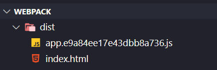
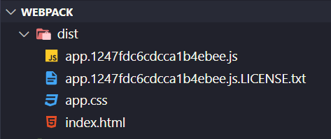
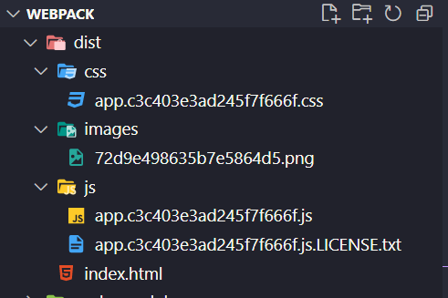

# Configurando entornos

Llegados a este punto, nos gustaría dividir nuestro proyecto en diferentes configuraciones, podríamos tener una para desarrollo y otra para producción, pero nos encontramos con la siguiente problemática:

- Si creamos dos configuraciones (por ejemplo desarrollo y producción), creando dos duplicados y después personalizando cada una, nos
  vamos a encontrar con varios problemas: Por un lado tenemos mucho código en común y, por otra parte, ¿qué sucede si necesitamos crear composiciones más específicas?, ¿debemos hacer copy paste de las partes comunes?, y si algún día cambia un componente en común ¿tenemos que cambiar todos los ficheros?, es decir, su mantenimiento acabaría siendo una pesadilla.
- Debemos encontrar la manera de tener una estructura común, y a partir de esa base, crear diferentes configuraciones más específicas.

## Pasos

- Vamos a crear un archivo nuevo llamado **`webpack.common.js`** , copiamos todo el contenido de **`webpack.config.js`** y eliminamos las configuraciones que no son comunes.
  - Eliminamos **`MiniCssExtractPlugin`** que no será necesario en desarrollo (usamos en este caso **`style-loader`**) y Lo utilizaremos en producción.
  - También **`devtool`** y **`devServer`** que sólo irán a desarrollo.
  - Suprimimos el **`loader`** de **`css`** que recorría **`node_modules`** para encontrar **`bootstrap`** que tampoco lo necesitaremos.

_./webpack.common.js_

```diff
const HtmlWebpackPlugin = require("html-webpack-plugin");
- const MiniCssExtractPlugin = require("mini-css-extract-plugin");
const { CleanWebpackPlugin } = require("clean-webpack-plugin");
const path = require("path");

module.exports = {
  context: path.resolve(__dirname, "./src"),
  resolve: {
    extensions: [".js", ".ts", ".tsx"],
  },
  entry: {
    app: "./index.tsx",
-    vendorStyles: ["../node_modules/bootstrap/dist/css/bootstrap.css"],
  },
  output: {
    filename: "[name].[chunkhash].js",
    path: path.resolve(__dirname, "dist"),
  },
  module: {
    rules: [
      {
        test: /\.tsx?$/,
        exclude: /node_modules/,
        loader: "babel-loader",
      },
-      {
-        test: /\.scss$/,
-        exclude: /node_modules/,
-        use: [
-          MiniCssExtractPlugin.loader,
-          {
-            loader: "css-loader",
-            options: {
-              modules: {
-                exportLocalsConvention: "camelCase",
-                localIdentName: "[path][name]__[local]--[hash:base64:5]",
-                localIdentContext: path.resolve(__dirname, "src"),
-              },
-            },
-          },
-          "sass-loader",
-        ],
-      },
-      {
-        test: /\.css$/,
-        use: ["style-loader", "css-loader"],
-      },
    ],
  },
  plugins: [
    //Generate index.html in /dist => https://github.com/ampedandwired/html-webpack-plugin
    new HtmlWebpackPlugin({
      filename: "index.html", //Name of file in ./dist/
      template: "./index.html", //Name of template in ./src
      scriptLoading: "blocking", // Load the scripts correctly
    }),
-    new MiniCssExtractPlugin({
-      filename: "[name].css",
-      chunkFilename: "[id].css",
-    }),
    new CleanWebpackPlugin(),
-  ],
-  stats: "errors-only",
-  devtool: 'eval-source-map',
-  devServer: {
-    port: 8080,
-  },
};

```

- Es hora de crear nuestra versión de desarrollo para **`webpack`**, comenzamos importando **`common`** y luego agregamos su configuración específica.
- Creamos nuestro archivo **`webpack.dev.js`**.

_./webpack.dev.js_

```javascript
const common = require("./webpack.common.js");

module.exports = {};
```

- ¿Tenemos alguna herramienta para dejar caer toda la estructura en común de nuestro código y expandirlo con la que queramos? **`JavaScript`** nos proporciona el **`spread operator`**, que nos dice, déjame todo lo que hay en **`common`** y añádele la configuración específica para desarrollo.

_./webpack.dev.js_

```diff
const common = require("./webpack.common.js");
const path = require("path");

module.exports = {
+  ...common,
+  module: {
+    rules: [
+      {
+        test: /\.scss$/,
+        exclude: /node_modules/,
+        use: [
+          "style-loader",
+          {
+            loader: "css-loader",
+            options: {
+              modules: {
+                exportLocalsConvention: "camelCase",
+                localIdentName: "[path][name]__[local]--[hash:base64:5]",
+                localIdentContext: path.resolve(__dirname, "src"),
+              },
+            },
+          },
+          "sass-loader",
+        ],
+      },
+    ],
+  },
+  stats: "errors-only",
+  devtool: "eval-source-map",
+  devServer: {
+    port: 8080,
+  },
};
```

- Esto parece que está muy bien, pero nos puede llevar a problemas, ya que si en una subsección hay ya información, corremos
  el riesgo de que se sobreescriba, para ello debemos de usar un método más elaborado para mezclar **`common`** y **`dev`**,
  **`webpack`** nos provee de una herramienta llamada **`webpack-merge`**, que nos permitirá tener una configuración común de **`webpack`** y poder mezclarlas de forma inteligente (más información: https://stackoverflow.com/questions/51202701/what-is-the-difference-between-webpack-merge-and-object-assign).

Vamos a instalar la herramienta:

> [Documentación](https://webpack.js.org/guides/production/)

```bash
$ npm install webpack-merge --save-dev
```

- Y para utilizarlo lo hacemos de la siguiente forma:

```diff
+ const { merge } = require("webpack-merge");
const common = require("./webpack.common.js");

- module.exports = {
+ module.exports = merge(common, {
- ...common,
.....
- };
+ });
```

- A continuación, cambiamos el **`package.json`** para que ejecute la **`build`** de desarrollo,
  fíjate que añadimos un parámetro _--config_ y a continuación el nombre del fichero de configuración
  de desarrollo (esto podríamos llamarlo como quisiéramos).

```diff
  "scripts": {
     "start": "run-p -l type-check:watch start:dev",
- 	 "build": "run-p -l type-check build:dev",
     "type-check": "tsc --noEmit",
     "type-check:watch": "npm run type-check -- --watch",
-    "start:dev": "webpack serve --mode development",
+    "start:dev": "webpack serve --mode development --config webpack.dev.js",
+    "build:dev": "webpack --mode development --config webpack.dev.js"
},
```

Es hora de configurar el entorno de producción, seguiremos pasos similares a los de desarrollo:

- Creamos el archivo **`webpack.prod.js`**.
- En este caso vamos a utilizar **`MiniCssExtractPlugin`**, añadimos el **`plugin`** para que nos cree el archivo **`css`** y le quitamos la referencia tanto al **`path`** como al nombre del componente ya que esto nos daría igual que apareciera en producción.

_./webpack.prod.js_

```javascript
const { merge } = require("webpack-merge");
const MiniCssExtractPlugin = require("mini-css-extract-plugin");
const common = require("./webpack.common.js");

module.exports = merge(common, {
  module: {
    rules: [
      {
        test: /\.scss$/,
        exclude: /node_modules/,
        use: [
          MiniCssExtractPlugin.loader,
          {
            loader: "css-loader",
            options: {
              modules: {
                exportLocalsConvention: "camelCase",
              },
            },
          },
          "sass-loader",
        ],
      },
    ],
  },
  plugins: [
    new MiniCssExtractPlugin({
      filename: "[name].css",
      chunkFilename: "[id].css",
    }),
  ],
});
```

- Genial, tenemos ambas configuraciones, es hora de actualizar de nuevo el **`package.json`** y añadir nuestra **`build`** de producción.

_./package.json_

```diff
"scripts": {
    "start": "run-p -l type-check:watch start:dev",
    "type-check": "tsc --noEmit",
    "type-check:watch": "npm run type-check -- --watch",
    "start:dev": "webpack serve --mode development --config webpack.dev.js",
	"build:dev": "webpack --mode development --config webpack.dev.js"
+   "build:prod": "webpack --mode production --config webpack.prod.js"
  },
```

- El modo producción o desarrollo sería más interesante tenerlo dentro de los archivos que en el **`package.json`**, ¿cómo lo hacemos?

_./webpack.dev.js_

```diff
const { merge } = require("webpack-merge");
const common = require("./webpack.common.js");

const path = require("path");

module.exports = merge(common, {
+  mode: "development",
   module: {
     rules: [
```

_./webpack.prod.js_

```diff
const { merge } = require("webpack-merge");
const MiniCssExtractPlugin = require("mini-css-extract-plugin");
const common = require("./webpack.common.js");

module.exports = merge(common, {
+  mode: "production",
   module: {
```

- Y modificamos el **`package.json`**:

_./package.json_

```diff
"scripts": {
    "start": "run-p -l type-check:watch start:dev",
    "build": "run-p -l type-check build:dev",
    "type-check": "tsc --noEmit",
    "type-check:watch": "npm run type-check -- --watch",
-   "start:dev": "webpack serve --mode development --config webpack.dev.js",
+   "start:dev": "webpack serve --config webpack.dev.js",
-   "build:dev": "webpack --mode development --config webpack.dev.js",
+	"build:dev": "webpack --config webpack.dev.js",
-   "build:prod": "webpack --mode production --config webpack.prod.js"
+   "build:prod": "webpack --config webpack.prod.js"
  },
```

- Si quieres probar la compilación de desarrollo, simplemente ejecutamos:

```bash
$ npm run build:dev
```



- O si por el contrario queremos construir la de producción, vemos que crea un archivo **`css`** con los estilos de la aplicación:

```bash
$ npm run build:prod
```



Hasta ahora, todo esta está muy bien pero ¿no sería mejor que en producción estén los archivos agrupados por tipos?

- Primero vamos a añadir una imagen a nuestra aplicación.
- Para que nuestro **`IDE`** no lance un error de tipado con las imágenes, igual que sucedía con los archivos **`scss`**, tenemos que añadir una declaración a esos ficheros para que los transforme a módulos.

_./src/declaration.d.ts_

```diff
declare module "*.scss";
+ declare module "*.png";
```

- Tenemos que volver a añadir nuestro **`loader`** para las imágenes.

_./webpack.common.js_

```diff
 .....
 module: {
    rules: [
      {
        test: /\.tsx?$/,
        exclude: /node_modules/,
        loader: "babel-loader",
      },
+      {
+        test: /\.(png|jpg)$/,
+        type: "asset/resource",
+      },
    ],
 .....
```

- Importamos y añadimos una imagen al **`index.tsx`**:

_./src/index.tsx_

```diff
import React from "react";
import { createRoot } from "react-dom/client";
import { AverageComponent } from "./averageComponent";
import { TotalScoreComponent } from './totalScoreComponent';
+ import logo from './content/logo_1.png';

const root = createRoot(document.getElementById("root"));
root.render(
  <div>
    <h1>Hello from React DOM</h1>
+   
    <AverageComponent />
    <TotalScoreComponent />
  </div>
);
```

- Y agrupamos por carpetas cuando compilamos el **`bundle`**.

_./webpack.prod.js_

```diff
...
module.exports = merge(common, {
  mode: "production",
  output: {
+   filename: "js/[name].[chunkhash].js",
+   assetModuleFilename: "images/[hash][ext][query]",
  },
...
  plugins: [
    new MiniCssExtractPlugin({
-     filename: "[name].[chunkhash].css",
+     filename: "css/[name].[chunkhash].css",
      chunkFilename: "[id].css",
    }),
  ],
});
```

- Si ahora volvemos a crear nuestra **`build`**.

```bash
$ npm run build:prod
```

- El resultado sería mucho más ordenado y más visible.



- Ya podemos borrar **`webpack.config.js`**, nos quedamos con nuestra configuración _common_
  base, _dev_ para desarrollo y _prod_ para producción.

## Sumario

1. Hemos creado un archivo llamado **`webpack.common.js`**, y añadimos toda la configuración en común.
2. Creamos **`webpack.dev.js`** para desarrollo.
3. Instalamos **`webpack-merge`** para poder incluir el código en común sin sobrescribir nada.
4. Añadimos otro archivo para producción **`webpack.prod.js`**.
5. Borramos **`webpack.config.js`**.

# ¿Te apuntas a nuestro máster?

Si te ha gustado este ejemplo y tienes ganas de aprender Front End
guiado por un grupo de profesionales ¿Por qué no te apuntas a
nuestro [Máster Front End Online Lemoncode](https://lemoncode.net/master-frontend#inicio-banner)? Tenemos tanto edición de convocatoria
con clases en vivo, como edición continua con mentorización, para
que puedas ir a tu ritmo y aprender mucho.

También puedes apuntarte a nuestro Bootcamp de Back End [Bootcamp Backend](https://lemoncode.net/bootcamp-backend#inicio-banner)

Y si tienes ganas de meterte una zambullida en el mundo _devops_
apuntate nuestro [Bootcamp devops online Lemoncode](https://lemoncode.net/bootcamp-devops#bootcamp-devops/inicio)
