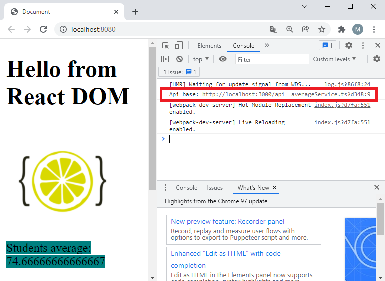
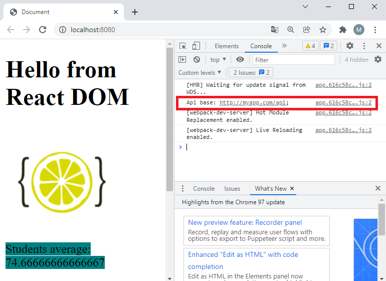
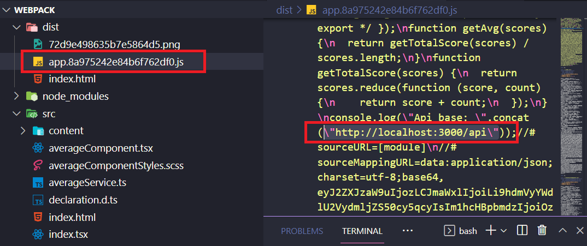
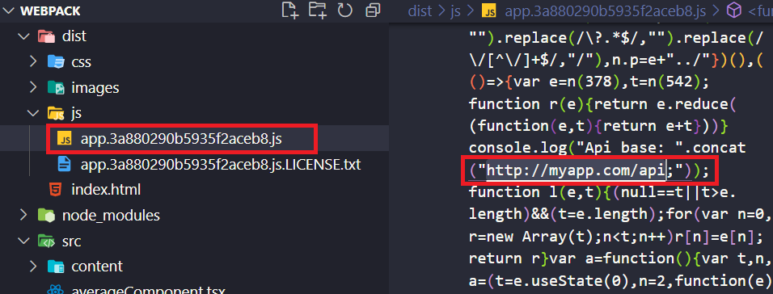

# Añadiendo Variables de Entorno

- Imaginemos que tenemos una _api rest_ para desarrollo local, y tenemos otra en la nube para el entorno de producción, y nos gustaría poder cambiar de una a otra sin tener que ponernos a tocar código, sin tirar de ayudas podríamos pensar en poner un _flag_, y llenar nuestra aplicación de _"if"_ como el que puedes ver más abajo, esto se convertiría en algo inmanejable (no te digo nada... si encima tenemos entornos de preproducción etc...)

```javascript
if (isDevelopment) {
  fetch("http://localhost:3000/api/members");
} else {
  fetch("http://myapp.com/api/members");
}
```

- Deberíamos tener alguna forma de gestionar ciertas variables que hicieran esto por nosotros y me despreocupara si estoy en desarrollo o en producción. Este ejemplo (que no funciona, al llamarse las dos variable igual), nos sirve para hacernos a la idea, que según en el entorno que estemos, utilizamos diferentes declaraciones:

```javascript
const API_BASE = http://localhost:3000/api;
const API_BASE = http://myapp.com/api;

fetch(`${API_BASE}/members`);

```

- Ya que tenemos los ficheros separados para cada entorno, sería interesante decirle a la variable **`API_BASE`** que apunte a un lugar o a otro, según estemos trabajando en desarrollo o en producción, a esto se le conoce como **variables de entorno**. Desde la última versión de **`node`** ya tenemos soporte para variables de entorno.

> [Documentación](https://nodejs.org/en/blog/release/v20.6.0)

En la versión anterior de **`node`** teníamos que tirar de librerías de terceros, como **`dotenv`**.

> [Documentación](https://www.npmjs.com/package/dotenv-webpack)

## Pasos

- Vamos a instalar **`dotenv-webpack`**:

```bash
npm install dotenv-webpack --save-dev
```

- Vamos a crear dos archivos para nuestros entornos, uno para desarrollo y otro para producción.

_./dev.env_

```env
API_BASE=http://localhost:3000/api
```

_./prod.env_

```env
API_BASE = http://myapp.com/api
```

- Agregamos el entorno a la configuración de desarrollo:

_./webpack.dev.js_

```diff
import { merge } from "webpack-merge";
import common from "./webpack.common.js";
import path from "path";
import url from "url";
+ import Dotenv from "dotenv-webpack";
...
+ plugins: [
+   new Dotenv({
+     path: './dev.env',
+   }),
+ ],
});
```

- Ahora a **`webpack.prod.js`**:

_./webpack.prod.js_

```diff
import { merge } from "webpack-merge";
import common from "./webpack.common.js";
import MiniCssExtractPlugin from "mini-css-extract-plugin";
+ import Dotenv from "dotenv-webpack";
...
  plugins: [
    new MiniCssExtractPlugin({
      filename: "css/[name].[chunkhash].css",
      chunkFilename: "[id].css",
    }),
+   new Dotenv({
+     path: "./prod.env",
+   }),
  ],
});
```

- Introducimos un test en nuestro código para ver que está funcionando correctamente.

_./src/averageService.ts_

```diff
.....
+ console.log(`Api base: ${process.env.API_BASE}`);
```

- Agregamos una nueva línea de configuración al **`package.json`** para iniciar nuestro servidor en modo producción.

_./package.json_

```diff
"scripts": {
    "start": "run-p -l type-check:watch start:dev",
    "build": "run-p -l type-check build:dev",
    "type-check": "tsc --noEmit",
    "type-check:watch": "npm run type-check -- --watch",
    "start:dev": "webpack serve --config webpack.dev.js",
+   "start:prod": "webpack serve --config webpack.prod.js",
    "build:dev": "webpack --config webpack.dev.js",
    "build:prod": "webpack --config webpack.prod.js"
  },
```

- Probamos la configuración de desarrollo, ejecuta el siguiente comando desde la terminal y abre la consola de tu navegador:

```bash
npm start
```



- Ahora lo probamos en producción:

```bash
npm run start:prod
```



Y vamos a ver las diferencias entre el código generado.

- Después de crear la **`build`** de desarrollo vemos la referencia, dentro del archivo generado, a la variable de entorno:

```bash
$ npm run build:dev
```



- Aquí vemos referencia a nuestra **`API`** en producción:

```bash
$ npm run build:prod
```



## Sumario

1. Instalamos **`dotenv-webpack`**.
2. Creamos entornos para desarrollo y producción.
3. Configuramos **`webpack.dev.js`** y **`webpack.prod.js`**.
4. Actualizamos **`package.json`**.

# ¿Te apuntas a nuestro máster?

Si te ha gustado este ejemplo y tienes ganas de aprender Front End
guiado por un grupo de profesionales ¿Por qué no te apuntas a
nuestro [Máster Front End Online Lemoncode](https://lemoncode.net/master-frontend#inicio-banner)? Tenemos tanto edición de convocatoria
con clases en vivo, como edición continua con mentorización, para
que puedas ir a tu ritmo y aprender mucho.

También puedes apuntarte a nuestro Bootcamp de Back End [Bootcamp Backend](https://lemoncode.net/bootcamp-backend#inicio-banner)

Y si tienes ganas de meterte una zambullida en el mundo _devops_
apuntate nuestro [Bootcamp devops online Lemoncode](https://lemoncode.net/bootcamp-devops#bootcamp-devops/inicio)