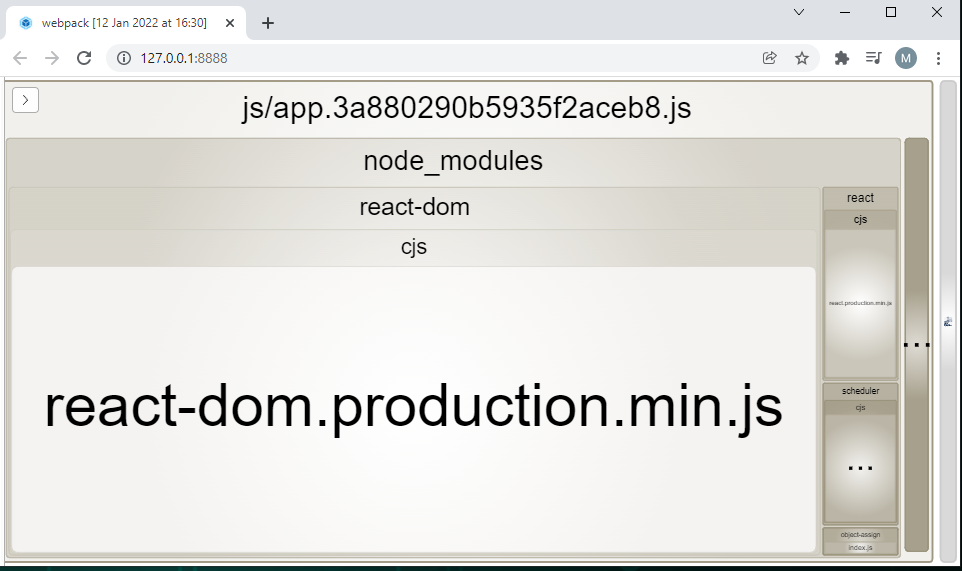
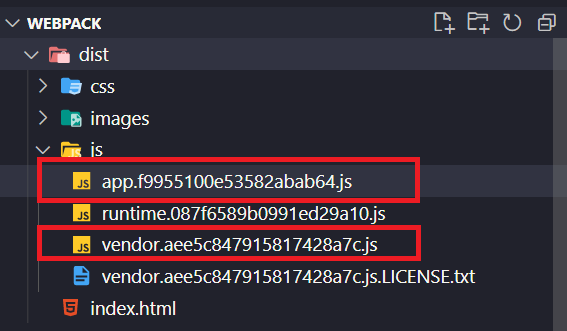
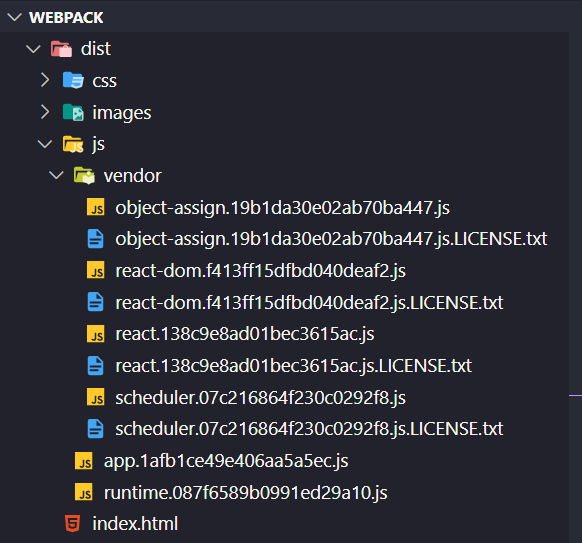
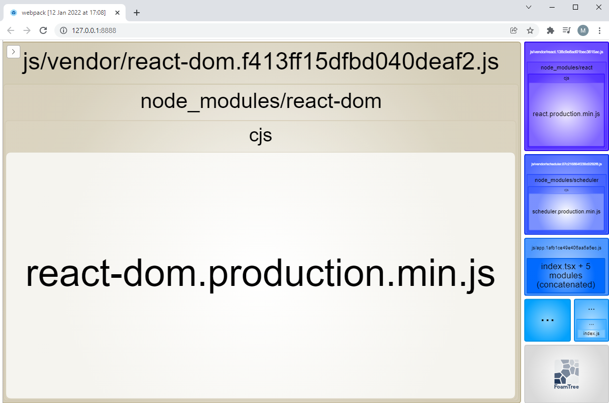

# Calculando el peso de nuestra compilación

Cuando arrancamos un desarrollo web, nos las vemos muy felices, empezamos a usar librerías de terceros, lógica de nuestra aplicación, incluimos recursos tales como iconos o fuentes... todo en local funciona a las mil maravillas, sin embargo, cuando salimos a producción, podemos ver que si la conexión a internet no es muy buena (por ejemplo una conexión móvil en ciertas áreas) la aplicación va muy lenta... si abres el capó te puedes dar cuenta de que tu **`bundle`** puedes pesar ¡varios megas! en algunos desarrollos he llegado a ver ficheros JS que pesaban 7 o 14 megas, ¿Cuál es el problema de esto? Qué tu aplicación se vuelve pesada y tarda en cargar, incluso en algunos casos el que tu app tarde unos segundos de más en cargar puede hacer que tus clientes potenciales se vayan a la competencia (por ejemplo [Un segundo de retraso en carga le suponen perdidas millonarias a Amazon](https://www.fastcompany.com/1825005/how-one-second-could-cost-amazon-16-billion-sales)).

Con **`webpack`** contamos con _plugins_ que nos muestran de forma gráfica que partes ocupan más peso en nuestra aplicación, esto nos puede ser de gran ayuda para detectar posibles problemas.

En este ejemplo vamos a configurar el **`plugin`** **`Wepback Bundle Analyzer`**, que nos ayuda a visualizar el tamaño de los archivos de salida de **`webpack`** con un mapa de árbol interactivo. Veremos las diferentes partes del **`bundle`**, y podremos chequear si hay módulos que pesan demasiado, o incluso, que estén en nuestro _bundle_ por error.

## Pasos

- Vamos a instalar el plugin:

```bash
npm install webpack-bundle-analyzer --save-dev
```

- Creamos una nueva configuración de **`webpack`**, la llamaremos **`webpack.perf.js`**.
- El cálculo del peso lo haremos sobre el **`bundle`** que irá a producción, así tomaremos esa configuración como base.
- E incorporaremos el **`plugin`** a nuestra nueva configuración.

_./webpack.perf.js_

```javascript
import { merge } from "webpack-merge";
import prod from "./webpack.prod.js";
import { BundleAnalyzerPlugin } from "webpack-bundle-analyzer";

export default merge(prod, {
  plugins: [new BundleAnalyzerPlugin()],
});
```

- Vamos a crear un nuevo **`script`** en el **`package.json`** que va a tirar del fichero
  _webpack.perf.js_ que acabamos de crear.

_./package.json_

```diff
"scripts": {
    "start": "run-p -l type-check:watch start:dev",
    "build": "run-p -l type-check build:dev",
    "type-check": "tsc --noEmit",
    "type-check:watch": "npm run type-check -- --watch",
    "start:dev": "webpack serve --config webpack.dev.js",
    "start:prod": "webpack serve --config webpack.prod.js",
    "build:dev": "webpack --config webpack.dev.js",
    "build:prod": "webpack --config webpack.prod.js",
+   "build:perf": "npm run type-check && webpack --config webpack.perf.js"
  },
```

- Ejecutamos el **`script`**:

```bash
npm run build:perf
```

- Y Directamente se abre una web en nuestro navegador, donde veremos cuánto pesa cada parte de la aplicación.



- Como podemos ver, hemos mezclado el código de la aplicación con el código de **`vendor`** (nuestra librería de terceros), podemos usar la función de **`webpack`** llamada [splitChunks](https://webpack.js.org/guides/code-splitting/#splitchunksplugin) que nos lo separara en dos archivos diferentes.

_./webpack.prod.js_

```diff
.....
  output: {
    filename: "js/[name].[chunkhash].js",
    assetModuleFilename: "images/[hash][ext][query]",
  },
+ optimization: {
+   runtimeChunk: 'single',
+   splitChunks: {
+     cacheGroups: {
+       vendor: {
+         chunks: 'all',
+         name: 'vendor',
+         test: /[\\/]node_modules[\\/]/,
+         enforce: true,
+       },
+     },
+   },
+ },
```

- Lanzamos de nuevo la **`build`**

```bash
npm run build:prod
```

- Ahora nos sacaría un **`bundle`** con el código de aplicación y otro con la librería de terceros.



- Incluso podemos crear una carpeta donde cada **`vendor`** tenga su propio **`bundle`**:

_./webpack.prod.js_

```diff
...
  output: {
    filename: "js/[name].[chunkhash].js",
    assetModuleFilename: "images/[hash][ext][query]",
  },
  optimization: {
    runtimeChunk: 'single',
    splitChunks: {
      cacheGroups: {
        vendor: {
          chunks: 'all',
-         name: 'vendor',
+         name: (module) => {
+           const packageName = module.context.match(
+             /[\\/]node_modules[\\/](.*?)([\\/]|$)/
+           )?.[1];
+           return packageName
+             ? `vendor/${packageName.replace("@", "")}`
+             : null;
+         },
          test: /[\\/]node_modules[\\/]/,
          enforce: true,
        },
      },
    },
  },
```

> Referencias
>
> [SplitChunks](https://webpack.js.org/plugins/split-chunks-plugin/#optimizationsplitchunks)
>
> https://medium.com/hackernoon/the-100-correct-way-to-split-your-chunks-with-webpack-f8a9df5b7758

- Lanzamos de nuevo la **`build`**

```bash
npm run build:prod
```



- Vemos ahora que tenemos un **`bundle`** para cada **`vendor`**.

```bash
npm run build:perf
```

- Y ya lo vemos más detallado:



## Sumario

1. Instalamos **`webpack-bundle-analyzer`**.
2. Creamos **`webpack.perf.js`**.
3. Actualizamos el **`package.json`**.
4. Añadimos [splitChunks](https://webpack.js.org/guides/code-splitting/#splitchunksplugin) a **`webpack.prod.js`**, y crea una compilación para la aplicación y otra para **`node_modules`**.
5. Agregamos configuración a **`webpack.prod.js`** para que cree una carpeta llamada **`vendor`** y dentro de ella cree un **`bundle`** para cada librería de terceros.

# ¿Te apuntas a nuestro máster?

Si te ha gustado este ejemplo y tienes ganas de aprender Front End
guiado por un grupo de profesionales ¿Por qué no te apuntas a
nuestro [Máster Front End Online Lemoncode](https://lemoncode.net/master-frontend#inicio-banner)? Tenemos tanto edición de convocatoria
con clases en vivo, como edición continua con mentorización, para
que puedas ir a tu ritmo y aprender mucho.

También puedes apuntarte a nuestro Bootcamp de Back End [Bootcamp Backend](https://lemoncode.net/bootcamp-backend#inicio-banner)

Y si tienes ganas de meterte una zambullida en el mundo _devops_
apuntate nuestro [Bootcamp devops online Lemoncode](https://lemoncode.net/bootcamp-devops#bootcamp-devops/inicio)
