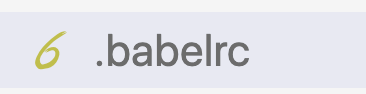

# Guía de errores tontos >> posible solución

# No me reconoce el contenido jsx de React

Tengo el siguiente error:

```
ERROR in ./index.jsx
Module build failed (from ../node_modules/babel-loader/lib/index.js):
SyntaxError: /Users/brauliodiez/Downloads/reactdemo-master/src/index.jsx: Unexpected token (6:2)

  4 |
  5 | ReactDOM.render(
> 6 |   <div>
    |   ^
  7 |     <h1>Hello from React!</h1>
  8 |     <AverageComponent />
  9 |   </div>,
    at Parser._raise (/Users/brauliodiez/Downloads/reactdemo-master/node_modules/@babel/parser/lib/index.js:746:17)
```

Lo que está pasando aquí es que el loader encuentra el fichero, pero no es capaz de parsear el JSX (este JSX es un XML
que se convierte a una ristra de código JavaScript).

De donde puede venir el problema:

1. ¿ Has añadido el _@babel/preset-react_ a los presets de _.babelrc_ ?

```bash
npm install @babel/preset-react --save-dev
```

_./.babelrc_

```json
{
  "presets": ["@babel/preset-env", "@babel/preset-react"]
}
```

2. ¿El fichero ".babelrc" lo has nombrado bien? Si estás con code te tiene que aparece de esta manera en la lista de ficheros de tu proyecto en VSCode:


