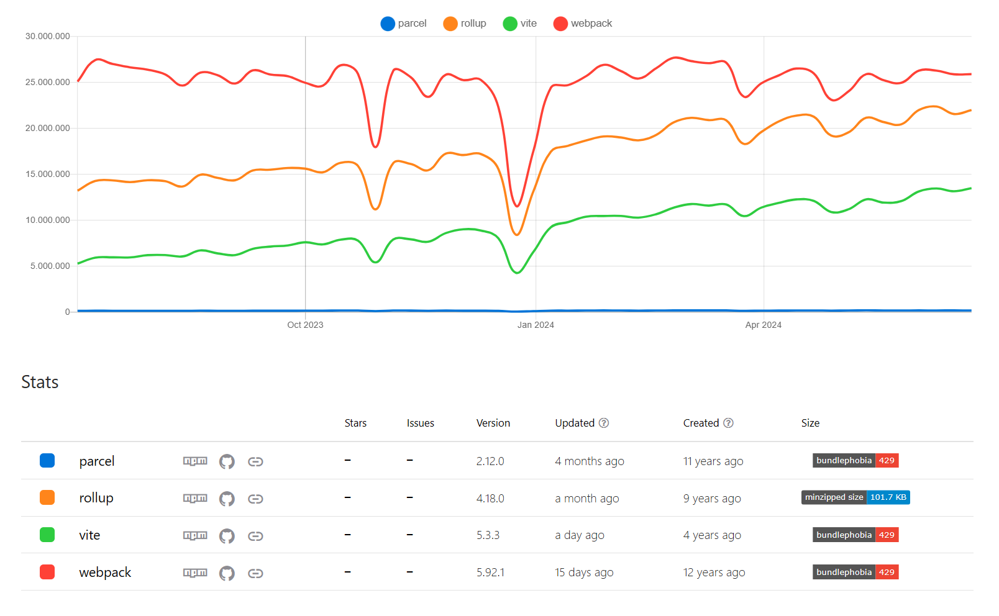
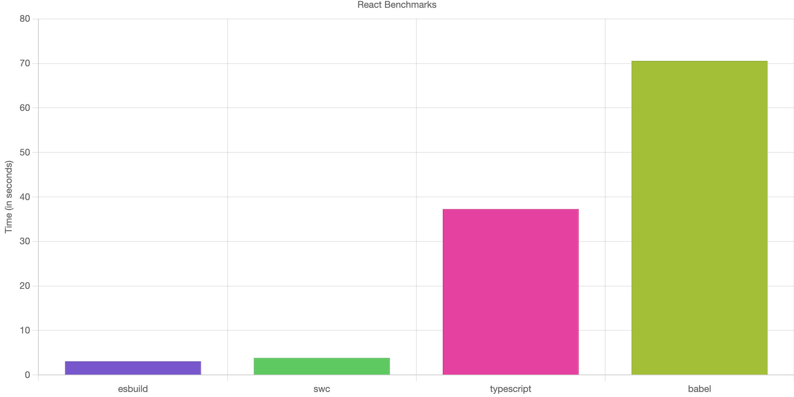

# Introducción a `vite`

## Panorama actual

El panorama de los _bundlers_ está relativamente maduro y es un nicho de mercado bastante copado. Es decir, hay una buena variedad de _bundlers_, bastante efectivos todos ellos a la hora de empaquetar y productificar nuestro código fuente en front. Por supuesto, exiten matices de uno a otro, y han evolucionado corrigiendo sus propios errores e inspirándose en sus competidores. Cada uno ha tratado de poner el foco en diferentes problemáticas que han ido surgiendo de manera natural, por ejemplo:

- `webpack` ha sido (y es) el rey de los _bundlers_ por su extensísima flexibilidad y variado ecosistema de plugins, elección casi de facto en proyectos complejos. Sin embargo, esta potencia también implica una curva de aprendizaje más abrupta, fatiga por configuraciones tediosas, o tiempo elevado hasta puesta en producción.

- Para solventar esa fatiga, aparecen _bundlers_ como `parcel`, sin necesidad de un fichero de configuración ('zero configuration'), y listo para funcionar sin más, 'out of the box', ofreciendo un amplio abanico de loaders por defecto y settings preestablecidos para los escenarios más comunes. Si bien la premisa 'zero config' puede funcionar en proyectos pequeños, no es realista en proyectos a gran escala.

- Muchos de estos _bundlers_ han crecido siguiendo el modelo de navaja suiza: abarcarlo todo (empaquetado de código, HTML templating, optimización de imágenes, procesado de CSS, etc). Como respueta, aparecen otros _bundlers_ como `rollup`, que se concentra en el manejo de código javascript, y delegando el resto de funcionalidad a los plugins. Se suele decir que `rollup` es un _bundler_ de nueva generación, su propósito es ser equilibrado e intentar perfeccionar lo ya existente, aunque no siempre lo consigue.

  - No llega 'zero config' de `parcel` pero ofrece un setup reducido en comparación a `webpack`.
  - Cubre gran parte de la funcionalidad de `webpack` mejorando tamaño de salida de los _bundles_ gracias a optimizaciones refinadas, aunque en cuanto a rendimiento no añade mejoras.

- Y finalmente así llegamos al problema estrella, el que se ha llevado toda la atención recientemente: el rendimiendo. Lo trataremos en su propio apartado, pero antes veamos un resumen:

## Comparativa resumida

#### ⚡ En una frase

- `webpack`: Power vs Complexity. Large projects.
- `parcel`: Simplicity vs Too much abstraction. Simple projects.
- `rollup`: Balance vs Performance. No dependency (minimal third parties) libraries.

#### 📊 [Estadísticas](https://www.npmtrends.com/parcel-vs-rollup-vs-webpack)

## El problema del rendimiento

Cada vez diseñamos aplicaciones más complejas y ambiciosas. A medida que los proyectos han ido creciendo, con cientos o incluso miles de módulos, nos encontramos con un cuello de botella en los _bundlers_ tradicionales, que penalizan el tiempo de generación de nuestros paquetes o la puesta en marcha o disponibilidad de un servidor de desarrollo.

Ahora que la lupa está puesta en maximizar la velocidad y experiencia de desarrollo, se empieza a cuestionar que Javascript sea el lenguaje adecuado para desarrollar todo este 'tooling' relacionado con la construcción de proyectos. La **nueva tendencia** parece ser el uso de **lenguajes de bajo nivel y alto rendimiento** para las herramientas dedicadas a la **compilación y construcción de aplicaciones Javascript**.

Con esa premisa, han aparecido algunos _transformers_ novedosos como `swc` (2019, escrito en Rust) o `esbuild` (2020, escrito en Go) asi como otros proyectos ambiciosos como `rome` (del creador de `babel`, escrito en Rust). Además de _transformers_, toda esta nueva generación de herramientas puede ser usada como _bundlers_ también.

> Un transformador (loaders en webpack) es el encargado parsear y transpilar código javascript (o typescript). Los _bundlers_ utilizan estos transformadores internamente para recopilar múltiples ficheros de código y otros assets y generar el _bundle_. Los más conocidos actualmente son `babel` y `tsc`.

## Vite entra en escena

Vite irrumpe fuertemente decidido a mejorar drásticamente la experiencia de los desarrolladores, hacerlos más productivos y felices. Y para ello, identifica 2 puntos clave:

- Minimizar el tiempo de arranque del servidor de desarrollo.
- Minimizar el retardo desde que editamos código hasta que se refleja en el navegador.

Ambos objetivos tienen que ver con el flujo de desarrollo, y no de producción. Y aquí es donde `vite` se desmarca del resto de _bundlers_ tradicionales:

> Establece **2 flujos** claramente diferenciados, **desarrollo y producción**, y aplica una **aproximación diferente** en cada uno de ellos: si bien sigue una estrategia de _bundling_ clásico para producción, aplica un paradigma nuevo en desarrollo basado en módulos nativos ECMAScript y delegando el trabajo de _bundling_ al propio browser.

⚡ ¿Por qué no primamos la velocidad y el rendimiento en desarrollo y la optimización en producción, usando las herramientas más adecuadas para cada caso?

## Flujo de Desarrollo

Aqui es donde `vite` toma un camino totalmente diferenciado del _bundling_ tradicional.

En desarrollo repetimos las mismas operaciones decenas o cientos de veces al día: levantamos el _dev server_, desarrollamos código y lo probamos en el navegador.

¿Queremos acelerar la disponibilidad y tiempo de arranque del servidor de desarrollo? ¿Queremos que los cambios en nuestro código se reflejen inmediatamente en el navegador? Debemos abandonar entonces el esquema clásico de _bundling_, donde primero se confecciona todo el árbol de módulos de la aplicación (_eagerly crawling_) y posteriormente se construye el _bundle_ al completo, antes si quiera de poder arrancar nuestro _dev server_.

Para conseguir sus objetivos, `vite` diferencia los módulos (código) a procesar dividiéndolos en 2 categorías y actuando de forma específica:

### Dependencias

- Módulos eminentemente estáticos, que no cambian frecuentemente puesto que contienen código que no se edita habitualmente.
- Serán en su mayoría código de terceros: librerias, frameworks, utilidades, etc, que ya vienen transpilados en en vanilla Javascript (por tanto no es necesario transformarlos) pero que suelen presentar variedad de formatos (UMD, CommonJS, ESModules, etc).
- `Vite` aplica un _pre-bundling_ a las dependencias con `esbuild`. Tiene lógica servirlas pre-empaquetadas puesto que rara vez cambiarán. Con este procesado, se persigue lo siguiente:
  - Armonizar los distintos formatos de módulos a _ES modules_. Se corrigen ciertas sintaxis de importación que no son soportadas por ESM.
  - Disponer de un _bundle_ único de cada una de nuestras dependencias que rara vez cambiara (solo si actualizamos versión) optimizando asi el número de peticiones del navegador. Es habitual que algunas dependencias _3rd party_ contengan a su vez cientos de módulos (pensad en `lodash` por ejemplo). Si no hiciésemos _pre-bundling_, serían cientos de potenciales peticiones disparads por el navegador, que podrían congestionarlo e impactar en el rendimiento y la experiencia de desarrollo.

### Código fuente

- Módulos de código que se editan con mucha frecuencia: nuestro propio código fuente.
- Normalmente necesitan transformación, puesto que se escriben en ESNext o TS, o bien contienen sintaxis específicas como JSX o CSS-in-JS.
- En este caso `vite` lo sirve como módulos nativos ESM, delegando en el navegador el trabajo de un _bundler_: `vite` solo transforma el código fuente, si fuese necesario, y lo sirve bajo demanda a medida que el navegador lo requiere.

### Resultado

- El servidor de desarrollo está disponible inmediatamente. Es el navegador quien va resolviendo el árbol de módulos en tiempo real, solicitando los módulos necesarios en cada momento.
- En la práctica disponemos de _lazy-loading_ nativo. Si el navegador no solicita un módulo es porque todavía no lo necesita. Es posible gracias a la sintaxis nativa de _import_ dinámico de ES2020.
- En caso de cambios en código fuente, `vite` solo tiene que servir la nueva versión de estos módulos, y lo hace en caliente, mientras el server está funcionando, sin necesidad de reconstruir ningún _bundle_.
- Para la recarga de la página, `vite` implementa HMR a nivel de módulo ESM. Tal granularidad hace que solo se recarge una pequeña parte y el proceso sea casi instantáneo. Además, `vite` se integra con la API HMR de los frameworks más conocidos como `react` o `vue`.
- Además, `vite` aplica cache a nivel de petición HTTP:
  - Para peticiones de código fuente, devuelve un `304 Not Modified` redirigiendo al navegador a usar el módulo cacheado puesto que no hay cambios.
  - Para peticiones de dependencias aplica _strong cache_ (`Cache-Control: max-age=31536000,immutable`), permitiendo al navegador reusar el módulo cacheado durante un largo período de tiempo sin tan siquiera tener que enviar peticiones al servidor. Se emplea _hashing/versioning_ del módulo para disparar una petición diferente si el módulo cambiase (técnica conocida como _cache busting_).

## Flujo de Producción

En producción, sin embargo, se pone el foco en la optimización y `vite` aplica una estrategia tradicional de bundling sin recurrir a módulos nativos ESM (no empaquetados). ¿Por qué?

A pesar de que la mayoría de _browsers_ soportan módulos nativos ESM, sería ineficiente servir nuestro proyecto en cientos de módulos que causarían un gran número de peticiones, que además se agravarían debido a los _imports_ anidados. Si bien esta estrategia nos beneficia en desarrollo donde prima la inmediatez del cambio o edición, en producción es más eficiente seguir usando un _bundler_ tradicional con todas sus optimizaciones: _tree-shaking_, _lazy-loading_, _code splitting_, etc. De este modo, generamos _assets_ estáticos muy optimizados que darán pie a pocas peticiones, mejorando el tiempo de carga y el rendimiento en general.

Para el _bundling_ en producción, `vite` hace uso de `rollup` aunque no descarta en un futuro la posibilidad de emplear también `esbuild` para este cometido. ¿Por qué no utilizar ya `esbuild`? A pesar del asombroso rendimiento de `esbuild` y de su buen funcionamiento para el empaquetado de librerías, todavía no ofrece una optimización 100% madura para el _bundling_ de aplicaciones (_code splitting_, manejo de CSS, etc).

## Ventajas e Inconvenientes

### Pros

- Paradigmas diferenciados para desarrollo y producción, escogiendo la solución más adecuada para cada caso:
  - Módulos nativos servidos en desarrollo que permiten tiempos de arranque y de actualización de código casi inmediatos.
  - _Bundling_ tradicional en producción con un alto grado de optimizacion.
- Soporte nativo de TypeScript _out of the box_.
- Ofrece templates para arrancar a trabajar con los frameworks más conocidos como `react`, `vue`, `preact`, `svelte`, etc.

### Cons

- La principal ventaja también se convierte en una desventaja. Puesto que en desarrollo y producción se utilizan diferentes estrategias, podríamos encontrarnos casos (aunque raros) donde el comportamiento no está alienado (bugs en producción que no se reproducen en desarrollo o viceversa).
- Se apoya enormemente en los módulos nativos de ECMAScript y por tanto requiere navegadores compatibles.
- `Vite`, al trabajar con `esbuild` en la transpilación de TS, si bien gana muchisimo en rendimiento (20-30x mas rápido que TSC), por otro lado obliga a trabajar en módo (`isolatedModules`)[https://www.typescriptlang.org/tsconfig#isolatedModules] puesto que esbuild parsea módulos TS de uno en uno y no tiene constancia de todo el sistema de tipos (como si sucede con TSC, que elabora el sistema de tipos completo antes de comenzar la transpilación).
- `Vite` es opinionado. Tiene sintaxis específicas como por ejemplo directivas que extienden el uso de import (`import.meta.glob`). Estas sintaxis son útiles pero no son estándar ni para el navegador ni para el lenguaje y por tanto tampoco serán compatibles con otros _bundlers_. Solo `vite` conoce esta sintaxis y por tanto te acoplas a él.
