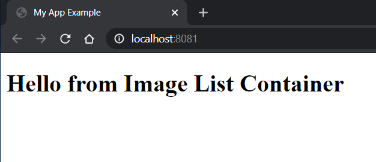
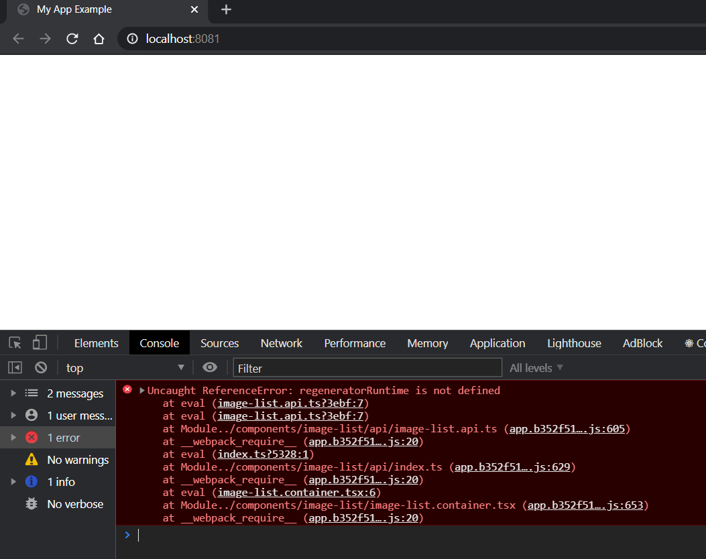
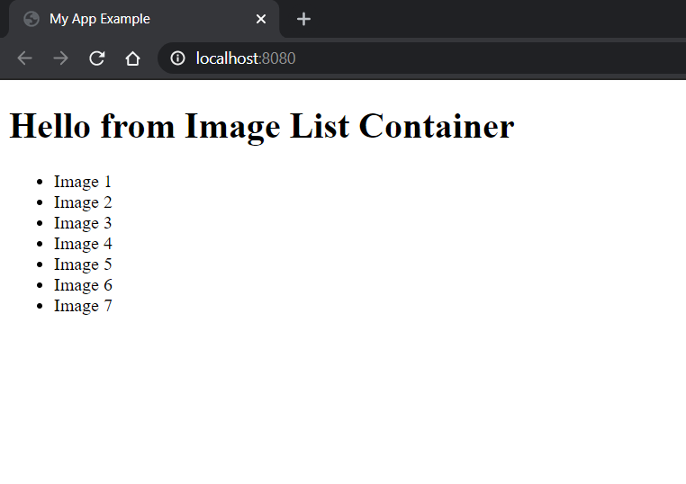

# Solucionar el error 'RegeneratorRuntime is not defined'

## Resumen.

Realizando el ejercicio intermedio del listado de imagenes y el carrito de la compra, partiendo del código 02-webpack-boiler, hemos encontrado que a la hora realizar llamadas await sync, en el navegador se produce un error que hasta ahora no se había producido.

## Primeros pasos antes del error.

- Primero copiamos el ejemplo anterior, y hacemos un _npm install_

```bash
npm install
```

- Vamos a instalar _react_ y _react-dom_

```bash
npm install react react-dom --save
```

- Vamos a instalarnos los typing de _react_ y _react-dom_

```bash
npm install @types/react @types/react-dom --save-dev
```

Así tenemos la librería de React y los bindings para que se integre con un navegador web.

- En el index.html vamos a meter el _div_ que nos servirá como punto de entrada para instanciar
  nuestra aplicación React.

_./src/index.html_

```diff
  <body>
-    Hello World !
+    <div id="root"></div>
  </body>
```

- Vamos a crear nuestro primero componente React.

_./src/app.tsx_

```tsx
import React from "react";

export const App = () => {
  return <h1>Hello React !!</h1>;
};
```

- Es hora de instanciar ese compente principal, para poder integrarlo con el navegador
  tenemos que hacer uso a _ReactDOM.render_

_./src/index.tsx_

```tsx
import React from "react";
import ReactDOM from "react-dom";
import { App } from "./app";

ReactDOM.render(
  <div>
    <App />
  </div>,
  document.getElementById("root")
);
```

- Vamos por buen camino, pero si intentamos ejecutar esto no va fallar, ya que _babel_ no sabe
  como transformar el _jsx_ (recordemos que esto era un azucar, que en realidad era un XML) a
  javaScript, para que babel sea capaz de entender esto tenemos que instalar el _preset_
  _@babel/preset-react_

Primero lo instalamos

```bash
npm install @babel/preset-react --save-dev
```

_.babelrc_

```diff
{
  "presets": [
      "@babel/preset-env",
      "@babel/preset-typescript",
+     "@babel/preset-react"
  ]
}
```

## Siguiente paso, creación de la api para el componente que muestra los datos.

- Dentro de src, creamos las carpetas components/datalist/api

```cmd
D:.
└───src
    └───components
        └───image-list
            └───api
```

```bash
mkdir components
cd components

mkdir datalist
cd image-list

mkdir api
cd api
```

- Dentro de api añadimos los ficheros necesarios para la suplantación de la respuesta del api.

_./src/components/image-list/api/image-list.api.models.ts_

```tsx
export interface Image {
  id: number; // primary key
  description: string; // Image description
  imagePath: string; // path server Image
}
```

_./src/components/image-list/api/image-list.mock-data.ts_

```tsx
import { Image } from "./image-list.api.model";

export const mockImagesCats: Image[] = [{
    id: 1,
    description: 'Image 1',
    imagePath: ''
}, {
    id: 2,
    description: 'Image 2',
    imagePath: ''
}, {
    id: 3,
    description: 'Image 3',
    imagePath: ''
}}];
```

_./src/components/image-list/api/image-list.api.ts_

```tsx
import { Image } from "./image-list.api.model";
import { mockImagesCats, mockImagesKities } from "./image-list.mock-data";

let imagesCats = [...mockImagesCats];
let imagesKities = [...mockImagesKities];

export const getCatsCollection = async (): Promise<Image[]> => {
  return imagesCats;
};

export const getKitiesCollection = async (): Promise<Image[]> => {
  return imagesKities;
};
```

_./src/components/image-list/api/index.ts_

```ts
export * from "./image-list.api";
```

- Una vez definido los dato a devolver por el mock, procedemos a crear el viewmodel, el mapper, el container y el componente para mostrar estos datos.

_./src/components/image-list/image-list.vm.ts_

```ts
export interface Image {
  id: number;
  description: string;
  image: string;
  buy: boolean;
}
```

_./src/components/image-list/image-list.mapper.ts_

```ts
import * as apiModel from "./api/image-list.api.model";
import * as viewModel from "./image-list.vm";

const mapImageFromApiToVM = (image: apiModel.Image): viewModel.Image => {
  let vm: viewModel.Image = {
    id: image.id,
    description: image.description,
    image: image.imagePath,
    buy: false,
  };

  return vm;
};

export const mapImageListFromApiToVM = (
  imageList: apiModel.Image[]
): viewModel.Image[] => imageList.map((image) => mapImageFromApiToVM(image));
```

_./src/components/image-list/image-list.component.tsx_

```tsx
import React from "react";
import { Image } from "./image-list.vm";

interface Props {
  ImageCollection: Image[];
}

export const ImageListComponent: React.FC<Props> = (props) => {
  const imageList = props.ImageCollection;
  return (
    <ul>
      {imageList.map((image) => (
        <li key={image.id}>{image.description}</li>
      ))}
    </ul>
  );
};
```

_./src/components/image-list/image-list.container.tsx_

```tsx
import React from "react";
import { ImageListComponent } from "./image-list.component";
import { Image } from "./image-list.vm";
import { getCatsCollection } from "./api/";
import { mapImageListFromApiToVM } from "./image-list.mapper";

export const ImageListContainer: React.FC = () => {
  const [images, setImages] = React.useState<Image[]>([]);

  return (
    <>
      <h1>Hello from Image List Container</h1>
      <ImageListComponent ImageCollection={images} />
    </>
  );
};
```

- Modificamos ahora el fichero app.tsx para que muestre el contenido del contenedor _image-list.container.tsx_.

```diff
import React from "react";
+ import { ImageListContainer } from "./components";

export const App = () => {
-   return <h1>Hello React !!</h1>;
+    return <ImageListContainer />;
};
```

- Ejecutamos npm.

```bash
npm start
```

 Hello React

- Siguiente paso

- Añadimos la llama al componente

```diff
import React from "react";
import { ImageListComponent } from "./image-list.component";
import { Image } from "./image-list.vm";
+import { getCatsCollection } from "./api/";
+import { mapImageListFromApiToVM } from "./image-list.mapper";

export const ImageListContainer: React.FC = () => {
  const [images, setImages] = React.useState<Image[]>([]);

+     const onLoadImageList = async () => {
+     const apiImageList = await getCatsCollection();
+     const viewModelImageList = mapImageListFromApiToVM(apiImageList);
+     setImages(viewModelImageList);
+   };

+     React.useEffect(() => {
+       onLoadImageList();
+     }, []);

  return (
    <>
      <h1>Hello from Image List Container</h1>
      <ImageListComponent ImageCollection={images} />
    </>
  );
};
```

- Ejecutamos npm.

```bash
npm start
```

 Regenerator Runtime Error

- Aqui lo tenemos, para solucionarlo, debemos de instalar como dependencia de producción el paquete: regenerator-runtime

```bash
npm install regenerator-runtime --save
```

- Una vez instalador hay que modificar el webpack.config.js.

```diff
module.exports = {
  context: path.join(basePath, "src"),
  resolve: {
    extensions: [".js", ".ts", ".tsx"],
  },
  entry: {
-    app: ["./index.tsx"],
+    app: ['regenerator-runtime/runtime', './index.tsx'],
  },
  devtool: "eval-source-map",
  ...
```

Solucionado el error RegeneratorRuntime is not defined.
