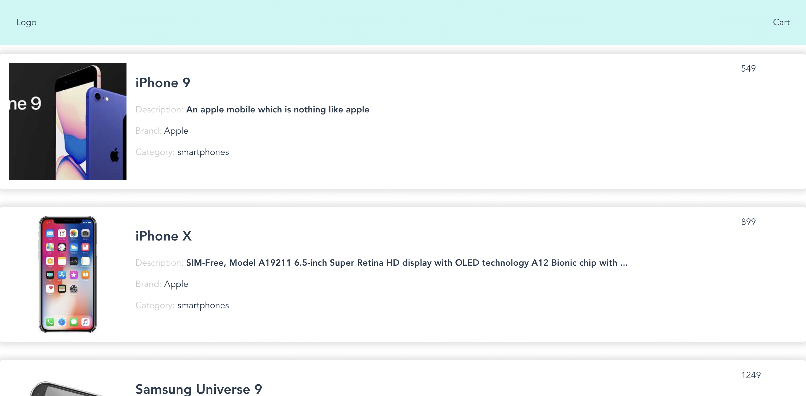

# ecommerce-app

Resultado de la primera sesión del módulo.



## Inicio

```bash
# npx nuxi init <NOMBRE_DE_LA_APP>
npx nuxi init ecommerce-app
# cd <NOMBRE_DE_LA_APP>
cd ecommerce-app
# Instalar dependencias con el gestor de paquetes que se desee
yarn
# y lanzar el servidor
yarn dev
```

### Eliminar el NuxtWelcome

En el `app.vue`, eliminamos el componente `<NuxtWelcome />` y nada más. En Nuxt v3, no tenemos que borrar archivos innecesarios al hacer el bootstrapping, como era el caso en versiones anteriores o en vue-cli.

También añadiremos un `id` al `div` padre, para los estilos que usaremos desupés.

```diff
<template>
-  <div>
+  <div id="app">
-    <NuxtWelcome />
  </div>
</template>

```

En esta vista podemos añadir cosas que queramos que estén para la aplicación de manera global. Como un `header` (como veremos a continuación), o el aviso de cookies...

Pero más adelante veremos que, para añadir varias páginas, tenemos que crear la carpeta `pages`.

### Componentes propios

Vamos a crear nuestro primer componente.

Creamos el archivo `/components/Header.vue`. Aquí es donde vienen muy bien los _snippets_ de código. Voy a compartiros el que tengo para los componentes de Vue 3 + TS:

Son accesibles en VS Code con el comando "Ctrl/Cmd + Shift + P" > "Configure User Snippets"

```json
// vue.json snippets
{
  "Vue Component": {
    "prefix": "vue3scriptsetup",
    "body": [
      "<template>",
      "  ${1}",
      "</template>",
      "",
      "<script setup lang=\"ts\">",
      "${2}",
      "</script>",
      ""
    ],
    "description": "Vue Component"
  }
}
```

Podéis generar vuestros propios _snippets_ para TS, JS, vue, etc... Gracias a la app https://snippet-generator.app/ es muy sencillo (disponibles otros editores). Tomad el ejemplo de arriba como ejemplo para vuestros _snippets_. En este caso, con teclear `vue3scriptsetup` en el archivo vacío, ya nos mostraría un autocompletado para generar esa "plantilla" de código.

Este paso es opcional, pero altamente recomendado, sin importar el framework o lenguaje utilizado. Incluso, en empresas, si se comparte un mismo estilo de código, se puede tener un archivo de _snippets_ compartidos para los equipos/squads pertinentes.

De vuelta, a `/components/Header.vue`, vamos a poner algo simple solo para verlo en pantalla:

```vue
<template>
  <nav class="nav">
    <div>Logo</div>
    <div>Cart</div>
  </nav>
</template>

<script setup lang="ts"></script>

<style lang="scss" scoped>
.nav {
  min-height: 80px;
  background-color: rgb(198, 247, 244);
  position: sticky;
  top: 0;
}
</style>
```

Fijaros en los atributos `lang` de los bloques `<script>` y `<style>`: Vamos a hacer uso de TS y SCSS en este caso.

En `/App.vue`, añadiremos una referencia a nuestro nuevo componente:

```diff
<template>
  <div id="app">
+    <Header />
  </div>
</template>

```

#### SASS

```
[vite] Internal server error: Preprocessor dependency "sass" not found. Did you install it?
```

Nos sale un error, porque no hemos instalado la dependencia de `sass`. Con añadirla, nuestra app ya podrá usar `<style lang="scss" scoped>` para los estilos.

```bash
# si habéis elegido yarn
yarn add -D sass
# con npm
# npm i -D sass
# con pnpm
# pnpm add -D sass
```

El componente no queda ocupando el 100% de la pantalla y es porque no tenemos unos estilos de "reset" que normalmente se añaden al principio de los proyectos.

Para esta app no vamos a usar ninguna librería de estilos, como las implementaciones de Material Design (como Vuetify, en el caso de Vue) o Tailwind o Windi. Usaremos estilos propios, pero sin reparar mucho en ellos.

Vamos a añadir, de hecho, directamente el contenido de: https://raw.githubusercontent.com/Lemoncode/master-frontend-lemoncode/a40dd5852e7f199b7ca90a207177fdcc59c70dcf/04-frameworks/03-vue/05_ecommerce_app_final/src/assets/scss/main.scss (o su última versión en master) en `/assets/scss/main.scss`

Y vamos a importarlo en nuestro `nuxt.config.ts`:

```diff
// https://nuxt.com/docs/api/configuration/nuxt-config
export default defineNuxtConfig({
+  css: ['~/assets/scss/main.scss'],
})

```

Nuxt, al ser un framework, nos va a ayudar en las tareas de _bundling_. Normalmente, requiere ninguna o muy poca configuración. Y gracias a que Nuxt 3 usa Vite, vamos a tener una experiencia de desarrollo muy rápida.

Para la versión de producción, ved el comando de nuxt en su [documentación oficial](https://nuxt.com/docs/api/commands/build):

```
npx nuxi build
```

Vamos a volver al componente de `<Header>` para añadirle unos estilos.

```diff
<template>
-  <nav class="nav">
+  <nav class="nav flex align-items-center justify-content-between container">
    <div>Logo</div>
    <div>Cart</div>
  </nav>
</template>
```

En el resto de la sesión, no repararemos mucho en los estilos. Pero utilizaremos algunas de las clases que vienen en ese archivo de estilos globales.

#### Product List

Vamos a empezar a pintar productos en nuestra app de e-commerce. Para ello, usaremos una API gratuita. Empezamos creando un componente `/components/ProductList.vue`. Podemos usar nuestro _snippet_ para iniciar el componente con algo ya:

```vue
<template></template>
<script setup lang="ts"></script>
```

Añadimos una lista y la directiva de "loops" de Vue:

```diff
<template>
+  <ul>
+    <li v-for="product in list" :key="product.id"></li>
+  </ul>
</template>

<script setup lang="ts">
+ const list: any = []
</script>
```

Como véis, estoy esperando una propiedad (Array) `list` y que tenga objetos que contengan, al menos, una propiedad `id`. De momento, lo inicializamos como Array vacío de tipo `any[]`.

Vamos a utilizar un JSON de datos para nuestro componente. Dónde lo podemos guardar? Podríamos poner el JSON, como objeto de JS directamente en el componente, pero vamos a imitar el comportamiento de una app de verdad, haciendo un "servicio", como habéis visto en otros frameworks como Angular.

Añadiremos el archivo `/services/products.ts` con la llamada a la API:

```
https://dummyjson.com/products
```

Así es como se haría:

```ts
export const productService = {
  async get() {
    const products = await fetch('https://dummyjson.com/products').then((r) =>
      r.json()
    )
    return products
  },
}
```

Pero si nos damos cuenta, falta el tipado! Vamos a añadir nuestros tipos globales de la app:

```ts
// //types/index.ts
export interface Product {
  id: number
  title: string
  description: string
  price: number
  discountPercentage: number
  rating: number
  stock: number
  brand: string
  category: string
  thumbnail: string
  images: string[]
}
```

Usamos la misma "forma" que tienen los objetos de la respuesta de la API JSON y lo `export`amos para importarlo en nuestros módulos de TS.

Nuestro servicio quedaría entonces así:

```diff
+import { Product } from '~~/types'
+
export const productService = {
  async get() {
    const products = await fetch(
      'https://dummyjson.com/products'
    ).then((r) => r.json())
-    return products
+    return products as Product[]
  },
}
```

Ahora, vamos a añadir el servicio en el componente de _ProductList_:

```diff
<template>
  <ul>
    <li v-for="product in list" :key="product.id"></li>
  </ul>
</template>
<script lang="ts">
- const list: any = []
+ import { productService } from '@/services/products'
+
+ const list = await productService.get()
</script>
```

Como veís, hemos recibido el tipado en nuestra propiedad `list`.

Ahora tenemos que pintar algo dentro de los `li`s.

```diff
<template>
  <ul>
-    <li v-for="product in list" :key="product.id"></li>
+    <li v-for="product in list" :key="product.id">
+      {{ product.title }}
+    </li>
  </ul>
</template>
```

Pero todavía no veremos nada en pantalla, porque no hemos incuido el componente en la app. Vamos a `app.vue` y lo añadimos.

```diff
<template>
  <div id="app">
    <Header />
+    <ProductList />
  </div>
</template>

```

Con ese cambio deberíamos ver ya una lista de nombres de productos en la pantalla. Vamos a pintar el resto de datos:

```diff
<template>
  <ul>
    <li v-for="product in list" :key="product.id">
-     {{ product.title }}
+     <h2>
+       {{ product.title }}
+     </h2>
+     <p>
+       <span class="grey-text">Description: </span>
+       <strong>{{ product.description }}</strong>
+     </p>
+     <p>
+       <span class="grey-text">Brand: </span>
+       {{ product.brand }}
+     </p>
+     <p><span class="grey-text">Category: </span>{{ product.category }}</p>
    </li>
  </ul>
</template>
```

Para darle un aspecto más real, añadiremos una imagen y un poco más de estructura: haremos un grid con 3 columnas:

```diff
<template>
-  <ul>
+  <ul class="product-list">
    <li v-for="product in list" :key="product.id">
       <!-- Añadimos una capa de contenedor y unas clases -->
+      <article class="grid product-container card">
+        <div class="image">
+          
+        </div>
+        <div class="product-container__content">
...          <!-- Aquí los datos que acabábamos de añadir -->
+        </div>
+        <div class="flex product-container__aside">
+          <div class="text-align-end aside__price">
+            {{ product.price }}
+          </div>
+        </div>
+      </article>
    </li>
  </ul>
</template>
```

Y en el mismo archivo `.vue`, unos estilos:

```vue
<style lang="scss" scoped>
.product-list {
  padding: 0;
  li {
    margin-bottom: 2em;
  }
}
.product-container {
  align-items: flex-start;
  grid-template-columns: 210px 1fr 100px;
}

.product-container__content {
  padding: 0 1em;
}

.product-container__aside {
  flex-direction: column;
  justify-content: space-between;
  height: 100%;
}
.image {
  display: flex;
  height: 100%;
  flex-direction: column;
  justify-content: center;
  img {
    width: 100%;
    aspect-ratio: 1/1;
    object-fit: cover;
  }
}
</style>
```

#### Siguientes pasos:

- [ ] Añadir computed property `totalProducts`
- [ ] Binding de clases de manera dinámica: `product.discountPercentage > 15,`
- [ ] Añadir un botón de compra como componente, `AddToCartButton`
- [ ] Añadir la página detalle
- [ ] cambiar `fetch` a `$fetch` para ser _SSR-friendly_.

#### Opcional

- [ ] Extraer parte de la lógica del componente `ProductList` a un componente hijo `ProductCard` para simplificar el componente de listado.
