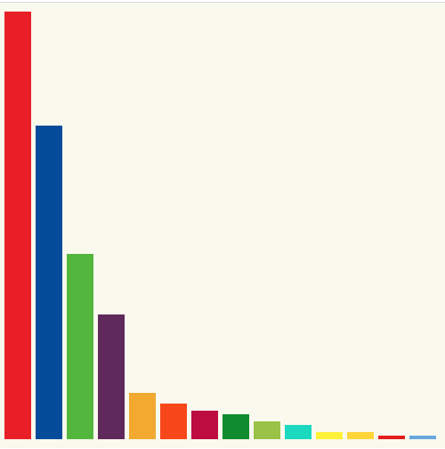

# Barchart

We are going to simulate that we have just started working on a local newspaper (we are d3js noob) our boss asked us to generate a chart
showing national elections results (we will evolve this charts in the following examples).

First we are going to start creating a Bar Chart form scratch (we won't get benefit of any already built in layout), this will serve us to learn the basics of d3js.



codesandbox: https://codesandbox.io/s/nameless-flower-h77vc

# Steps

- Let's copy the content from the previous example (00-boiler-plate).

```bash
npm install
```

- We have the data available under the path _./src/data.ts_ (in case your resources are stored in a remote location d3js offers you help to load _csv_, _tsv_, _json_ and other formats from a remote source). We will start by removing part of the current code stored in index.ts:

_./src/index.ts_

```diff
import * as d3 from "d3";

const svg = d3
  .select("body")
  .append("svg")
  .attr("width", 500)
  .attr("height", 500);

- svg
-  .append("text")
-  .attr("x", 100)
-  .attr("y", 100)
-  .text("Hello d3js");
-
-svg
-  .append("circle")
-  .attr("r", 20)
-  .attr("cx", 20)
-  .attr("cy", 20);
```

- Let's import the data that we need:

_./src/index.ts_

```diff
import * as d3 from "d3";
+ import {resultCollectionSpainNov19} from './data';
```

- Let's start building our chart step by step, first we have to select all the rectangles under the SVG
  we are working on (our barchart is composed of rectangles, if we have other rectangles that we don't
  want to get involved we can use a group to isolate them).

```diff
const svg = d3
  .select("body")
  .append("svg")
  .attr("width", 500)
  .attr("height", 500);

+ svg
+  .selectAll("rect")
```

- After selecting all the existing rectangles binded to our data (the first time we render none will exists),
  we are going to expose the data we wan to represent (the array of voting results).

_./src/index.ts_

```diff
svg
  .selectAll("rect")
+  .data(resultCollectionSpainNov19)
```

> In d3js when we talk about **data** we are talking about an array of items, when we talk about
> **datum** we are reffering to a single item.

- Since all the data that we are going to introduce is fresh (we are not updating the chart just appending
  all the new data), we tell them that we go into "enter" mode (if you need to "update" existing data you would
  enter in "update" mode, if you want to delete data you would enter in "exit" mode).

```diff
svg
  .selectAll("rect")
  .data(resultCollectionSpainNov19)
+ .enter()
```

- Now for every entry we are going to create a rectangle, with a given width and height:

```diff
svg
  .selectAll("rect")
  .data(resultCollectionSpainNov19)
  .enter()
+  .append("rect")
+  .attr("width", 50)
+  .attr("height", d => d.seats);
  ;
```

- If we run the sample we will see that a single ugly black rectangle is shown, why? because
  we are creating a fix width rectangle per item in the same X position. Let's add some
  offset to each of the bar charts. In this case on the _x_ attribute we get a function
  that contain the current entry information (datum party/seats), and the position (index)
  in the array of data.

```diff
svg
  .selectAll("rect")
  .data(resultCollectionSpainNov19)
  .enter()
  .append("rect")
  .attr("width", 50)
  .attr("height", d => d.seats);
+ .attr("x", (d,i) => i * 60)
  ;
```

- Now we got something more interesting, a flipped barchart. Why the Barchart is shown top to bottom?
  That's because the coordinate origin starts in (0,0), we should tell d3 to start the rectangle in a
  bottom coordinate, right now we will enter a harcoded offset number and substract the seats
  position, in the next step we will fix this by introducing scales.

```diff
svg
  .selectAll("rect")
  .data(resultCollectionSpainNov19)
  .enter()
  .append("rect")
  .attr("width", 50)
  .attr("height", d => d.seats);
  .attr("x", (d,i) => i * 60)
+  .attr("y", (d) => 490 - d.seats)
  ;
```

- Now the chart is not flipped, but we are getting an strange feeling, ... we are calculating seats, what would
  happen if the measure we would be handling is for instance millions of habitants, ... we don't have enough
  pixels to display this :), is time to learn about how to scale values, in this case:
  - We know that the number of seats available is 350, and the most voted political party has 150 seats (if we don't know that value, we can just calculate
    it iterating over the data entry array) .
  - We know that we got available 500 pixels of height space.
  - d3js offers us several scaling helpers, we are going to use _scaleLinear_ maps from vaues to pixels

```diff
const svg = d3
  .select("body")
  .append("svg")
  .attr("width", 500)
  .attr("height", 500);

// Let's put the max scale to the most voted party
+ const yScale = d3.scaleLinear().domain([0, 150]).range([0, 480]);
```

- And let's scale each bar position plus it's height:

```diff
svg
  .selectAll("rect")
  .data(resultCollectionSpainNov19)
  .enter()
  .append("rect")
  .attr("width", 50)
-  .attr("height", d => d.seats)
+  .attr("height", d => yScale(d.seats))
  .attr("x", (d, i) => i * 60)
-  .attr("y", d => 490 - d.seats);
+  .attr("y", d => 490 - yScale(d.seats));
```

- Adding magic harcoded numbers can be a bit dangerous, e.g. if you decide to change the height of your canvas, or add different margin everyting can be screwn up.
  Let's refactor this a bit and add some variables to control all this:
  _./src/index.ts_

```diff
+  const svgDimensions = {width: 500, height: 500}
+  const margin = { left: 5, right: 5, top: 10, bottom: 10 };
+  const chartDimensions = {
+    width: svgDimensions.width - margin.left - margin.right,
+    height: svgDimensions.height - margin.bottom - margin.top
+  };
+  const maxNumberSeats = resultCollectionSpainNov19.reduce((max, item) => (item.seats > max) ?
+                                                                item.seats
+                                                                :
+                                                                max
+ , 0);

const svg = d3
  .select("body")
  .append("svg")
-  .attr("width", 500)
+  .attr("width", svgDimensions.width)
-  .attr("height", 500)
+  .attr("height", svgDimensions.height)
  .attr("style", "background-color: red");
```

- Nice it's time to remove harcoded values on the scale:

```diff
const yScale = d3
  .scaleLinear()
-  .domain([0, 150])
+ .domain([0, maxNumberSeats])
-  .range([0, 490]);
+  .range([0, chartDimensions.height]);
```

- Let's create a group that will add the top margin offset.

```diff
const yScale = d3
  .scaleLinear()
  .domain([0, maxNumberSeats])
  .range([0, chartDimensions.height]);

+ const chartGroup = svg
+ .append("g")
+ .attr("transform", `translate(${margin.left}, ${margin.top})`)
+ .attr("width", chartDimensions.width)
+ .attr("height", chartDimensions.height);
```

- And start our chart under that group.

- And remove the harcoded values on the chart rendering itself (y axis):

```diff
- svg
+ chartGroup
  .selectAll("rect")
  .data(resultCollectionSpainNov19)
  .enter()
  .append("rect")
  .attr("width", 50)
  .attr("height", d => yScale(d.seats))
  .attr("x", (d, i) => i * 60)
-  .attr("y", d => 490 - yScale(d.seats));
+  .attr("y", d => chartDimensions.height - yScale(d.seats));
```

> In order to resize charts and keep aspect ratio, you can calculate new sizes or use svg ViewBox.

- That was great for the y scale, what about X axis? In this case since we get a fix width
  per bar we can just setup a formula to calculate this.

```diff
const svgDimensions = { width: 500, height: 500 };
const margin = { left: 0, right: 0, top: 10, bottom: 10 };
const chartDimensions = {
  width: svgDimensions.width,
  height: svgDimensions.height - margin.bottom - margin.top
};
const maxNumberSeats = resultCollectionSpainNov19.reduce(
  (max, item) => (item.seats > max ? item.seats : max),
  0
);
+ const politicalPartiesCount = resultCollectionSpainNov19.length;
+ const barPadding = 5; // We could calculate this value as well
+ const barWidth =
+  (chartDimensions.width - barPadding * politicalPartiesCount) /
+  politicalPartiesCount;

const yScale = d3
  .scaleLinear()
  .domain([0, maxNumberSeats])
  .range([0, chartDimensions.height]);

chartGroup
  .selectAll("rect")
  .data(resultCollectionSpainNov19)
  .enter()
  .append("rect")
-  .attr("width", 50)
+  .attr("width", barWidth)

  .attr("height", d => yScale(d.seats))
-  .attr("x", (d, i) => i * 60)
+  .attr("x", (d, i) => i * (barWidth + barPadding) )
  .attr("y", d => chartDimensions.height - yScale(d.seats));
```

- Now let's give some color to this chart, we can setup a wide range of color scales,
  e.g. based on value ranges or based on ordinal values, or...

- In this case we will create a discrete color palette based on the political parties:

```typescript
const partiesColorScale = d3
  .scaleOrdinal(d3.schemeCategory10)
  .domain([
    "PSOE",
    "PP",
    "VOX",
    "UP",
    "ERC",
    "Cs",
    "JxCat",
    "PNV",
    "Bildu",
    "Más pais",
    "CUP",
    "CC",
    "BNG",
    "Teruel Existe"
  ]);
```

- And let's use it on every chart:

```diff
chartGroup
  .selectAll("rect")
  .data(resultCollectionSpainNov19)
  .enter()
  .append("rect")
  .attr("width", barWidth)
  .attr("height", d => yScale(d.seats))
  .attr("x", (d, i) => i * (barWidth + barPadding))
  .attr("y", d => chartDimensions.height - yScale(d.seats))
+ .attr("fill", d => partiesColorScale(d.party));
  ;
```

- That was nice but we want to use as each bar background it's corresponding political party background, let's go for that:

```diff
const partiesColorScale = d3
  .scaleOrdinal(
-    d3.schemeCategory10
+ [
+    "#ED1D25",
+    "#0056A8",
+    "#5BC035",
+    "#6B2E68",
+    "#F3B219",
+    "#FA5000",
+    "#C50048",
+    "#029626",
+    "#A3C940",
+    "#0DDEC5",
+    "#FFF203",
+    "#FFDB1B",
+    "#E61C13",
+    "#73B1E6"
+  ]
  ])
  .domain([
    "PSOE",
    "PP",
    "VOX",
    "UP",
    "ERC",
    "Cs",
    "JxCat",
    "PNV",
    "Bildu",
    "Más pais",
    "CUP",
    "CC",
    "BNG",
    "Teruel Existe"
  ]);
```

- We feel proud about this chart, we could now add a legend, x/y axis... but we will
  stop by now:
  - We could used a histogram layout to create this and save some time.
  - If we talk to our boss (remember that we are simulating that we are working on a newspaper), he would say this is not the type of chart optimal to display election results (crap !).

In the next example we will create an horizontal rectangle showing a segment.

# Appendix - Refactoring

One of the weak points of d3js is that the code generated looks a bit cryptic, too much details, could it
be possible to refactor it?

If we play bit we can end up with something like:

```typescript
const svg = createBlankSvg();
const yScale = createYScale();
const chartGroup = createChartGroup();
generateBarChart(chartGroup);
```

And _generateBarChart_ could be splitted into two functions:

```typescript
const drawSingleBar = (
  parent: d3.Selection<d3.EnterElement, ResultEntry, SVGGElement, unknown>
) => {
  parent
    .append("rect")
    .attr("width", barWidth)
    .attr("height", d => yScale(d.seats))
    .attr("x", (d, i) => i * (barWidth + barPadding))
    .attr("y", d => chartDimensions.height - yScale(d.seats))
    .attr("fill", d => partiesColorScale(d.party));
};

const generateBarChart = (
  element: d3.Selection<SVGGElement, unknown, HTMLElement, any>
) => {
  const selection = chartGroup
    .selectAll("rect")
    .data(resultCollectionSpainNov19)
    .enter();
  drawSingleBar(selection);
};
```

Whole refactored file:
_./src/index.ts_

```typescript
import * as d3 from "d3";
import { resultCollectionSpainNov19, ResultEntry } from "./data";

const svgDimensions = { width: 500, height: 500 };
const margin = { left: 5, right: 5, top: 10, bottom: 10 };
const chartDimensions = {
  width: svgDimensions.width - margin.left - margin.right,
  height: svgDimensions.height - margin.bottom - margin.top
};
const maxNumberSeats = resultCollectionSpainNov19.reduce(
  (max, item) => (item.seats > max ? item.seats : max),
  0
);
const politicalPartiesCount = resultCollectionSpainNov19.length;

const barPadding = 5; // We could calculate this value as well
const barWidth =
  (chartDimensions.width - barPadding * politicalPartiesCount) /
  politicalPartiesCount;

const partiesColorScale = d3
  .scaleOrdinal([
    "PSOE",
    "PP",
    "VOX",
    "UP",
    "ERC",
    "Cs",
    "JxCat",
    "PNV",
    "Bildu",
    "Más pais",
    "CUP",
    "CC",
    "BNG",
    "Teruel Existe"
  ])
  .range([
    "#ED1D25",
    "#0056A8",
    "#5BC035",
    "#6B2E68",
    "#F3B219",
    "#FA5000",
    "#C50048",
    "#029626",
    "#A3C940",
    "#0DDEC5",
    "#FFF203",
    "#FFDB1B",
    "#E61C13",
    "#73B1E6",
    "#BECD48",
    "#017252"
  ]);

const createBlankSvg = () =>
  d3
    .select("body")
    .append("svg")
    .attr("width", svgDimensions.width)
    .attr("height", svgDimensions.height)
    .attr("style", "background-color: #FBFAF0");

const createYScale = () =>
  d3
    .scaleLinear()
    .domain([0, maxNumberSeats])
    .range([0, chartDimensions.height]);

const createChartGroup = () =>
  svg
    .append("g")
    .attr("transform", `translate(${margin.left}, ${margin.top})`)
    .attr("width", chartDimensions.width)
    .attr("height", chartDimensions.height);

const drawSingleBar = (
  parent: d3.Selection<d3.EnterElement, ResultEntry, SVGGElement, unknown>
) => {
  parent
    .append("rect")
    .attr("width", barWidth)
    .attr("height", d => yScale(d.seats))
    .attr("x", (d, i) => i * (barWidth + barPadding))
    .attr("y", d => chartDimensions.height - yScale(d.seats))
    .attr("fill", d => partiesColorScale(d.party));
};

const generateBarChart = (
  element: d3.Selection<SVGGElement, unknown, HTMLElement, any>
) => {
  const selection = chartGroup
    .selectAll("rect")
    .data(resultCollectionSpainNov19)
    .enter();
  drawSingleBar(selection);
};

const svg = createBlankSvg();
const yScale = createYScale();
const chartGroup = createChartGroup();
generateBarChart(chartGroup);
```

Here it goes a link about better coding d3js:

https://bost.ocks.org/mike/chart/

# About Basefactor + Lemoncode

We are an innovating team of Javascript experts, passionate about turning your ideas into robust products.

[Basefactor, consultancy by Lemoncode](http://www.basefactor.com) provides consultancy and coaching services.

[Lemoncode](http://lemoncode.net/services/en/#en-home) provides training services.

For the LATAM/Spanish audience we are running an Online Front End Master degree, more info: http://lemoncode.net/master-frontend
