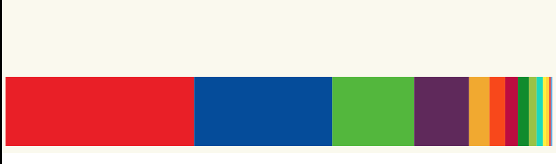

# Single bar

So the boss was not happy with a Barchart, we must choose a chart type where
is easier to check the relative weight of each political party compared with
the total of seats available.

Maybe a chart like this could help:



Click here to check the sample live: [Codesandbox](https://codesandbox.io/s/flamboyant-forest-sxyq0)

Let's give a try.

# Steps

- We will start from scratch, but will be reuseing a lot of code from 01-bar-chart
  (in a real world scenario it would be enough to refactor the previous example
  but for the sake of clarity we will go step by step).

- Let's copy the content from _00-boilerplate_ and execute _npm install_

```bash
npm install
```

- Let's start by adding the setting information we have alreadty calculated
  in the previous chart.

- Let's wipe the test content in _index.ts_

_./src/index.ts_

```diff
- import * as d3 from "d3";

- svg
-  .append("text")
-  .attr("x", 100)
-  .attr("y", 100)
-  .text("Hello d3js");
-
-svg
-  .append("circle")
-  .attr("r", 20)
-  .attr("cx", 20)
-  .attr("cy", 20);
```

- Let's add all the settings. IMPORTANT this time the height will be fixed (we will
  name that const **barHeight** and the width will be dynamic).

_./src/index.ts_

```typescript
import * as d3 from "d3";
import { resultCollectionSpainNov19 } from "./data";

const svgDimensions = { width: 800, height: 500 };
const margin = { left: 5, right: 5, top: 10, bottom: 10 };
const chartDimensions = {
  width: svgDimensions.width - margin.left - margin.right,
  height: svgDimensions.height - margin.bottom - margin.top
};

const totalNumberSeats = resultCollectionSpainNov19.reduce(
  (sum, item) => sum + item.seats,
  0
);

const barHeight = 200;

const politicalParties = [
  "PSOE",
  "PP",
  "VOX",
  "UP",
  "ERC",
  "Cs",
  "JxCat",
  "PNV",
  "Bildu",
  "Más pais",
  "CUP",
  "CC",
  "BNG",
  "Teruel Existe"
];

const partiesColorScale = d3
  .scaleOrdinal([
    "#ED1D25",
    "#0056A8",
    "#5BC035",
    "#6B2E68",
    "#F3B219",
    "#FA5000",
    "#C50048",
    "#029626",
    "#A3C940",
    "#0DDEC5",
    "#FFF203",
    "#FFDB1B",
    "#E61C13",
    "#73B1E6"
  ])
  .domain(politicalParties);

const svg = d3
  .select("body")
  .append("svg")
  .attr("width", svgDimensions.width)
  .attr("height", svgDimensions.height)
  .attr("style", "background-color: #FBFAF0");

const chartGroup = svg
  .append("g")
  .attr("transform", `translate(${margin.left}, ${margin.top})`)
  .attr("width", chartDimensions.width)
  .attr("height", chartDimensions.height);
```

- Since x axis will be dynamic (depending on the seats assigned for each party)
  let's calcualte the XScale (seats to pixels).

```typescript
const xScale = d3
  .scaleLinear()
  .domain([0, totalNumberSeats])
  .range([0, chartDimensions.width]);
```

- Let's add the rectangles, this time, we will calculate the width dinamically and
  the height will be fixed. We have one challenge here... each bar (PSOE, PP, ...)
  has to start when the previous one finished, in order to solve this we are going
  to use an accumulator (in the next example we will learn how to solve
  this using a layout)

```typescript
let currentXPosition = 0;

chartGroup
  .selectAll("rect")
  .data(resultCollectionSpainNov19)
  .enter()
  .append("rect")
  .attr("width", d => xScale(d.seats))
  .attr("height", barHeight)
  .attr("x", (d, i) => {
    const position = currentXPosition;
    currentXPosition += xScale(d.seats);
    return position;
  })
  .attr("y", d => chartDimensions.height - barHeight)
  .attr("fill", d => partiesColorScale(d.party));
```

- Let's run this code now

```bash
npm start
```

# Excercise

Couldn't it be cool to add an indicator showing how many seat are needed to
get overall majority? Something like:

Tips:

- The number of seats to get overall majority is half of the aviable seat + 1.
- You can use the xScale to get the exact position where to draw a line.
- you can draw a vertical line (check svg attribute to give it the right
  widht and color).

¡That's all!

# About Basefactor + Lemoncode

We are an innovating team of Javascript experts, passionate about turning your ideas into robust products.

[Basefactor, consultancy by Lemoncode](http://www.basefactor.com) provides consultancy and coaching services.

[Lemoncode](http://lemoncode.net/services/en/#en-home) provides training services.

For the LATAM/Spanish audience we are running an Online Front End Master degree, more info: http://lemoncode.net/master-frontend
