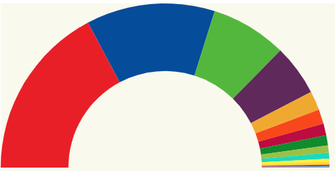

# Semi Arch Chart

Hey.. we got some positive feedback from our boss, the chart starts to make sense, buuuuut wouldn't it be nice
to display the bar as a semi arch.

Something like:



Live demo: [codesandbox](https://codesandbox.io/s/snowy-firefly-nd71d)

Well... since we have learn to use layouts, this time we will make use of the _pieChartLayout_, the good thing
of layouts is that you can easily preprocess the data the way you need it to display a customized chart
(instead of a pie, it will be a ring chart + semi arch).

# Steps

- We will take as starting sample _00-boilerplate_.

- Let's copy the content from _00-boilerplate_ and execute _npm install_

```bash
npm install
```

- Let's start by adding the setting information we have alreadty calculated
  in the previous chart.

- Let's wipe the test content in _index.ts_

_./src/index.ts_

```diff
- import * as d3 from "d3";

- svg
-  .append("text")
-  .attr("x", 100)
-  .attr("y", 100)
-  .text("Hello d3js");
-
-svg
-  .append("circle")
-  .attr("r", 20)
-  .attr("cx", 20)
-  .attr("cy", 20);
```

- Let's add all the settings. IMPORTANT this time the height will be fixed (we will
  name that const **barHeight** and the width will be dynamic).

> As an enhancemente this time we will take the keys from the data array, and
> we will increase the with of the chart to 800 pixels.

_./src/index.ts_

```typescript
import * as d3 from "d3";
import { resultCollectionSpainNov19 } from "./data";

const svgDimensions = { width: 800, height: 500 };
const margin = { left: 5, right: 5, top: 10, bottom: 10 };
const chartDimensions = {
  width: svgDimensions.width - margin.left - margin.right,
  height: svgDimensions.height - margin.bottom - margin.top
};

const partiesColor = [
  "#ED1D25",
  "#0056A8",
  "#5BC035",
  "#6B2E68",
  "#F3B219",
  "#FA5000",
  "#C50048",
  "#029626",
  "#A3C940",
  "#0DDEC5",
  "#FFF203",
  "#FFDB1B",
  "#E61C13",
  "#73B1E6",
  "#BECD48",
  "#017252"
];

const svg = d3
  .select("body")
  .append("svg")
  .attr("width", svgDimensions.width)
  .attr("height", svgDimensions.height)
  .attr("style", "background-color: #FBFAF0");

const chartGroup = svg
  .append("g")
  .attr("transform", `translate(${margin.left}, ${margin.top})`)
  .attr("width", chartDimensions.width)
  .attr("height", chartDimensions.height);
```

- For the pie to be created we need to calculate it's radius:

```typescript
const radius = Math.min(chartDimensions.width, chartDimensions.height) / 2;
```

- Now we need to move the center of the pie chart, from 0,0 to radius, radius

```typescript
chartGroup.attr("transform", `translate(${radius},${radius})`);
```

- Now we want to create a ring (doughnut), it will have an _innerRadius_ and _outerRadius_.

```typescript
const arc = d3
  .arc()
  .innerRadius(radius / 1.7) // We want to have an arc with a propotional width
  .outerRadius(radius);
```

- Now it's time for the pie layout to make it's magic, we will indicate that we want him to calculate all the semi archs angles,
  based on the values (and base on a half pie shape).

```typescript
const pieChart = d3
  .pie()
  .startAngle(-90 * (Math.PI / 180))
  .endAngle(90 * (Math.PI / 180));
```

- For the sake of simplicity we are gong to pass just the seats values to the pie layout:

```typescript
const politicalResultsOnlyNumbers: number[] = resultCollectionSpainNov19.map(
  result => result.seats
);
```

- Let's setup our pie chart layout and get the array of arcs:

```typescript
const pie = pieChart(politicalResultsOnlyNumbers);
```

- Now it's time to start rendering our chart:

```typescript
const arcs = chartGroup
  .selectAll("slice")
  .data(pie)
  .enter();

arcs
  .append("path")
  .attr("d", <any>arc) // Hack typing: https://stackoverflow.com/questions/35413072/compilation-errors-when-drawing-a-piechart-using-d3-js-typescript-and-angular/38021825
  .attr("fill", (d, i) => partiesColor[i]); // TODO color ordinal
```

- Let's run this code now

```bash
npm start
```

# Additional resources

Check this great example from Saninn: https://jsfiddle.net/Saninn/15pwLf7u/

# About Basefactor + Lemoncode

We are an innovating team of Javascript experts, passionate about turning your ideas into robust products.

[Basefactor, consultancy by Lemoncode](http://www.basefactor.com) provides consultancy and coaching services.

[Lemoncode](http://lemoncode.net/services/en/#en-home) provides training services.

For the LATAM/Spanish audience we are running an Online Front End Master degree, more info: http://lemoncode.net/master-frontend
