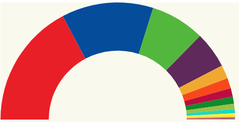

# Pimp Chart

"You nailed it!" the boss said, that's great, buuuuut... he asked as well if
we can just pimp a bit the chart, it is going to be published on an online
newspaper and it needs some details like add a legend to the chart, highlight
the selected party when we make a mouse hover, ...

Something like:



Live demo: [codesandbox](https://codesandbox.io/s/fervent-lumiere-8w12q)

# Steps

- We will take as starting sample _03-arc-chart_.

- We will add the parties keys array again:

```typescript
const politicalPartiesKeys: string[] = resultCollectionSpainNov19.map(
  item => item.party
);
```

- Let's copy the content from _03-arc-chart_ and execute _npm install_

```bash
npm install
```

- Let's install _d3-svg-legend_

```bash
npm i d3-svg-legend -P
```

- Let's import this legend in our _index.ts_ file.

_./src/index.ts_

```diff
import * as d3 from "d3";
import { resultCollectionSpainNov19 } from "./data";
+ import {legendColor} from 'd3-svg-legend';
```

- Now let's create and ordinal scale color,map it to a legend object and add it in a group below the semi arch chart (APPEND THIS CONTENT, EOF).

_./src/index.ts_

```typescript
// Legend
const ordinal = d3
  .scaleOrdinal(partiesColor)
  .domain(politicalPartiesKeys)

const legendOrdinal = legendColor().scale(ordinal);

const legendLeft = margin.left;
const legendTop = radius + 5;

const legendGroup = svg
 .append("g")
 .attr("transform", `translate(${legendLeft},${legendTop})`);
legendGroup.call(legendOrdinal);
```

- Let's go for one more goodie, we want to highlight the piece of arc where the mouse point
  is on.

```diff
arcs
  .append("path")
  .attr("d", <any>arc) // Hack typing: https://stackoverflow.com/questions/35413072/compilation-errors-when-drawing-a-piechart-using-d3-js-typescript-and-angular/38021825
  .attr("fill", (d, i) => partiesColor[i]); // TODO color ordinal
+ .on("mouseover", function(d, i) {
+   d3.select(this).attr("transform", `scale(1.1, 1.1)`);
+ })
+  .on("mouseout", function(d, i) {
+    d3.select(this).attr("transform", ``);
+  });
```

- Now we want to add a tooltip when the mouse is over a party and display the
  party and number of votes, we will follow the approach defined in this blocks example: https://bl.ocks.org/d3noob/a22c42db65eb00d4e369.

- Let's start by defining the styles for that tooltip.

_styles.css_

```css
div.tooltip {
  position: absolute;
  text-align: center;
  width: 60px;
  height: 28px;
  padding: 2px;
  font: 12px sans-serif;
  background: #f7f2cb;
  border: 0px;
  border-radius: 8px;
  pointer-events: none;
}
```

- Let's import this css into our index.html

_./src/index.html_

```diff
  <head>
    <link rel="stylesheet" type="text/css" href="./base.css" />
+    <link rel="stylesheet" type="text/css" href="./styles.css" />
  </head>
```

- Now let's define the tooltip.

_./src/index.ts_

```typescript
// Define the div for the tooltip
const div = d3
  .select("body")
  .append("div")
  .attr("class", "tooltip")
  .style("opacity", 0);
```

- And let's show it on mouseover

_./src/index.ts_

```diff
  .on("mouseover", function(d, i) {
    d3.select(this).attr("transform", `scale(1.1, 1.1)`);
+    div
+      .transition()
+      .duration(200)
+      .style("opacity", 0.9);
+    div
+      .html(
+        `<span>${resultCollectionSpainNov19[i].party}: ${resultCollectionSpainNov19[i].seats}</span>`
+      )
+      .style("left", `${d3.event.pageX}px`)
+      .style("top", `${d3.event.pageY - 28}px`);
  })
```

- And hide it on mouse out

_./src/index.ts_

```diff
  .on("mouseout", function(d, i) {
    d3.select(this).attr("transform", ``);
+   div.transition()
+                .duration(500)
+                .style("opacity", 0);
  });
```

# Excercise

A) We have shown a legend where all elements are in single columns, what if we want to split them in two columns?

- We could use two legends objects and split the colors / domain.
- We could play creating our custom legend.

Tips: https://stackoverflow.com/questions/51520596/spread-d3-js-legend-on-two-columns/51524137
Tips: http://jsfiddle.net/v7mkg/1/

B) Play a bit... add a rectangle, interact when clicking on a given arc (e.g. display tooltip)...

# About Basefactor + Lemoncode

We are an innovating team of Javascript experts, passionate about turning your ideas into robust products.

[Basefactor, consultancy by Lemoncode](http://www.basefactor.com) provides consultancy and coaching services.

[Lemoncode](http://lemoncode.net/services/en/#en-home) provides training services.

For the LATAM/Spanish audience we are running an Online Front End Master degree, more info: http://lemoncode.net/master-frontend

