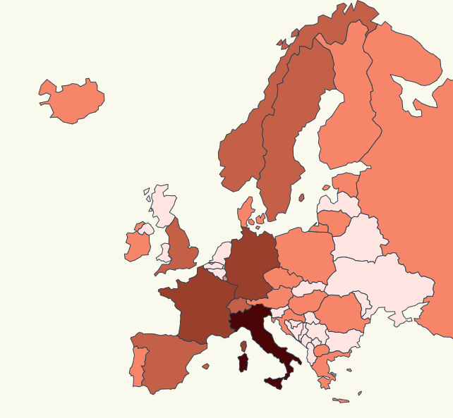

# Map Background Scale

Our boss got a link form a spanish news paper about choronavirus stats, he got
astonished by the charts that we represented (https://elpais.com/sociedad/2020/03/03/actualidad/1583227754_157787.html), now we have to implement a chart that
colours each european country depending on heavhy they have been affected by Choronavirus.



Codesandbox: https://codesandbox.io/s/aged-sunset-y8n63

# Steps

- We will take as starting point our previous example: _00-render-map-hover_ let's copy
  the content and execute _npm start_

```bash
npm start
```

We have the following information (07 March)

| Country         | Infected |
| --------------- | :------: |
| Italy           |   4636   |
| Germany         |   687    |
| France          |   613    |
| Spain           |   443    |
| Switzerland     |   210    |
| England         |   163    |
| Sweden          |   137    |
| Netherdlands    |   128    |
| Norway          |   113    |
| Belgium         |   109    |
| Austria         |    55    |
| Greek           |    46    |
| Island          |    45    |
| San Marino      |    23    |
| Denmark         |    23    |
| Irlanda         |    18    |
| Chzech Republic |    18    |
| Finlandia       |    15    |
| Croacia         |    11    |
| Estonia         |    10    |
| Portugal        |    8     |
| Rusia           |    8     |
| Eslovenia       |    6     |
| Rumania         |    6     |
| Polonia         |    5     |
| Luxemburgo      |    3     |
| Hungría         |    3     |
| Macedony        |    1     |
| Lituania        |    1     |
| Mónaco          |    1     |

- Let's port it to json (respecting the name of the countries that we are using
  in our europe map)

_./src/stats.ts_

```typescript
export const coronaVirusAffectedByCountry = [
  { country: "Italy", affected: 4636 },
  { country: "Germany", affected: 687 },
  { country: "France", affected: 613 },
  { country: "Spain", affected: 443 },
  { country: "Switzerland", affected: 210 },
  { country: "England", affected: 163 },
  { country: "Sweden", affected: 137 },
  { country: "Netherdlands", affected: 128 },
  { country: "Norway", affected: 113 },
  { country: "Austria", affected: 55 },
  { country: "Greece", affected: 46 },
  { country: "Iceland", affected: 45 },
  { country: "San Marino", affected: 23 },
  { country: "Denmark", affected: 23 },
  { country: "Ireland", affected: 18 },
  { country: "Czech Republic", affected: 18 },
  { country: "Finland", affected: 15 },
  { country: "Croatia", affected: 11 },
  { country: "Estonia", affected: 10 },
  { country: "Portugal", affected: 8 },
  { country: "Russia", affected: 8 },
  { country: "Romania", affected: 6 },
  { country: "Poland", affected: 5 },
  { country: "Luxembourg", affected: 3 },
  { country: "Hungary", affected: 3 },
  { country: "Macedonia", affected: 1 },
  { country: "Lithuania", affected: 1 },
  { country: "Monaco", affected: 1 },
];
```

- Le't import the new set of data into our _index.ts_ file:

_./src/index.ts_

```diff
const europejson = require("./europe.json");
+ import { coronaVirusAffectedByCountry } from "./stats";
```

- If we check the values the start from 0 to 5000 approx, let's assign a range of colores for that
  domain:

_./src/index.ts_

```diff
import { coronaVirusAffectedByCountry } from "./stats";

+ // set the affected color scale
+ const color = d3
+  .scaleThreshold<number, string>()
+  .domain([0, 1, 100, 500, 700, 5000])
+  .range([
+    "#FFFFF",
+    "#FFE8E5",
+    "#F88F70",
+    "#CD6A4E",
+    "#A4472D",
+    "#7B240E",
+    "#540000"
+  ]);
```

- Let's create a help function to map from country to color: we have to take into account
  that some European countries are not affected (won't exists on our list).

```diff
var color = d3
  .scaleThreshold<number, string>()
  .domain([0, 1, 100, 500, 700, 5000])
  .range([
    "#FFFFF",
    "#FFE8E5",
    "#F88F70",
    "#CD6A4E",
    "#A4472D",
    "#7B240E",
    "#540000"
  ]);

+ const assignCountryBackgroundColor = (countryName: string) => {
+  const item = coronaVirusAffectedByCountry.find(
+    item => item.country === countryName
+  );
+  return item ? color(item.affected) : color(0);
+ };
```

- Now it's time to remove features that we don´t need on the map render (mouse out, mouseover):

```diff
svg
  .selectAll("path")
  .data(geojson["features"])
  .enter()
  .append("path")
  .attr("class", "country")
  // data loaded from json file
  .attr("d", geoPath as any)
-  .on("mouseover", function(d, i) {
-    d3.select(this).attr("class", "selected-country");
-  })
-  .on("mouseout", function(d, i) {
-    d3.select(this).attr("class", "country");
-  });
```

- And add a fill style to match country name with corresponding background color (based on
  coronavirus affected people):

```diff
svg
  .selectAll("path")
  .data(geojson["features"])
  .enter()
  .append("path")
  .attr("class", "country")
+  .style("fill", function(d: any) {
+    return assignCountryBackgroundColor(d.properties.geounit);
+  })

  // data loaded from json file
  .attr("d", geoPath as any)
```

- To complete our styling journey, let's modify our country css class to provide a default
  background color to our countries.

_./src/map.css_

```diff
.country {
  stroke-width: 1;
  stroke: #2f4858;
-  fill: #008c86;
+  fill: #FFFFFF;
}

- .selected-country {
-  stroke-width: 1;
-  stroke: #bc5b40;
-  fill: #f88f70;
}
```

- Let's give a try

```bash
npm start
```

# About Basefactor + Lemoncode

We are an innovating team of Javascript experts, passionate about turning your ideas into robust products.

[Basefactor, consultancy by Lemoncode](http://www.basefactor.com) provides consultancy and coaching services.

[Lemoncode](http://lemoncode.net/services/en/#en-home) provides training services.

For the LATAM/Spanish audience we are running an Online Front End Master degree, more info: http://lemoncode.net/master-frontend
