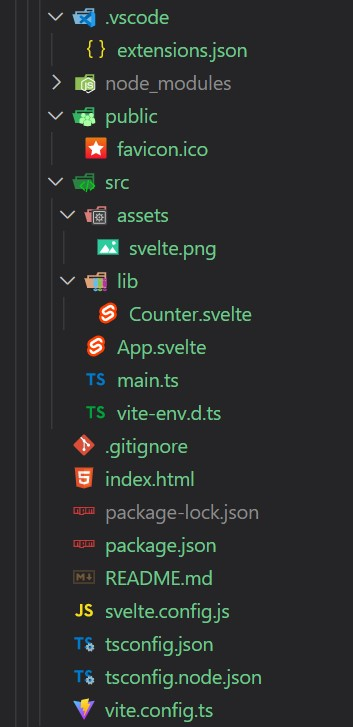

# 01 - Limpiar el Boilerplate

## Resumen

Ya tenemos creado y corriendo nuestro primer proyecto de **Svelte**. Vamos a echar un ojo a lo que nos ha creado y hacer una limpieza para seguir con los siguientes ejemplos.

## Paso a paso

### ¿Qué nos ha creado la plantilla?

Esta es la estructura que se ha creado (puede variar según la forma de comenzar el proyecto que hemos visto en el [ejemplo anterior](../00-boilerplate/README.md):



A destacar:

- **/.vscode**: carpeta con configuración recomendada para VS Code (extensiones útiles para _Svelte_).
- **/src**:
  - **/lib**: carpeta con un componente _Counter_. De momento la limpiaremos.
  - **App.svelte**: componente _App_ principal para nuestra aplicación.
  - **main.ts**: entrypoint de la aplicación.
- **svelte.config.js**: configuración de svelte para el bundler (en este caso _Vite_).
- **ts.config.json y ts.node.json**: configuración de _Tpyescript_.
- **vite.config.ts**: configuración de _Vite_ (básicamente el plugin de _Svelte_).

### package.json

Podemos ver el contenido del fichero `package.json`:

```json
{
  "name": "svelte-ts-by-sample",
  "private": true,
  "version": "0.0.0",
  "type": "module",
  "scripts": {
    "dev": "vite",
    "build": "vite build",
    "preview": "vite preview",
    "check": "svelte-check --tsconfig ./tsconfig.json"
  },
  "devDependencies": {
    "@sveltejs/vite-plugin-svelte": "^1.0.0-next.30",
    "@tsconfig/svelte": "^2.0.1",
    "svelte": "^3.44.0",
    "svelte-check": "^2.2.7",
    "svelte-preprocess": "^4.9.8",
    "tslib": "^2.3.1",
    "typescript": "^4.5.4",
    "vite": "^2.9.9"
  }
}
```

Como vemos, todos los paquetes (incluido _Svelte_) son **¡devDependencies!**, dependencias de desarrollo. ¿Cómo? ¿Porqué? ¿Entonces no llevaremos _Svelte_ a nuestro _bundle_? ¿Y cómo gestionará los estados y los componentes?

_Svelte_ añadirá lo necesario en nuestro código **en tiempo de compilación**, generando código javascript sin dependencias con la librería :D

### Limpiar la plantilla

Para quitar ruido y continuar con los siguientes ejemplos, eliminaremos la carpeta `/lib` y dejaremos el componente _App.svelte_ con el siguiente contenido:

```html
<script lang="ts"></script>

<main>
  <h1>Hello Svelte!</h1>
</main>

<style>
  h1 {
    color: #ff3e00;
  }
</style>
```

### Introducción a los componentes de **Svelte**

Podemos ver 3 partes claramente diferenciadas:

- **script**: dejaremos aquí nuestro código de javascript (typescript en nuestro caso).
- **markup**: donde especificamos el código HTML (en realidad JSX) de nuestro componente.
- **style**: para añadir los estilos de nuestro componente (tenemos scope y :global de fábrica, voilá!).

> ¿Podemos crear varios componentes en un mismo fichero? No se puede :(

### Hot reloading

Podemos comprobar que tenemos `hot reload` de fábrica. Arrancamos el proyecto con:

```bash
npm run dev
```

Y modificamos el contenido del elemento `h1` del componente _App_ para comprobar que se actualiza de inmediato en el navegador :)

### Instalar Prettier para formatear componentes de Svelte

Podemos instalar y configurar _Prettier_ para formatear los componentes de svelte. Para ellos utilizaremos el plugin [prettier-plugin-svelte](https://github.com/sveltejs/prettier-plugin-svelte)

```bash
npm i --save-dev prettier-plugin-svelte prettier
```

Podemos configurar varias opciones en el fichero .prettierrc:

- **svelteSortOrder** (_string_): establece el orden dentro del componente de `options`, `scripts`, `markup` y `styles`. Por ejemplo `options-scripts-markup-styles`.
- **svelteStrictMode** (_bool_): si se activa, indica una sintaxis HTML más estricta:

```html
<!-- svelteStrictMode: true -->
<div foo="{bar}"></div>

<!-- svelteStrictMode: false -->
<div foo="{bar}" />
```

- **svelteAllowShorthand** (_bool_): habilita/deshabilita el shorthand para los atributos de componentes cuando el nombre y la expresión son iguales:

```html
<!-- allowShorthand: true -->
<input type="text" {value} />

<!-- allowShorthand: false -->
<input type="text" value="{value}" />
```

- **svelteBracketNewLine** (_bool_): cierra los elementos multilinea del markup en una nueva linea.
- **svelteIndentScriptAndStyle** (_bool_): indentar (o no) el código dentro de los tags de `script` y `style` del componente.

Un ejemplo de configuración del fichero _.prettierrc_:

```json
{
  "printWidth": 120,
  "singleQuote": true,
  "useTabs": false,
  "tabWidth": 2,
  "semi": true,
  "bracketSpacing": true,
  "trailingComma": "es5",
  "arrowParens": "avoid",
  "svelteSortOrder": "options-scripts-markup-styles",
  "svelteStrictMode": false,
  "svelteAllowShorthand": false,
  "svelteBracketNewLine": false,
  "svelteIndentScriptAndStyle": true
}
```

# ¿Te apuntas a nuestro máster?

Si te ha gustado este ejemplo y tienes ganas de aprender Front End guiado por un grupo de profesionales ¿Por qué no te apuntas a nuestro [Máster Front End Online Lemoncode](https://lemoncode.net/master-frontend#inicio-banner)? Tenemos tanto edición de convocatoria con clases en vivo, como edición continua con mentorización, para que puedas ir a tu ritmo y aprender mucho.

También puedes apuntarte a nuestro Bootcamp de Back End [Bootcamp Backend](https://lemoncode.net/bootcamp-backend#inicio-banner).

Y si tienes ganas de meterte una zambullida en el mundo _devops_ apuntate nuestro [Bootcamp devops online Lemoncode](https://lemoncode.net/bootcamp-devops#bootcamp-devops/inicio).
