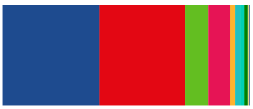

# Single bar + Layout

In the previous example we create a single stacked bar chart.

We just used a variable to store the previous position. But... Is there any standard way of doing something like that? What if I have to hop in into more complex scenarios like showing a stack bar chart comparing several years election results? StackLayout to the rescue.

We are going to recreate the same chart as in the previous sample but using d3js stack layout:



Live example: [codesandbox](https://codesandbox.io/s/nice-mccarthy-1jwtx)

Let's give a try.

# Steps

- Let's continue from example _02A-single-bar-stack-layout_, copy the example to a new folder and execute

```bash
npm install
```

> In a stacked bar chart, we would have more bars in this case we will represent a single one.

- Let's start adding some transformations.

First let's extract all the parties keys:

```typescript
const politicalPartiesKeys: string[] = resultCollectionSpainNov19.map(
  (item) => item.party
);
```

- Let's build a single serie

```typescript
// Since we are going to use stack layout
// We are going to format the data in the following format
// {
//   PSOE: 120,
//   PP: 88,
//   VOX: 52
//   ...
// }
// This will represent a serie for a single entry (in this
// case we are handling a single bar, an example of multiple
// bar would be showing result elections of several years)
const singleElectionResult = resultCollectionSpainNov19.reduce(
  (total, item) => ({
    ...total,
    [item.party]: item.seats,
  }),
  {}
);
```

- Now let's add a total with all the series (in this case one)

```typescript
// Stack Layout will expect an array of objects
// In this case we are going to display only one bar
// we just wrap it in an array
const data = [singleElectionResult];
```

- Let's create our stack layout:

```typescript
// Let's create our stack layout
// we are going to pass the keys (PSOE, PP, VOX, UP, Cs...)
// to have them attached on every item
const stack = d3.stack().keys(politicalPartiesKeys);
```

- Let's transform the data:

```typescript
// Now we get the data formatted in the follwing way:
//[
//  [[0,120]] // PSOE entry (seats), starts on 0 ends on 120
//  [[120,208]] // PP entry (88), but starts on previous items 120 (PSOE)
//  [[208, 260]] // VOX Entry
//]
const series = stack(data);
```

- Let's update chart group:

```diff
- let currentXPosition = 0;

chartGroup
  .selectAll("rect")
- .data(resultCollectionSpainNov19)
+ .data(series)
  .enter()
  .append("rect")
- .attr("width", (d) => xScale(d.seats))
+ .attr("width", (d) => {
+    // To get the width of the current item we have to substract
+    // the final stack value - the initial stack value
+    return xScale(d[0][1] - d[0][0]);
+ })
  .attr("height", barHeight)
- .attr("x", (d) => {
-    const position = currentXPosition;
-    currentXPosition += xScale(d.seats);
-    return position;
- })
+  .attr("x", (d) => {
+    // We take as starting point the first coordinate
+    // e.g. PP 120, 208 -> we start at 120 (where PSOE ended, and on the width param sum up that value)
+    return xScale(d[0][0]);
+  })
  .attr("y", () => chartDimensions.height - barHeight)
- .attr("fill", (d) => partiesColorScale(d.party));
+ .attr("fill", (d) => partiesColorScale(d.key));
```

# Excercise

Same as in previous example (just in case you didn't implement it)

Couldn't it be cool to add an indicator showing how many seat are needed to get overall majority? Something like:

Tips:

- The number of seats to get overall majority is half of the aviable seat + 1.
- You can use the xScale to get the exact position where to draw a line.
- you can draw a vertical line (check svg attribute to give it the right widht and color).

¡That's all!

# About Basefactor + Lemoncode

We are an innovating team of Javascript experts, passionate about turning your ideas into robust products.

[Basefactor, consultancy by Lemoncode](http://www.basefactor.com) provides consultancy and coaching services.

[Lemoncode](http://lemoncode.net/services/en/#en-home) provides training services.

For the LATAM/Spanish audience we are running an Online Front End Master degree, more info: http://lemoncode.net/master-frontend
