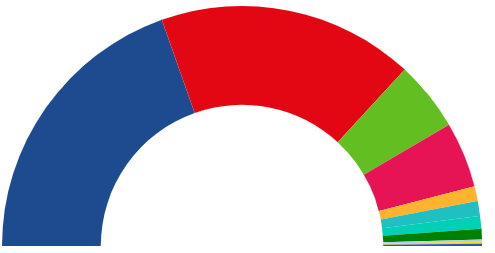

# Semi Arch Chart

Hey.. we got some positive feedback from our boss, the chart starts to make sense, buuuuut wouldn't it be nice
to display the bar as a semi arch.

Something like:



Live demo: [codesandbox](https://codesandbox.io/s/snowy-firefly-nd71d)

Well... since we have learn to use layouts, this time we will make use of the _pieChartLayout_, the good thing
of layouts is that you can easily preprocess the data the way you need it to display a customized chart
(instead of a pie, it will be a ring chart + semi arch).

# Steps

- We will take as starting sample _00-boilerplate_.

- Let's copy the content from _00-boilerplate_ and execute _npm install_

```bash
npm install
```

- Let's keep a fresh cut, wipe _index.ts_ and let's get started with the following boiler plate:

_index.ts_

```tsx
import * as d3 from "d3";
import { resultCollectionSpainNov19, ResultEntry } from "./data";

const svgDimensions = { width: 800, height: 500 };
const margin = { left: 5, right: 5, top: 10, bottom: 10 };

const chartDimensions = {
  width: svgDimensions.width - margin.left - margin.right,
  height: svgDimensions.height - margin.bottom - margin.top,
};

const partiesColorScale = d3
  .scaleOrdinal([
    "#ED1D25",
    "#0056A8",
    "#5BC035",
    "#6B2E68",
    "#F3B219",
    "#FA5000",
    "#C50048",
    "#029626",
    "#A3C940",
    "#0DDEC5",
    "#FFF203",
    "#FFDB1B",
    "#E61C13",
    "#73B1E6",
  ])
  .domain([
    "PSOE",
    "PP",
    "VOX",
    "UP",
    "ERC",
    "Cs",
    "JxCat",
    "PNV",
    "Bildu",
    "Más pais",
    "CUP",
    "CC",
    "BNG",
    "Teruel Existe",
  ]);

const svg = d3
  .select("body")
  .append("svg")
  .attr("width", svgDimensions.width)
  .attr("height", svgDimensions.height);

const chartGroup = svg
  .append("g")
  .attr("width", chartDimensions.width)
  .attr("height", chartDimensions.height);
```

- For the pie to be created we need to calculate it's radius:

```typescript
const radius = Math.min(chartDimensions.width, chartDimensions.height) / 2;
```

- Now we need to move the center of the pie chart, from 0,0 to radius, radius (plus our margin)

```typescript
chartGroup.attr("transform", `translate(${radius+margin.left},${radius+margin.top})`);
```

- Now we want to create a ring (doughnut), it will have an _innerRadius_ and _outerRadius_.

```typescript
const arc = d3
  .arc()
  .innerRadius(radius / 1.7) // We want to have an arc with a propotional width
  .outerRadius(radius);
```

- Now it's time for the pie layout to make it's magic, we will indicate that we want him to calculate all the semi archs angles, based on the values (and base on a half pie shape), since our array
  contains objects we need to pass a selector to extract the numeric values (seats)

```typescript
const pieChart = d3
  .pie<ResultEntry>()
  .startAngle(-90 * (Math.PI / 180))
  .endAngle(90 * (Math.PI / 180))
  .value(function (d: any) {
    return d.seats;
  });
```

- Let's create the chartGroup, set the data and start in enter (insert mode):

```typescript
const arcs = chartGroup
  .selectAll("slice")
  .data(pieChart(resultCollectionSpainNov19))
  .enter();
```

- And let's pain the paths

```typescript
arcs
  .append("path")
  .attr("d", <any>arc) // Hack typing: https://stackoverflow.com/questions/35413072/compilation-errors-when-drawing-a-piechart-using-d3-js-typescript-and-angular/38021825
  .attr("fill", (d) => {
    console.log(d.data.party);
    return partiesColorScale(d.data.party);
  });
```

- Let's give a try

```bash
npm start
```

# Additional resources

- Check this great example from Saninn: https://jsfiddle.net/Saninn/15pwLf7u/
- Check this example from Jane Pong on [bl.ocks.org](https://bl.ocks.org/officeofjane/b60c6d0fa49f0834ec7de47e5eb1a1d9)

# About Basefactor + Lemoncode

We are an innovating team of Javascript experts, passionate about turning your ideas into robust products.

[Basefactor, consultancy by Lemoncode](http://www.basefactor.com) provides consultancy and coaching services.

[Lemoncode](http://lemoncode.net/services/en/#en-home) provides training services.

For the LATAM/Spanish audience we are running an Online Front End Master degree, more info: http://lemoncode.net/master-frontend
