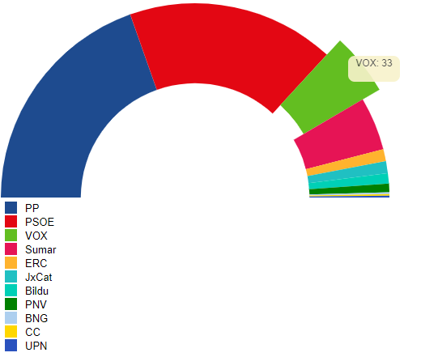

# Pimp Chart

"You nailed it!" the boss said, that's great, buuuuut... he asked as well if
we can just pimp a bit the chart, it is going to be published on an online
newspaper and it needs some details like add a legend to the chart, highlight
the selected party when we make a mouse hover, ...

Something like:



Live demo: [codesandbox](https://codesandbox.io/s/fervent-lumiere-8w12q)

# Steps

- We will take as starting sample _03-arc-chart_.

- Let's copy the content from _03-arc-chart_ and execute _npm install_

```bash
npm install
```

- We could just create the legend by ourselves or use some library (in this case
  we will go for the easy path), let's install

```bash
npm i d3-svg-legend --save
```

- Let's import the legend in our index

_./src/index.ts_

```diff
import * as d3 from "d3";
+ import { legendColor } from 'd3-svg-legend';
import { resultCollectionSpainNov19, ResultEntry } from "./data";
```

- Now let's create and ordinal scale color,map it to a legend object and add it in a group below the semi arch chart (APPEND THIS CONTENT, EOF).

_./src/index.ts_

```typescript
// Legend
const legendLeft = margin.left;
const legendTop = radius + 5;

const legendGroup = svg
  .append("g")
  .attr("transform", `translate(${legendLeft+margin.left},${legendTop+margin.top})`);

var colorLegend = legendColor().scale(partiesColorScale);

// TODO: review this any
legendGroup.call(colorLegend as any);
```

About d3 call:

_Invokes the specified function exactly once, passing in this selection along with any optional arguments. Returns this selection. This is equivalent to invoking the function by hand but facilitates method chaining. For example, to set several styles in a reusable function_

More info: https://stackoverflow.com/questions/12805309/javascript-library-d3-call-function

- Let's go for one more goodie, we want to highlight the piece of arc where the cursor is on.

```diff
arcs
  .append("path")
  .attr("d", <any>arc) // Hack typing: https://stackoverflow.com/questions/35413072/compilation-errors-when-drawing-a-piechart-using-d3-js-typescript-and-angular/38021825
  .attr("fill", (d) => {
    return partiesColorScale(d.data.party);
  })
+ .on("mouseover", function (mouseEvent: MouseEvent, datum) { {
+   d3.select(this).attr("transform", `scale(1.1, 1.1)`);
+ })
+ .on("mouseout", function() {
+   d3.select(this).attr("transform", ``);
+ });
```

- Now we want to add a tooltip when the mouse is over a party and display the
  party and number of votes, we will follow the approach defined in this blocks example: https://bl.ocks.org/d3noob/a22c42db65eb00d4e369.

- Let's start by defining the styles for that tooltip.

_./src/styles.css_

```css
div.tooltip {
  position: absolute;
  text-align: center;
  width: 60px;
  height: 28px;
  padding: 2px;
  font: 12px sans-serif;
  background: #f7f2cb;
  border: 0px;
  border-radius: 8px;
  pointer-events: none;
}
```

- Let's import this css into our index.html

_./src/index.html_

```diff
  <head>
    <link rel="stylesheet" type="text/css" href="./base.css" />
+   <link rel="stylesheet" type="text/css" href="./styles.css" />
  </head>
```

- Now let's define the tooltip.

> Watch out!! breaking change on d3 v6: https://stackoverflow.com/questions/63693132/unable-to-get-node-datum-on-mouseover-in-d3-v6

_./src/index.ts_

```typescript
// Define the div for the tooltip
const div = d3
  .select("body")
  .append("div")
  .attr("class", "tooltip")
  .style("opacity", 0);
```

- And let's show it on mouseover

_./src/index.ts_

```diff
  .on("mouseover", function (mouseEvent: MouseEvent, datum) { {
    d3.select(this).attr("transform", `scale(1.1, 1.1)`);
+   const partyInfo = datum.data;
+
+   const coords = { x: mouseEvent.pageX, y: mouseEvent.pageY };
+   div.transition().duration(200).style("opacity", 0.9);
+   div
+     .html(`<span>${partyInfo.party}: ${partyInfo.seats}</span>`)
+     .style("left", `${coords.x}px`)
+     .style("top", `${coords.y - 28}px`);
  })
```

- And hide it on mouse out

_./src/index.ts_

```diff
  .on("mouseout", function(datum) {
    d3.select(this).attr("transform", ``);
+   div.transition().duration(500).style("opacity", 0);
  });
```

# Excercise

A) We have shown a legend where all elements are in single columns, what if we want to split them in two columns?

- We could use two legends objects and split the colors / domain.
- We could play creating our custom legend.

Tips: https://stackoverflow.com/questions/51520596/spread-d3-js-legend-on-two-columns/51524137
Tips: http://jsfiddle.net/v7mkg/1/

B) Play a bit... add a rectangle, interact when clicking on a given arc (e.g. display tooltip)...

# About Basefactor + Lemoncode

We are an innovating team of Javascript experts, passionate about turning your ideas into robust products.

[Basefactor, consultancy by Lemoncode](http://www.basefactor.com) provides consultancy and coaching services.

[Lemoncode](http://lemoncode.net/services/en/#en-home) provides training services.

For the LATAM/Spanish audience we are running an Online Front End Master degree, more info: http://lemoncode.net/master-frontend
