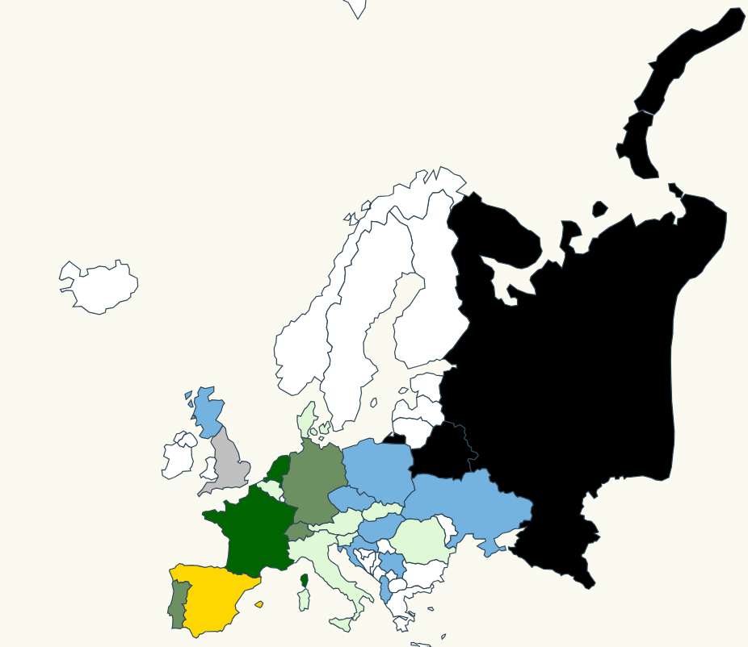
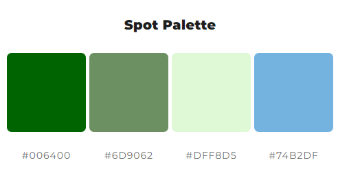

# Map Background Scale

After the Euro 2024 final, our boss asked us to implement a map that colours each european country depending on their final position in the above mentioned competition.



## Steps

- We will take as starting point our previous example: _00-render-map-hover_ let's copy the content and execute _npm start_

```bash
npm start
```

We have the following information

| Country               | Result         |
| --------------------- | :------------: |
| Spain                 | champion       |
| England               | runner-up      |
| France                | semifinals     |
| Netherlands           | semifinals     |
| Germany               | quarterfinals  |
| Portugal              | quarterfinals  |
| Switzerland           | quarterfinals  |
| Turkey                | quarterfinals  |
| Italy                 | knockout-stage |
| Belgium               | knockout-stage |
| Austria               | knockout-stage |
| Romania               | knockout-stage |
| Slovakia              | knockout-stage |
| Slovenia              | knockout-stage |
| Denmark               | knockout-stage |
| Georgia               | knockout-stage |
| Croatia               | group-stage    |
| CzechRepublic         | group-stage    |
| Hungary               | group-stage    |
| Serbia                | group-stage    |
| Poland                | group-stage    |
| Scotland              | group-stage    |
| Albania               | group-stage    |
| Ukraine               | group-stage    |
| Russia                | DSQ            |
| Belarus               | DSQ            |

- Let's port it to json (respecting the name of the countries that we are using in our eurobasket map)

_./src/stats.ts_:

```typescript
export const finalStandingsEuro2024 = [
  { country: "Spain", result: "champion" },
  { country: "England", result: "runner-up" },
  { country: "France", result: "semifinals" },
  { country: "Netherlands", result: "semifinals" },
  { country: "Germany", result: "quarterfinals" },
  { country: "Portugal", result: "quarterfinals" },
  { country: "Switzerland", result: "quarterfinals" },
  { country: "Turkey", result: "quarterfinals" },
  { country: "Italy", result: "knockout-stage" },
  { country: "Belgium", result: "knockout-stage" },
  { country: "Austria", result: "knockout-stage" },
  { country: "Romania", result: "knockout-stage" },
  { country: "Slovakia", result: "knockout-stage" },
  { country: "Slovenia", result: "knockout-stage" },
  { country: "Denmark", result: "knockout-stage" },
  { country: "Georgia", result: "knockout-stage" },
  { country: "Croatia", result: "group-stage" },
  { country: "CzechRepublic", result: "group-stage" },
  { country: "Hungary", result: "group-stage" },
  { country: "Serbia", result: "group-stage" },
  { country: "Poland", result: "group-stage" },
  { country: "Scotland", result: "group-stage" },
  { country: "Albania", result: "group-stage" },
  { country: "Ukraine", result: "group-stage" },
  { country: "Russia", result: "DSQ" },
  { country: "Belarus", result: "DSQ" },
];

```

- Now we are going to assign a range of colores for our domain:

_./src/index.ts_:

```typescript
import { finalStandingsEuro2024 } from "./stats";

// DIFF
// set the affected color scale
const color = d3
  .scaleOrdinal([
    "gold",
    "silver",
    "#006400",
    "#6D9062",
    "#DFF8D5",
    "#74B2DF",
    "black",
  ])
  .domain([
    "champion",
    "runner-up",
    "semifinals",
    "quarterfinals",
    "knockout-stage",
    "group-stage",
    "DSQ",
  ]);
// DIFF
```

We are using a color palette generated by [mycolor.space](https://mycolor.space/?hex=%23006400&sub=1):



- Let's create a help function to map from country to color: we have to take into account that some European countries didn't qualify to the Euro 2024 (they don't exist on our list).

```diff
const color = d3
  .scaleOrdinal([
    "gold",
    "silver",
    "#006400",
    "#6D9062",
    "#DFF8D5",
    "#74B2DF",
    "black",
  ])
  .domain([
    "champion",
    "runner-up",
    "bronze",
    "semifinals",
    "quarterfinals",
    "knockout-stage",
    "group-stage",
    "DSQ",
  ]);

+ const assignCountryBackgroundColor = (countryName: string) => {
+   const item = finalStandingsEuro2024.find(
+     item => item.country === countryName
+   );
+   return item ? color(item.result) : "white";
+ };
```

- Before modifying our svg, the css file _map.css_ has to be updated:

```diff
.country {
  stroke-width: 1;
  stroke: #2f4858;
- fill: #008c86;
}

.selected-country {
  stroke-width: 1;
  stroke: #bc5b40;
- fill: #f88f70;
}
```

- Let's add a fill style to match country name with corresponding background color, using the function defined previously:

```diff
svg
  .selectAll("path")
  .data(geojson["features"])
  .enter()
  .append("path")
  .attr("class", "country")
+ .style("fill", function(d: any) {
+   return assignCountryBackgroundColor(d.properties.geounit);
+ })
  // data loaded from json file
  .attr("d", geoPath as any)
```

- Now it's time to modify mouseout and mouseover render features. In this case we will add a tooltip when mouse is over a country, which is going to display the name and final position of that country:

```diff
+ // Define the div for the tooltip
+ const div = d3
+   .select("body")
+   .append("div")
+   .attr("class", "tooltip")
+   .style("opacity", 0);

svg
  .selectAll("path")
  .data(geojson["features"])
  .enter()
  .append("path")
  .attr("class", "country")
  .style("fill", function (d: any) {
    return assignCountryBackgroundColor(d.properties.geounit);
  }
  // data loaded from json file
  .attr("d", geoPath as any)
- .on("mouseover", function(d, i) {
+ .on("mouseover", function (mouseEvent: MouseEvent, datum: any) {
    d3.select(this).attr("class", "selected-country");
+   const country = datum.properties.geounit;
+   const item = finalStandingsEuro2024.find(
+     (item) => item.country === country
+   );
+   const countryResult = item ? item.result : "DNQ";
+
+   const coords = { x: mouseEvent.pageX, y: mouseEvent.pageY };
+   div.transition().duration(200).style("opacity", 0.9);
+   div
+     .html(`<span>${country}: ${countryResult}</span>`)
+     .style("left", `${coords.x}px`)
+     .style("top", `${coords.y - 28}px`);
  })
  .on("mouseout", function(d, i) {
    d3.select(this).attr("class", "country");
+   div.transition()
+     .duration(500)
+     .style("opacity", 0);
  });
```

- This new div element requires some styling. Let's create a new css file, _./src/styles.css_ with the content below:

```css
div.tooltip {
  position: absolute;
  text-align: center;
  width: 70px;
  height: 28px;
  padding: 2px;
  font: 12px sans-serif;
  background: #f7f2cb;
  border: 0px;
  border-radius: 8px;
  pointer-events: none;
}
```

- And import this new css file in our html file _index.html_:

```diff
  <link rel="stylesheet" type="text/css" href="./map.css" />
+ <link rel="stylesheet" type="text/css" href="./styles.css" />
  <link rel="stylesheet" type="text/css" href="./base.css" />
```

- Let's give a try

```bash
npm start
```

## About Basefactor + Lemoncode

We are an innovating team of Javascript experts, passionate about turning your ideas into robust products.

[Basefactor, consultancy by Lemoncode](http://www.basefactor.com) provides consultancy and coaching services.

[Lemoncode](http://lemoncode.net/services/en/#en-home) provides training services.

For the LATAM/Spanish audience we are running an Online Front End Master degree, more info: <http://lemoncode.net/master-frontend>
