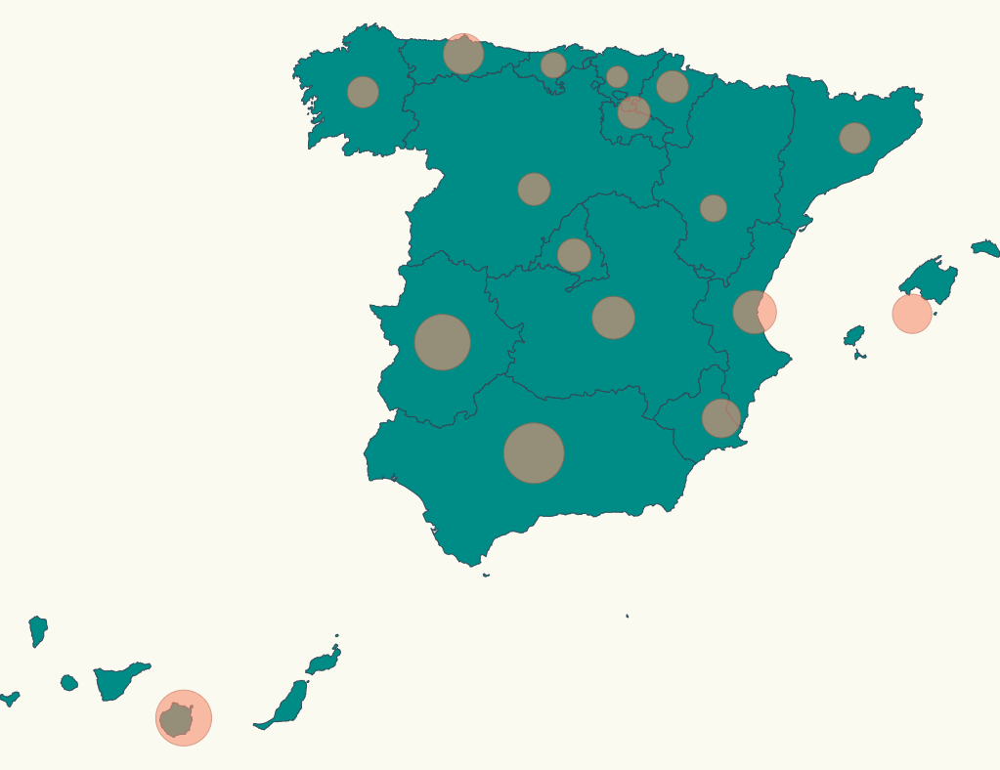

# Pinning locations + scale

Our boss liked a lot the map we have developed, now he wants to focus on Spain booster dose vaccination percentage by region, he wants to
display a map pinning each region and scaling that pin according the percentage of vaccination, something like:



codesandbox: https://codesandbox.io/s/hopeful-ellis-rlczx (deprecated, it has to be updated)

We have to face three challenges here:

- Canary islands are a territory placed far away from Spain mainlan. We need to cropt that islands and paste them in a visible place in the map.
- Place pins on a map based on location.
- Scale pin radius based on vaccination percentage.

# Steps

- We will take as starting example _00-render-map-hover_, let's copy the content from that folder and execute _npm install_.

```bash
npm install
```

- This time we will Spain topojson info: https://github.com/deldersveld/topojson/blob/master/countries/spain/spain-comunidad-with-canary-islands.json

Let's copy it under the following route _./src/spain.json_

- Now instead of importing _europe.json_ we will import _spain.json_.

_./src/index.ts_

```diff
import * as d3 from "d3";
import * as topojson from "topojson-client";
- const europejson = require("./europe.json");
+ const spainjson = require("./spain.json");
```

- Let's build the spain map instead of europe:

_./src/index.ts_

```diff
const geojson = topojson.feature(
+  spainjson,
-  europejson,
+  spainjson.objects.ESP_adm1
-  europejson.objects.continent_Europe_subunits
);
```

> How do we know that we have to use _spainjson.objects.ESP_adm1_ just by examining
> the _spain.json_ file and by debugging and inspecting what's inside _spainjson_ object?

- If we run the project, we will get some bitter-sweet feelings, we can see a map of spain,
  but it's too smal, and on the other hand, canary islands are shown far away (that's normal,
  but usually in maps these islands are relocated).

- If we run the project we can check that the map is now renders in a proper size and position, let's
  go for the next challenge, we want to reposition Canary Islands, in order to do that we can build a
  map projection that positions that piece of land in another place, for instance for the USA you can
  find Albers USA projection: https://bl.ocks.org/mbostock/2869946, there's a great project created by
  [Roger Veciana](https://github.com/rveciana) that implements a lot of projections for several
  maps:

  - [Project site](https://geoexamples.com/d3-composite-projections/)
  - [Github project](https://github.com/rveciana/d3-composite-projections)

Let's install the library that contains this projections:

```bash
npm install d3-composite-projections --save
```

- Let's import it in our _index.ts_ (we will use require since we don't have typings).

```diff
import * as d3 from "d3";
import * as topojson from "topojson-client";
const spainjson = require("./spain.json");
+ const d3Composite = require("d3-composite-projections");
```

- Let's change the projection we are using (we will need to tweak as well the
  _scale_ and _translate_ values):

_./src/index.ts_

```diff
- const aProjection = d3.geoMercator();
+ const aProjection = d3Composite.geoConicConformalSpain();
```

- If we run the project, voila ! we got the map just the way we want it.

- Now we want to display a circle in the middle of each community (comunidad autónoma),
  we have collected the latitude and longitude for each community, let's add them to our
  project.

_./src/communities.ts_

```typescript
export const latLongCommunities = [
  {
    name: "Andalucía",
    long: -4.5,
    lat: 37.6,
  },
  {
    name: "Aragón",
    long: -1.0,
    lat: 41.0,
  },
  {
    name: "Asturias",
    long: -5.86112,
    lat: 43.36662,
  },
  {
    name: "Islas Baleares",
    long: 2.52136,
    lat: 39.18969,
  },
  {
    name: "Islas Canarias",
    long: -15.5,
    lat: 28.0,
  },
  {
    name: "Cantabria",
    long: -4.03333,
    lat: 43.2,
  },
  {
    name: "Castilla y León",
    long: -4.45,
    lat: 41.383333,
  },
  {
    name: "Castilla-La Mancha",
    long: -3.000033,
    lat: 39.500011,
  },
  {
    name: "Cataluña",
    long: 1.86768,
    lat: 41.82046,
  },
  {
    name: "C. Valenciana",
    long: -0.37739,
    lat: 39.45975,
  },
  {
    name: "Extremadura",
    long: -6.16667,
    lat: 39.16667,
  },
  {
    name: "Galicia",
    long: -7.86621,
    lat: 42.75508,
  },
  {
    name: "La Rioja",
    long: -2.445556,
    lat: 42.465,
  },
  {
    name: "Madrid",
    long: -3.70256,
    lat: 40.4165,
  },
  {
    name: "Murcia",
    long: -1.13004,
    lat: 37.98704,
  },
  {
    name: "Navarra",
    long: -1.65,
    lat: 42.816666,
  },
  {
    name: "País Vasco",
    long: -2.75,
    lat: 43.0,
  },
];
```

- Let's import it:

_./src/index.ts_

```diff
import * as d3 from "d3";
import * as topojson from "topojson-client";
+ import { latLongCommunities } from "./communities";
```

- And let's append at the bottom of the _index_ file a code to render a circle on top of each community:

_./src/index.ts_

```typescript
svg
  .selectAll("circle")
  .data(latLongCommunities)
  .enter()
  .append("circle")
  .attr("r", 15)
  .attr("cx", (d) => aProjection([d.long, d.lat])[0])
  .attr("cy", (d) => aProjection([d.long, d.lat])[1]);
```

- Nice ! we got an spot on top of each region. Now it's time to
  make this spot size relative to the vaccination percentage.

- We will add the stats that we need to display (vaccination percentage per community). This informations has been obtained from [RTVE web site](https://www.rtve.es/noticias/20220920/mapa-del-coronavirus-espana/2004681.shtml):

_./stats.ts_

```typescript
export const boosterDosePerRegion = [
  {
    name: "Andalucía",
    value: 49.9,
  },
  {
    name: "Aragón",
    value: 55.2,
  },
  {
    name: "Asturias",
    value: 72.2,
  },
  {
    name: "Islas Baleares",
    value: 42.2,
  },
  {
    name: "Islas Canarias",
    value: 47.2,
  },
  {
    name: "Cantabria",
    value: 60.9,
  },
  {
    name: "Castilla y León",
    value: 64.6,
  },
  {
    name: "Castilla-La Mancha",
    value: 54.2,
  },
  {
    name: "Cataluña",
    value: 50.4,
  },
  {
    name: "C. Valenciana",
    value: 59.4,
  },
  {
    name: "Extremadura",
    value: 62.1,
  },
  {
    name: "Galicia",
    value: 74.3,
  },
  {
    name: "La Rioja",
    value: 58.8,
  },
  {
    name: "Madrid",
    value: 52.1,
  },
  {
    name: "Murcia",
    value: 47.1,
  },
  {
    name: "Navarra",
    value: 56.1,
  },
  {
    name: "País Vasco",
    value: 55.7,
  },
];
```

- Let's import it into our index.ts

_./src/index.ts_

```diff
import * as d3 from "d3";
import * as topojson from "topojson-client";
const spainjson = require("./spain.json");
const d3Composite = require("d3-composite-projections");
import { latLongCommunities } from "./communities";
+ import { boosterDosePerRegion } from "./stats";
```

- Let's calculate the highest vaccination percentage among all Spanish regions:

_./src/index.ts_

```typescript
const highestPercentage = boosterDosePerRegion.reduce(
  (max, item) => (item.value > max ? item.value : max),
  0
);
```

- Let's create an scale to map vaccination percentage to radius size.

_./src/index.ts_

```typescript
const vaccinationPercentageRadiusScale = d3
  .scaleLinear()
  .domain([0, highestPercentage])
  .range([0, 50]); // 50 pixel max radius, we could calculate it relative to width and height
```

- Let's create a helper function to glue the community name with the vaccination percentage.

_./src/index.ts_

```typescript
const calculateRadiusBasedOnVaccinationPercentage = (comunidad: string) => {
  const entry = boosterDosePerRegion.find((item) => item.name === comunidad);
  return entry ? vaccinationPercentageRadiusScale(entry.value) : 0;
};
```

- Let's tie it up with the circle rendering code that we created above:

_./src/index.ts_

```diff
svg
  .selectAll("circle")
  .data(latLongCommunities)
  .enter()
  .append("circle")
-  .attr("r", 15)
+  .attr("r", d => calculateRadiusBasedOnVaccinationPercentage(d.name))
  .attr("cx", d => aProjection([d.long, d.lat])[0])
  .attr("cy", d => aProjection([d.long, d.lat])[1]);
```

- If we run the example we can check that know circles are shonw in the right size.

- But those black circles are ugly. Let's add some styles to them: we will just use a red background and  some transparency to let the user see the spot and the map under that spot.

_./src/map.css_

```diff
+ .region {
- .country {
    stroke-width: 1;
    stroke: #2f4858;
    fill: #008c86;
  }

- .selected-country {
-   stroke-width: 1;
-   stroke: #bc5b40;
-   fill: #f88f70;
- }

+ .marker {
+   stroke-width: 1;
+   stroke: #bc5b40;
+   fill: #f88f70;
+   fill-opacity: 0.6;
+ }
```

- Let's apply this style to the black circles that we are rendering:

_./src/index.ts_

```diff
svg
  .selectAll("path")
  .data(geojson["features"])
  .enter()
  .append("path")
- .attr("class", "country")
+ .attr("class", "region")
  .attr("d", geoPath as any);
svg
  .selectAll("circle")
  .data(latLongCommunities)
  .enter()
  .append("circle")
+ .attr("class", "marker")
  .attr("r", d => calculateRadiusBasedOnVaccinationPercentage(d.name))
  .attr("cx", d => aProjection([d.long, d.lat])[0])
  .attr("cy", d => aProjection([d.long, d.lat])[1]);
```

- In order to make the map more interactive, let's listen for some events for each marker. Before doing this, it's necessary to create class _selected-marker_ in _map.css_:

_./src/map.css_

```diff
.country {
  stroke-width: 1;
  stroke: #2f4858;
  fill: #008c86;
}

.marker {
  stroke-width: 1;
  stroke: #bc5b40;
  fill: #f88f70;
  fill-opacity: 0.7;
}

+ .selected-marker {
+   stroke-width: 1;
+   stroke: #bc5b40;
+   fill: #f88f70;
+   fill-opacity: 0.9;
+ }
```

_./src/index.ts_

```diff
svg
  .selectAll("path")
  .data(geojson["features"])
  .enter()
  .append("path")
  .attr("class", "country")
  // data loaded from json file
  .attr("d", geoPath as any)
  .on("mouseover", function(d, i) {
-   d3.select(this).attr("class", "selected-country");
+   d3.select(this)
+     .attr("class", "selected-marker")
+     .style("cursor", "pointer");
  })
  .on("mouseout", function(d, i) {
-   d3.select(this).attr("class", "country");
+   d3.select(this)
+     .attr("class", "marker")
+     .style("cursor", "default");
+ })
+ .on("click", function(event, d) {
+   const percentage = boosterDosePerRegion.find((element) => element.name === d.name).value;
+   alert(`Booster dose percentage in ${d.name}: ${percentage}%`)
  });
```

# About Basefactor + Lemoncode

We are an innovating team of Javascript experts, passionate about turning your ideas into robust products.

[Basefactor, consultancy by Lemoncode](http://www.basefactor.com) provides consultancy and coaching services.

[Lemoncode](http://lemoncode.net/services/en/#en-home) provides training services.

For the LATAM/Spanish audience we are running an Online Front End Master degree, more info: http://lemoncode.net/master-frontend
