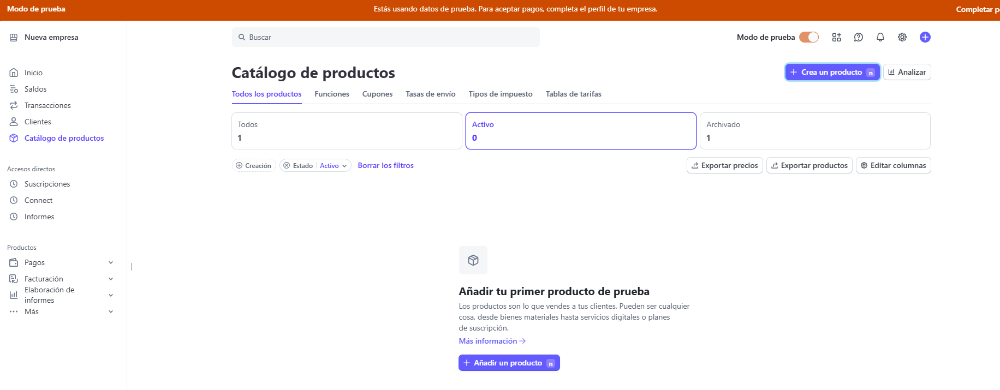

# Stripe Subscriptions

[🇬🇧 English version](./README.md)

## Que vamos a cubrir

En lugar de trabajar con pagos únicos, en este ejemplo vamos a trabajar con subscripciones. A diferencia de los ejemplos anteriores, aquí vamos a estar trabajando con el Dashboard de Stripe (también con la CLI).

## Pasos

- Tomamos como punto de partida el ejemplo anterior, lo copiamos e instalamos las dependencias:

```bash
npm install
```

- En primer lugar, tenemos que crear el 'pricing model': los productos y sus precios. Esta operación puede llevarse a cabo tanto con el Dashboard de Stripe como con su CLI. Vamos a crear uno de cada forma

### Stripe CLI

```bash
stripe products create \
  --name="Lemoncode Formacion: Plan basico" \
  --description="Servicio estandar"
```

- Es importante copiar el valor `id` en la respuesta del cliente, porque es necesario para la creación del precio (hay que reemplazar el valor `prod_RjNqVbkaGh2XfI`):

```bash
stripe prices create \
  -d product=prod_RjNqVbkaGh2XfI \
  -d unit_amount=1500 \
  -d currency=eur \
  -d "recurring[interval]"=month
```

### Stripe Dashboard

En la barra lateral hay que seleccionar 'Catálogo de productos'. Una vez en el catálogo, pulsa el botón 'Crea un producto' o 'Añadir un producto'. En este caso, producto y precio se crean en la misma operación.



- Una vez tengamos creados nuestros productos, vamos a modificar nuestra página principal para que ofrezca ambas subscripciones, `index.html`:

```html
<!DOCTYPE html>
<html>
  <head>
    <title>Subscribe to Lemoncode</title>
    <link rel="stylesheet" href="style.css" />
    <script src="https://polyfill.io/v3/polyfill.min.js?version=3.52.1&features=fetch"></script>
    <script src="https://js.stripe.com/v3/"></script>
  </head>
  <body>
    <section>
      <div class="product">
        
        <div class="description">
          <h3>Lemoncode Formación: Plan Básico</h3>
          <h5>15,00 €</h5>
        </div>
      </div>
      <form action="/api/create-checkout-session/basic" method="POST">
        <button id="checkout-button">Selecciona el plan básico</button>
      </form>
      <div class="product">
        
        <div class="description">
          <h3>Lemoncode Formación: Plan Premium</h3>
          <h5>30,00 €</h5>
        </div>
      </div>
      <form action="/api/create-checkout-session/premium" method="POST">
        <button id="checkout-button">Selecciona el plan premium</button>
      </form>
    </section>
  </body>
</html>
```

- Ahora tenemos que modificar el endpoint `/create-checkout-session` para que acepte un parámetro (el plan escogido). Además, la sesión a crear será diferente: el modo será `subscription` y el precio lo obtendremos del dashboard de Stripe.

```ts
api.post('/create-checkout-session/:plan', async (req, res) => {
  const plan = req.params.plan;
  const price = plan === 'basic' ?  'price_1QrG0zIc8xc9b5x9bQ5bQA4T' : 'price_1QrFyBIc8xc9b5x9a1qNcrey';
  const session = await stripe.checkout.sessions.create({
    line_items: [
      {
        price,
        quantity: 1,
      },
    ],
    mode: 'subscription',
    success_url: `http://localhost:${envConstants.PORT}/success.html`,
    cancel_url: `http://localhost:${envConstants.PORT}/cancel.html`,
  });

  res.redirect(303, session.url);
});
```

- En nuestro endpoint de webhook podemos escuchar alguno de los eventos ligados a suscripciones. Para más información, echa un vistazo a este enlace: <https://docs.stripe.com/billing/subscriptions/overview#subscription-events>

- Tras completar la subscripción, podemos regresar al Dashboard de Stripe para ver las subscripciones existentes.

### Portal de cliente

Una vez el cliente se ha suscrito, podrá gestionar su suscripción a través del portal de cliente de Stripe. Se trata de un portal alojado en Stripe que permite a los clientes gestionar por sí mismos los datos de sus suscripciones y su facturación. Dicho portal debe configurarse previamente en el siguiente enlace: <https://dashboard.stripe.com/test/settings/billing/portal>.

Si el portal de cliente ya está configurado, lo único que tenemos que hacer es añadir una vista nueva en nuestra interfaz gráfica para que el usuario pueda gestionar su suscripción. Para ello creamos el fichero `portal.html`:

```html
<!DOCTYPE html>
<html>
  <head>
    <title>Manage your subscription</title>
    <link rel="stylesheet" href="style.css" />
    <script src="https://polyfill.io/v3/polyfill.min.js?version=3.52.1&features=fetch"></script>
    <script src="https://js.stripe.com/v3/"></script>
  </head>
  <body>
    <section>
      <form action="/api/customer-portal" method="POST">
        <button id="checkout-button">Accede al portal de cliente</button>
      </form>
    </section>
  </body>
</html>
```

También será necesario añadir un nuevo endpoint, `/customer-portal`, en nuestro fichero de API, `api.ts`:

```ts
api.post('/customer-portal', async (req, res) => {
  const portalSession = await stripe.billingPortal.sessions.create({
    customer: 'cus_SATRBiexHebQQO', // Hardcoded, it should come from database
    return_url: `http://localhost:${envConstants.PORT}/portal.html`,
  });

  res.redirect(303, portalSession.url);
});
```

Volvemos a arrancar nuestra aplicación con `npm start` y nos dirigimos a <http://localhost:8081/portal.html> para acceder al portal de cliente de Stripe.
