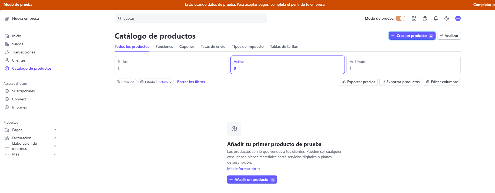

# Stripe Subscriptions

[🇬🇧 English version](./README.md)

## Que vamos a cubrir

En lugar de trabajar con pagos únicos, en este ejemplo vamos a trabajar con subscripciones. A diferencia de los ejemplos anteriores, aquí vamos a estar trabajando con el Dashboard de Stripe (también con la CLI).

## Pasos

- Tomamos como punto de partida el ejemplo anterior, lo copiamos e instalamos las dependencias:

```bash
npm install
```

- En primer lugar, tenemos que crear el 'pricing model': productos y sus precios. Esta operación puede llevarse a cabo tanto con el Dashboard de Stripe como con su CLI. Vamos a crear uno de cada forma

- Stripe CLI:

```bash
stripe products create \
  --name="Lemoncode Formacion: Plan basico" \
  --description="Servicio estandar"
```

- Es importante copiar el valor `id` en la respuesta del cliente, porque es necesario para la creación del precio (hay que reemplazar el valor `prod_RjNqVbkaGh2XfI`):

```bash
stripe prices create \
  -d product=prod_RjNqVbkaGh2XfI \
  -d unit_amount=1500 \
  -d currency=eur \
  -d "recurring[interval]"=month
```

- Stripe Dashboard:

En la barra lateral hay que seleccionar 'Catálogo de productos'. Una vez en el catálogo, pulsa el botón 'Crea un producto' o 'Añadir un producto'. En este caso, producto y precio se crean en la misma operación.



- Una vez tengamos creados nuestros productos, vamos a modificar nuestra página principal para que ofrezca ambas subscripciones, `index.html`:

```html
<!DOCTYPE html>
<html>
  <head>
    <title>Subscribe to Lemoncode</title>
    <link rel="stylesheet" href="style.css" />
    <script src="https://polyfill.io/v3/polyfill.min.js?version=3.52.1&features=fetch"></script>
    <script src="https://js.stripe.com/v3/"></script>
  </head>
  <body>
    <section>
      <div class="product">
        
        <div class="description">
          <h3>Lemoncode Formación: Plan Básico</h3>
          <h5>15,00 €</h5>
        </div>
      </div>
      <form action="/api/create-checkout-session/basic" method="POST">
        <button id="checkout-button">Selecciona el plan básico</button>
      </form>
      <div class="product">
        
        <div class="description">
          <h3>Lemoncode Formación: Plan Premium</h3>
          <h5>30,00 €</h5>
        </div>
      </div>
      <form action="/api/create-checkout-session/premium" method="POST">
        <button id="checkout-button">Selecciona el plan premium</button>
      </form>
    </section>
  </body>
</html>
```

- Ahora tenemos que modificar el endpoint `/create-checkout-session` para que acepte un parámetro (el plan escogido). Además, la sesión a crear será diferente: el modo será `subscription` y el precio lo obtendremos del dashboard de Stripe.

```ts
api.post('/create-checkout-session/:plan', async (req, res) => {
  const plan = req.params.plan;
  const price = plan === 'basic' ?  'price_1QpvBlIhZQY8IBfG9Vnbdnu6' : 'price_1QpvBlIhZQY8IBfG9Vnbdnu6';
  const session = await stripe.checkout.sessions.create({
    line_items: [
      {
        price,
        quantity: 1,
      },
    ],
    mode: 'subscription',
    success_url: `http://localhost:${envConstants.PORT}/success.html`,
    cancel_url: `http://localhost:${envConstants.PORT}/cancel.html`,
  });

  res.redirect(303, session.url);
});
```

- Tras completar la subscripción, podemos regresar al Dashboard de Stripe para ver las subscripciones existentes.
