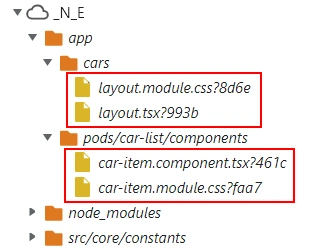

# 07 Server Components

Let's works with Nextjs using client side rendering.

We will start from `06-client-side-rendering`.

# Steps to build it

- `npm install` to install previous sample packages:

```bash
npm install
```

# Server Components

Enable `appDir`:

_./next.config.js_

```diff
module.exports = {
  images: {
    domains: [process.env.DOMAIN],
  },
+ experimental: {
+   appDir: true,
+ },
};

```

Let's create the `app` folder migrating the main page:

_./app/page.tsx_

```javascript
import Link from 'next/link';

const HomePage = () => {
  return (
    <>
      <h2>Hello from Nextjs</h2>
      <Link href="/cars">Navigate to car list</Link>
    </>
  );
};

export default HomePage;

```

_./app/head.tsx_

```javascript
const HomeHead = () => {
  return (
    <>
      <title>Rent a car - Home</title>
    </>
  );
};

export default HomeHead;

```

_./app/layout.tsx_

```javascript
import React from 'react';

interface Props {
  children: React.ReactNode;
}

const HomeLayout: React.FC<Props> = (props) => {
  const { children } = props;
  return (
    <html lang="en">
      <head />
      <body>{children}</body>
    </html>
  );
};

export default HomeLayout;

```

> [Required Root Layout](https://beta.nextjs.org/docs/routing/pages-and-layouts#root-layout-required)

Remove previous page `./src/pages/index.tsx`.

Run app:

```bash
npm start

```

There is some [issue when we use the link component in v13.0.7](https://github.com/vercel/next.js/issues/44129), so let's downgrade to [13.0.6]

```bash
npm install next@13.0.6 -E

```

Let's try the next page:

_./app/cars/head.tsx_

```javascript
const CarListHead = () => {
  return <title>Rent a car - Car list</title>;
};

export default CarListHead;

```

_./app/cars/layout.module.css_

```css
.toolbar {
  display: flex;
  flex-direction: row;
  column-gap: 1rem;
  row-gap: 1rem;
}

.toolbar > :nth-child(3) {
  margin-left: auto;
}

.iconButton {
  width: 3rem;
  height: 3rem;
}

.image {
  object-fit: contain;
}

.content {
  margin: 2rem;
}

```

_./app/cars/layout.tsx_

```javascript
import React from 'react';
import Image from 'next/image';
import { AppBar, Toolbar, Typography, IconButton } from '@mui/material';
import classes from './layout.module.css';

interface Props {
  children: React.ReactNode;
}

const Layout: React.FC<Props> = (props) => {
  const { children } = props;

  return (
    <>
      <AppBar position="fixed">
        <Toolbar className={classes.toolbar} variant="dense">
          <IconButton className={classes.iconButton}>
            <Image
              className={classes.image}
              alt="Lemoncode logo"
              src="/home-logo.png"
              fill={true}
            />
          </IconButton>
          <Typography variant="h6" color="inherit">
            Rent a car
          </Typography>
        </Toolbar>
      </AppBar>
      <main className={classes.content}>
        <Toolbar variant="dense" />
        {children}
      </main>
    </>
  );
};

export default Layout;

```

Add `page` with some text:

_./app/cars/page.tsx_

```javascript
const CarListPage = () => {
  return <h1>Car list page</h1>;
};

export default CarListPage;

```

Remove previous page `./src/pages/cars.tsx`.

Why it fails? Because all components inside `app` folder are server components by default but if we need to use client hooks such as `useState`, `useEffect`, `React context`, etc we need to mark it as [Client Component](https://beta.nextjs.org/docs/rendering/server-and-client-components#convention):


_./app/cars/layout.tsx_

```diff
+ 'use client';

import React from 'react';
import Image from 'next/image';
...
```

> [Some of third-party packages are not ready for server components](https://beta.nextjs.org/docs/rendering/server-and-client-components#third-party-packages)

Update cars `page`, first we will move `pods/car-list` folder to `app/pods/car-list`:

_./app/cars/page.tsx_

```diff
+ import { CarListContainer, api } from '../pods/car-list';

- const CarListPage = () => {
+ const CarListPage = async () => {
+   const carList = await api.getCarList();
+   console.log('Car list build time', { carList });
-   return (
-     <>
-       <h1>Car list page</h1>
-     </>
-   );
+   return <CarListContainer carList={carList} />;
};

export default CarListPage;

```

Why it fails? The error is _You have a Server Component that imports next/router. Use next/navigation instead._ Now, if we need a navigation different than `Link` component we have to use router from [next/navigation](https://beta.nextjs.org/docs/routing/linking-and-navigating#userouter-hook) and it will always be a "client" navigation, [next/router will be legacy](https://beta.nextjs.org/docs/upgrade-guide#step-5-migrating-routing-hooks).

_./app/pods/car-list/components/car-item.component.tsx_

```diff
+ "use client";

import React from 'react';
- import { useRouter } from 'next/router';
+ import { useRouter } from 'next/navigation';
...
```

This second error: _Error: Unsupported Server Component type: undefined_ is hard to debug and solve it, but it's related with the barrel file:

_./app/pods/car-list/components/index.ts_

```diff
- export * from './car-item.component';
+ export { CarItem } from './car-item.component';

```

Now, we can see in the bundle only the components marked as "client":



> NOTE: We have style flickering when we navigate from main route to `/cars`. Check with Fast 3G.

Let's migrate the last page `car details`, but this time since both pages are using the same layout, we don't need to define a new one for car details, we will reuse it:

> Move `pods/car` to `app/pods/car`

_./app/cars/\[carId\]/head.tsx_

```javascript
import { api } from '../../pods/car';

interface Props {
  params: { carId: string };
}

const CarHead = async (props: Props) => {
  const { params } = props;
  const car = await api.getCar(params?.carId);
  console.log('Get car from Head');

  return <title>Rent a car - Car {car?.name} details</title>;
};

export default CarHead;

```

_./app/cars/\[carId\]/page.tsx_

```javascript
import { CarContainer, api } from '../../pods/car';

interface Props {
  params: { carId: string };
}

const CarPage = async (props: Props) => {
  const { params } = props;
  const car = await api.getCar(params?.carId);
  console.log('Get car from Page');

  return <CarContainer car={car} />;
};

export default CarPage;

```

Mark `car.container` as client for same reasons:

_./app/pods/car/car.container.tsx_

```diff
+ "use client";

import React from 'react';
- import { useRouter } from 'next/router';
+ import { useRouter } from 'next/navigation';
...
```

_./app/pods/car/index.ts_

```diff
- export * from './car.container';
+ export { CarContainer } from './car.container';
import * as api from './api';
export { api };

```

Remove previous page `./src/pages/cars/[carId].tsx`.

> As we see, the data fetch is duplicated but in the official docs mentioning that [will automatically dedupe requests for the same data across layout page and head](https://beta.nextjs.org/docs/api-reference/file-conventions/head#data-fetching-and-dynamic-tags)

Run:

```bash
npm run start:api-server
npm run build
npm run start:prod
```

[About the different `fetch` types](https://beta.nextjs.org/docs/api-reference/fetch) like Static Site Generation, Incremental Static Regeneration, Server Side Rendering by deault will be use SSG or SSR depends on the page implementation (like car list and car details), but we can change in fetch options:

_./app/pods/car-list/api/car-list.api.ts_

```diff
- import Axios from 'axios';
import { envConstants } from 'core/constants';
import { Car } from './car-list.api-model';

const url = `${envConstants.BASE_API_URL}/cars`;

- export const getCarList = async (): Promise<Car[]> => {
+ export const getCarList = async (options?: RequestInit): Promise<Car[]> => {
-   const { data } = await Axios.get<Car[]>(url);
-   return data;
+   return await fetch(url, options).then((response) => response.json());
};

```

_./cars/page.tsx_

```diff
import { CarListContainer, api } from '../pods/car-list';

+ // cache: 'force-cache' SSG
+ // next { revalidate: } ISR
+ // cache: 'no-store' SSR

const CarListPage = async () => {
- const carList = await api.getCarList();
+ const carList = await api.getCarList({ cache: 'force-cache' });
+ const carList = await api.getCarList({ next: { revalidate: 10 } });
+ const carList = await api.getCarList({ cache: 'no-store' });
  console.log('Car list build time', { carList });

  return <CarListContainer carList={carList} />;
};

export default CarListPage;

```

> NOTE: Try the three options
>
> Add the 10th car to check different options.

Run:

```bash
npm run start:api-server
npm run build
npm run start:prod
```

Let's migrate car details:

_./app/pods/car/api/car.api.ts_

```diff
import Axios from 'axios';
import { envConstants } from 'core/constants';
import { Car } from './car.api-model';

const url = `${envConstants.BASE_API_URL}/cars`;

- export const getCar = async (id: string): Promise<Car> => {
+ export const getCar = async (id: string, options?: RequestInit): Promise<Car> => {
-   const { data } = await Axios.get<Car>(`${url}/${id}`);
-   return data;
+   return await fetch(`${url}/${id}`, options).then((response) =>
+     response.json()
+   );
};

export const bookCar = async (car: Car): Promise<boolean> => {
  await Axios.put(`${url}/${car.id}`, car);
  return true;
};

```

This time, we will need to use [generateStaticParams](https://beta.nextjs.org/docs/api-reference/generate-static-params) to use SSG:

_./cars/\[carId\]page.tsx_

```diff
import { CarContainer, api } from '../../pods/car';

+ export async function generateStaticParams() {
+   return [{ carId: '1' }, { carId: '2' }, { carId: '3' }];
+ }

interface Props {
  params: { carId: string };
}

const CarPage = async (props: Props) => {
  const { params } = props;
- const car = await api.getCar(params?.carId);
+ const car = await api.getCar(params?.carId, { cache: 'force-cache' });
  console.log('Get car from Page');

  return <CarContainer car={car} />;
};

export default CarPage;

```

> NOTE: [info about dynamicParams (the legacy fallback)](https://beta.nextjs.org/docs/api-reference/segment-config#configdynamicparams)

Run:

```bash
npm run start:api-server
npm run build
npm run start:prod
```

Incremental Static Regeneration

_./cars/\[carId\]page.tsx_

```diff
...
- const car = await api.getCar(params?.carId, { cache: 'force-cache' });
+ const car = await api.getCar(params?.carId, { next: { revalidate: 10 } });
  console.log('Get car from Page');

  return <CarContainer car={car} />;
};

export default CarPage;

```

Run:

```bash
npm run start:api-server
npm run build
npm run start:prod
```

Server Side Rendering

_./cars/\[carId\]page.tsx_

```diff
import { CarContainer, api } from '../../pods/car';

- export async function generateStaticParams() {
-   return [{ carId: '1' }, { carId: '2' }, { carId: '3' }];
- }

interface Props {
  params: { carId: string };
}

const CarPage = async (props: Props) => {
  const { params } = props;
- const car = await api.getCar(params?.carId, { next: { revalidate: 10 } });
+ const car = await api.getCar(params?.carId, { cache: 'no-store' });
  console.log('Get car from Page');

  return <CarContainer car={car} />;
};

export default CarPage;

```

Run:

```bash
npm run start:api-server
npm run build
npm run start:prod
```

# About Basefactor + Lemoncode

We are an innovating team of Javascript experts, passionate about turning your ideas into robust products.

[Basefactor, consultancy by Lemoncode](http://www.basefactor.com) provides consultancy and coaching services.

[Lemoncode](http://lemoncode.net/services/en/#en-home) provides training services.

For the LATAM/Spanish audience we are running an Online Front End Master degree, more info: http://lemoncode.net/master-frontend
