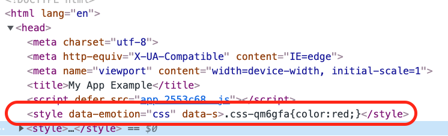

# 03 ¿Que genera esto?

## Resumen

Vamo a echarle un ojo a lo que genera esto de emotion

## Paso a Paso

- Partimos del ejemplo _01-emotion-rough_ y hacemos un _npm install_

```bash
npm install
```

- Arrancamos el proyrcto

```bash
npm start
```

Y si inspeccionamoes el _h1_ y abrimos las dev tools, podemos ver el
estilo en el _head_



Bueno esto está todo estático, que paso si intentamos alimentar algo de manera
dinámica:

_./src/app.tsx_

```diff
import React from "react";
import { css } from "@emotion/css";

- const color = "red";

- const h1Class = css`
-  color: ${color};
- `;

export const App = () => {
+ const [color, setColor] = React.useState("red");

+ const h1Class = css`
+  color: ${color};
+ `;

  return (
+    <>
+     <input value={color} onChange={e => setColor(e.target.value)}>
      <h1 className={h1Class}>Hello React !!</h1>
+    </>
  );
};
```

Si nos fijamos ahí tenemos el _red_ en nuetros estilos (dos veces :-@).

Vamos a cambiar el color a _blue_ si nos fijamos aparece un nuevo estilo,
¿Y si volvemos a _red_? En este caso no, utiliza en elemento que ya tiene.

# ¿Te apuntas a nuestro máster?

Si te ha gustado este ejemplo y tienes ganas de aprender Front End
guiado por un grupo de profesionales ¿Por qué no te apuntas a
nuestro [Máster Front End Online Lemoncode](https://lemoncode.net/master-frontend#inicio-banner)? Tenemos tanto edición de convocatoria
con clases en vivo, como edición continua con mentorización, para
que puedas ir a tu ritmo y aprender mucho.

Si tienes ganas de meterte una zambullida en el mundo _devops_
apuntate nuestro [Bootcamp devops online Lemoncode](https://lemoncode.net/bootcamp-devops#bootcamp-devops/inicio)

Y si lo que necesitas es ponerete al día en Backend, con nuestro Bootcamp
podrás parender stack node + documental y .net + relacional [Bootcamp Backend](https://lemoncode.net/bootcamp-backend#bootcamp-backend/banner)
