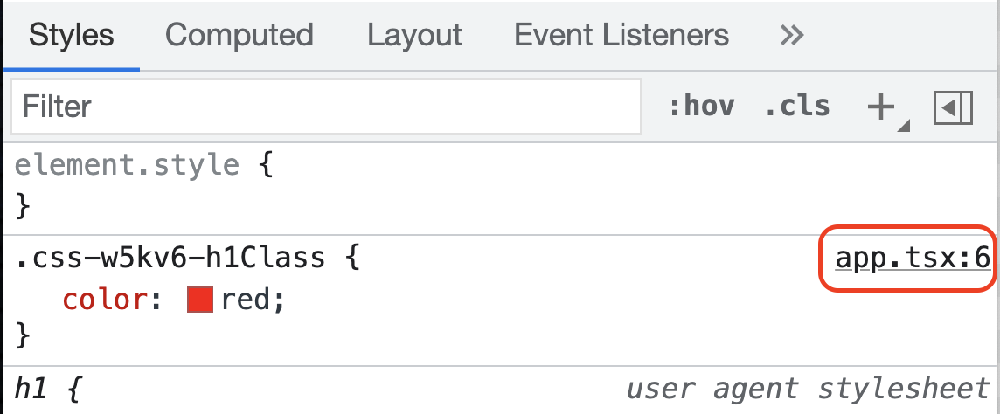

# 10 Depurando

## Resumen

Cuando jugamos con html y css unos de los sitios donde más solemos pasar el rato es con las devtools
del navegador viendo porque algo no funciona.

Ya que estos son estilos que se inyectan dinámicamente ¿Cómo funciona esto?

## Paso a Paso

- En este caso partimos de _01-emotion-rough_

- Hacemos un _npm install_

```bash
npm install
```

- Arrancamos el ejemplo, abrimos las dev tools y _eeeepaaa !!!_ nuestra clase
  tiene un nombre random :-(((((

```bash
npm start
```

- Ok, que no _panda el cúnico_ una cosa que podemos hacer es añadir un objeto _label_
  a nuestro css y poner un nombre para identificar la clase.

_./src/app.tsx_

```diff
const h1Class = css`
  color: ${color};
+ label: h1Class;
`;
```

Si ahora ejecutamos, vemos el sufijo _h1Class_ identificando a la clase,
pero esto huele mal:

- Es un tostón tener que poner un label en cada entrada que creemos.
- El plugin de VSCode nos lo marca en amarillo...

¿Hay una solucíon mejor para esto? Si... emotion babel plugin al rescate.

Vamos a quitar el label que hemos metido:

_./src/app.tsx_

```diff
const h1Class = css`
  color: ${color};
- label: h1Class;
`;
```

Vamos a instalar el plugin _@emotion/babel-plugin_

```bash
npm install @emotion/babel-plugin --save-dev
```

Y vamos a configurarlo:

_.babelrc_

```diff
{
+ "plugins": ["@emotion"],
  "presets": [
    "@babel/preset-env",
    "@babel/preset-typescript",
    "@babel/preset-react"
  ]
}
```

Ahora si ejecutamos vemos que cada css que hemos definido tiene el nombre
de la variable que hemos asociado.

Otro tema interesante que obtenemos con este plugin es que en desarrollo
tenemos _sourcemaps_ es decir, si inspeccionamos un elemento, nos vamos
a una clase de _css in js_ a la derecha arriba tenemos un enlace a la
línea de código js donde se definió el estilo.



# ¿Te apuntas a nuestro máster?

Si te ha gustado este ejemplo y tienes ganas de aprender Front End
guiado por un grupo de profesionales ¿Por qué no te apuntas a
nuestro [Máster Front End Online Lemoncode](https://lemoncode.net/master-frontend#inicio-banner)? Tenemos tanto edición de convocatoria
con clases en vivo, como edición continua con mentorización, para
que puedas ir a tu ritmo y aprender mucho.

Si tienes ganas de meterte una zambullida en el mundo _devops_
apuntate nuestro [Bootcamp devops online Lemoncode](https://lemoncode.net/bootcamp-devops#bootcamp-devops/inicio)

Y si lo que necesitas es ponerete al día en Backend, con nuestro Bootcamp
podrás parender stack node + documental y .net + relacional [Bootcamp Backend](https://lemoncode.net/bootcamp-backend#bootcamp-backend/banner)
