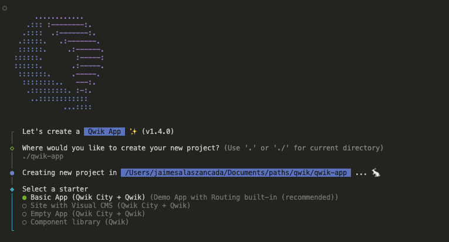
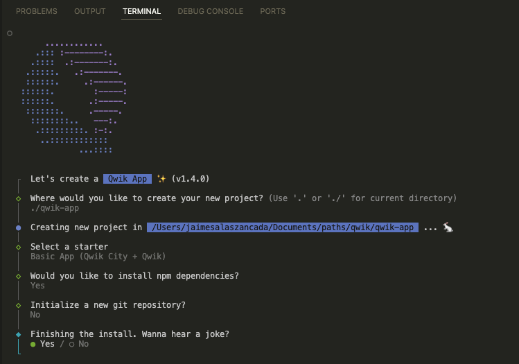
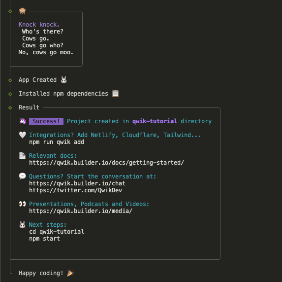
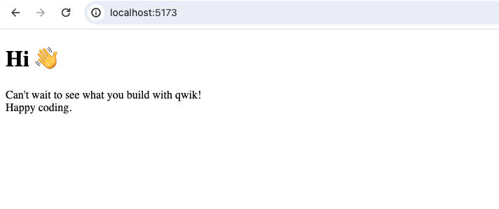

# Getting Started

## Prerequisites

- Node.js v18.17.x >=
- vscode recommended

## Create an app suing the CLI

```bash
npm create qwik@latest
```

Qwik will show to us a menu where we can select the different options to set up our project, select basic `Empty App (Qwik City + Qwik)` and name it `qwik-app` (default name):





After installation we must see something similar to this:



Now we can use `npm run dev` or `npm start` to start up the application locally, the second option will prompt a new browser for us, while the first one will not.

> NOTE: On macOS M2 could be missing dependencies, run `npm install --include=optional sharp`

```bash
npm run dev
```

> Open localhost:5173



