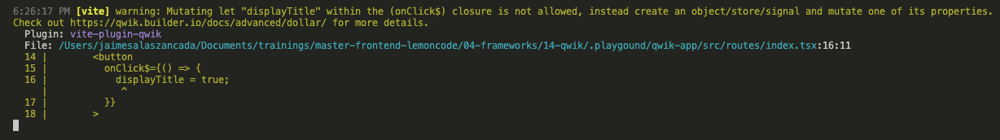
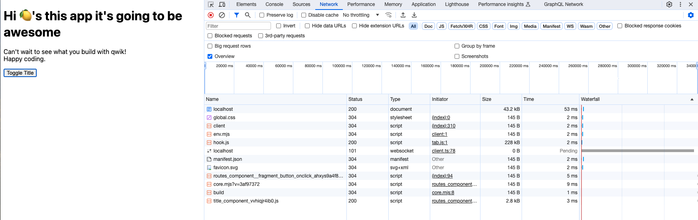
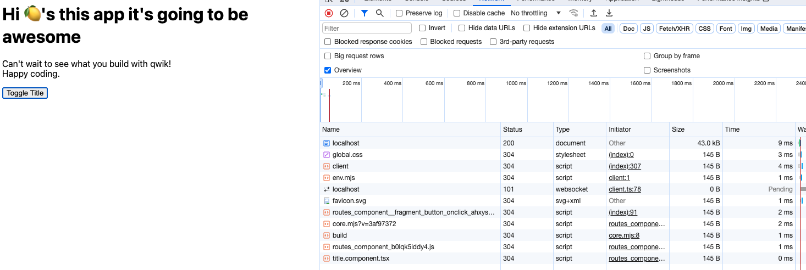

# Components 

## Basic component

Components are declared using [component$()](https://qwik.builder.io/docs/components/overview/#component) and at a minimum need to return a JSX Element.

The trailing `$` allows the `Optimizer` to break the components into an application tree into a separate chunk so that each chunk can be loaded (or not loaded if it is not needed) independently. **Without the `$` the component would be always loaded if the parent component needs to be loaded.**

Update `qwik-app/src/routes/index.tsx`

```diff
import { component$ } from "@builder.io/qwik";
import type { DocumentHead } from "@builder.io/qwik-city";

export default component$(() => {
  return (
    <>
-     <h1>Hi 👋</h1>
+     <Title />
      <p>
        Can't wait to see what you build with qwik!
        <br />
        Happy coding.
      </p>
    </>
  );
});

export const head: DocumentHead = {
- title: "Welcome to Qwik",
+ title: "Welcome to My Awesome App",
  meta: [
    {
      name: "description",
-     content: "Qwik site description",
+     content: "Awesome App",
    },
  ],
};
+
+const Title = component$(() => {
+ return <h1>Hi 🍋's this app it's going to be awesome</h1>;
+});

```

Open developer tools and check what is download. 

Lets update the title component to accept a property that will make render the component conditionally.

Update `qwik-app/src/routes/index.tsx`

```diff
import { component$ } from "@builder.io/qwik";
import type { DocumentHead } from "@builder.io/qwik-city";

export default component$(() => {
  return (
    <>
-     <Title />
+     <Title display={false} />
      <p>
        Can't wait to see what you build with qwik!
        <br />
        Happy coding.
      </p>
    </>
  );
});

# ....

+interface TitleProps {
+ display: boolean;
+}
+
-const Title = component$(() => {
+const Title = component$<TitleProps>(({ display }) => {
- return <h1>Hi 🍋's this app it's going to be awesome</h1>;
+ if (display) {
+   return <h1>Hi 🍋's this app it's going to be awesome</h1>;
+ }
+ return <></>;
});

```

We're feeding a simple property to display the title component. What we want to to do next, it's display the title when ever the prop display changes. In order to do this lets update the component:


Update `qwik-app/src/routes/index.tsx`

```diff
import { component$ } from "@builder.io/qwik";
import type { DocumentHead } from "@builder.io/qwik-city";

export default component$(() => {
+ let displayTitle = false;
  return (
    <>
      <Title display={displayTitle} />
      <p>
        Can't wait to see what you build with qwik!
        <br />
        Happy coding.
      </p>
+     <button
+       onClick$={() => {
+         displayTitle = true;
+       }}
+     >
+       Toggle Title
+     </button>
    </>
  );
});

```

We get the following warning:



In order to get rid off this warning, we're going to use `useSignal`, we will talk later more deeply about signals when we get into `store` demos.

Update `qwik-app/src/routes/index.tsx`

```diff
-import { component$ } from "@builder.io/qwik";
+import { component$, useSignal } from "@builder.io/qwik";
import type { DocumentHead } from "@builder.io/qwik-city";

export default component$(() => {
- let displayTitle = false;
+ const displayTitle = useSignal(false);
  return (
    <>
-     <Title display={displayTitle} />
+     <Title display={displayTitle.value} />
      <p>
        Can't wait to see what you build with qwik!
        <br />
        Happy coding.
      </p>
      <button
        onClick$={() => {
-         displayTitle = true;
+         displayTitle.value = true;
        }}
      >
        Toggle Title
      </button>
    </>
  );
});
```

Open the developer tools on network tab select all and refresh the page, we will get something as follows:


After we click on button Qwik will resume the application notice that two new bundles are downloaded:



As long as the component is not rendered **is not dwonloaded**. Lets refactor the code and change this behaviour.

Create `qwik-app/src/components/title.component.tsx`

```tsx
interface TitleProps {
  display: boolean;
}

export const Title = ({ display }: TitleProps) => {
  return <>{display && <h1>Hi 🍋's this app it's going to be awesome</h1>}</>;
};

```

> Notice that we're using conditional render instead `if/else` structure. 

Update `qwik-app/src/routes/index.tsx`

```diff
+import { Title } from '../components/title.component';

export default component$(() => {
  const displayTitle = useSignal(false);

# .....
- interface TitleProps {
-   display: boolean;
- }
-
- const Title = component$<TitleProps>(({ display }) => {
-   if (display) {
-     return <h1>Hi 🍋's this app it's going to be awesome</h1>;
-   }
-   return <></>;
- });
```

If we have a look into dev tools, we will check that the bundle related with the `Title` component, it's downloaded eagarly, that's the reason because it has not a suffix now:



This is what is called [inline components](https://qwik.builder.io/docs/components/overview/#inline-components)