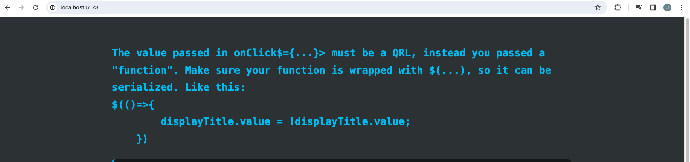
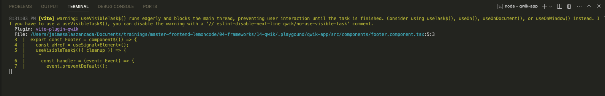

# Events

Qwik can listen on a variety of events by placing an `on<Eventname>$` attribute on an element that subscribes to the corresponding browser event.

We already have used `onClick$`, lets refactor our code, in order to remove the current inline function:

```tsx
<button
  onClick$={() => {
    displayTitle.value = true;
  }}
>
  Toggle Title
</button>
```

Update `qwik-app/src/routes/index.tsx`

```diff
export default component$(() => {
  const displayTitle = useSignal(false);
+ const onClick = () => {
+   displayTitle.value = !displayTitle.value;
+ };
  return (
    <>
      <Title display={displayTitle.value} />
      <p>
        Can't wait to see what you build with qwik!
        <br />
        Happy coding.
      </p>
      <button
-       onClick$={() => {
-         displayTitle.value = true;
-       }}
+       onClick$={onClick}
      >
        Toggle Title
      </button>
    </>
  );
});
```

We get the following error:



This code breaks, because must be serialized to be download when the user clicks on button. We can serialize a function by using `$`:

```diff
-import { component$, useSignal } from "@builder.io/qwik";
+import { component$, useSignal, $ } from "@builder.io/qwik";
import type { DocumentHead } from "@builder.io/qwik-city";
import { Title } from "../components/title.component";

export default component$(() => {
  const displayTitle = useSignal(false);
- const onClick = () => {
+ const onClick = $(() => {
    displayTitle.value = !displayTitle.value;
- };
+ });
```

## Understanding the Runtime

So far this may look like a normal framework behavior, however Qwik does things very differently from other frameworks.

Every time you see a `$` you should be thinking, "lazy-loading happens here".

As you open the browser's developer tools, notice that no JavaScript is loaded until you click the button.

If JavaScript is required to subscribe to browser events, how does Qwik achieve this interaction without loading JavaScript?

Consider the following simplified HTML of the application below.

```html
<html>
  <body>
    <button on:click="chunk-abc.js#App_onClick">Click Me</button>
    <script id="Qwikloader">
      ....
    </script>
  </body>
</html>
```

1. APIs contain the `$` so the Qwik optimizer can transform your code for lazy-loading.
   - The `$` is a signal to the optimizer to extract the code for lazy-loading.
   - The `$` is a signal to you that lazy-loading "magic" happens at this point.
   - TypeScript rules ensure you don't skip any places where the `$` should appear.
2. The optimizer looks for the $ and extracts the function wrapped by $ into a separate [lazy-loadable chunk](https://qwik.builder.io/docs/advanced/optimizer/).
3. As the server renders the page, the JSX is executed and notices that there is a click listener. The click listener is serialized into the `<button>` element as `on:click` attribute. Qwik then knows how to hook this event back up on the client.
4. Qwikloader scripts get inlined into HTML. The Qwikloader script sets up a global listener for all events in the browser. Qwikloader is about 1kb and executes in about 1ms.
5. When a user clicks on the button, the Qwikloader intercepts the event and looks for an element with `on:click` attribute.
6. The `on:click` attribute contains:
   - The URL to download the associated code.
     - To avoid delays between click and execution, Qwik prefetches the code related to the given component
   - A symbol that is exported by the downloaded chunk that contains the function needs to execute.
7. Once the code is downloaded the function is executed.

The above behavior is what gives Qwik applications their instant-on property (resumability) without eagerly downloading and executing code and performing hydration which is expensive.

> **NOTE** To avoid delays between user action and response, Qwik prefetches code in the background.

## Prevent default behavior

For some events browsers have default behavior. For example, when you click a link, the browser will usually navigate to the link's href. There are times when we would like to prevent that. For this reason the `Event` API contains the `preventDefault()` method.

Browser events are synchronous (listener invocation), but because Qwik is fine-grained the loadable Qwik execution model is asynchronous. This means that at the time the event is triggered, the event handler is not yet loaded. By the time the event handler is loaded the event has already been processed by the browser and calling `preventDefault()` will have no effect.

To solve this Qwik provides a declarative API to automatically call `preventDefault()` when the event is triggered. This is achieved by adding the `preventdefault:<event-name>` attribute to the element. This allows Qwikloader to synchronously call `preventDefault()` when the event is triggered.

Create `qwik-app/src/components/footer.component.tsx`

```tsx
import { component$ } from "@builder.io/qwik";

export const Footer = component$(() => {
  return (
    <a
      href="https://github.com/lemoncode"
      onClick$={() => {
        if (window.confirm("Do you really want to leave?")) {
          window.open("https://github.com/lemoncode");
        }
      }}
    >
      Go To Lemonland
    </a>
  );
});
```

Update `qwik-app/src/routes/index.tsx`

```diff
+import { Footer } from '../components/footer.component';

export default component$(() => {
  const displayTitle = useSignal(false);
  const onClick = $(() => {
    displayTitle.value = !displayTitle.value;
  });
  return (
    <>
      <Title display={displayTitle.value} />
      <p>
        Can't wait to see what you build with qwik!
        <br />
        Happy coding.
      </p>
      <button
        onClick$={onClick}
      >
        Toggle Title
      </button>
+     <Footer />
    </>
  );
});
```

We can see the confirmation dialog and immediately navigates to `GiTHub`. e wish to prevent this and call our callback instead. Add `preventdefault:click` to the `<a href>` to achieve this.

Update `qwik-app/src/components/footer.component.tsx`

```diff
<a
+  preventdefault:click
   href="https://github.com/lemoncode"
    onClick$={() => {
        if (window.confirm("Do you really want to leave?")) {
        window.open("https://github.com/lemoncode", "Thanks for Visiting!");
        }
    }}
    >
    Go To Lemonland
</a>
```

## Synchronous Events with `useVisibleTask$()`

Other approach that we can follow (not recommended way) is process the the events synchronously.

Since Qwik processes asynchronously by default, your code must be explicitly configured for synchronous calls.

There are two ways of processing events synchronously:

1. **preferred way**: use `sync$()` to load code synchronously. Fast, resumable but with significant restrictions on event handler size.
2. **eager registration**: use `useVisibleTask$()` to load code synchronously. No restrictions, but requires eager code execution, which goes against resumability.

> Currently `sync$()` is on beta!

Lets refactor the code to make it work with `useVisibleTask$()`

Update `qwik-app/src/components/footer.component.tsx`

```tsx
import { component$, useVisibleTask$, useSignal } from "@builder.io/qwik";

export const Footer = component$(() => {
  const aHref = useSignal<Element>();
  useVisibleTask$(({ cleanup }) => {
    const handler = (event: Event) => {
      event.preventDefault();
      window.open("https://github.com/lemoncode");
    };
    aHref.value!.addEventListener("click", handler);
    cleanup(() => aHref.value!.removeEventListener("click", handler));
  });
  return (
    <div>
      <a ref={aHref} href="/">
        Go To Lemonland
      </a>
    </div>
  );
});

```

Qwik warns us what is going on:



Lets back to previous version just to remove the current warning:

```tsx
import { component$ } from "@builder.io/qwik";

export const Footer = component$(() => {
  return (
    <div>
      <a
        preventdefault:click
        href="https://github.com/lemoncode"
        onClick$={() => {
          if (window.confirm("Do you really want to leave?")) {
            window.open("https://github.com/lemoncode", "Thanks for Visiting!");
          }
        }}
      >
        Go To Lemonland
      </a>
    </div>
  );
});

```