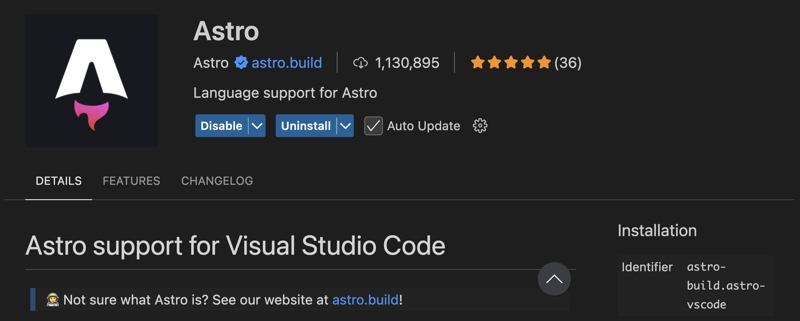

# Creación y estructura de un proyecto Astro

## Prerrequisitos

Nos arrancamos a desarrollar con Astro, para ello utilizaremos nuestro querido Visual Studio Code y mi recomendación es que te instales el plugin de Astro para VSCode.



## Crear un nuevo proyecto Astro

Para crear un nuevo proyecto Astro, podemos seguir las instrucciones de su web oficial y usar el siguiente comando en tu terminal:

```bash
npm create astro@latest
```

Te pedirá elegir:

- Carpeta de destino, en mi caso ya estoy en una carpeta vacía, y elijo ".", si no ponle un nombre de carpeta.

- Eligimos una plantilla: en nuestro caso "Minimal / empty" para tener así un punto de partida simple.

- Le decimos que queremos instalar las dependencias de nuestro proyecto, así nos ahorramos hacer un `npm install` :).

- Ahora toca elegir si queremos que nos cree un repo de Git local, en nuestro caso decimos que si.

Ejecutamos el proyecto:

```bash
npm run dev
```

Si todo va bien debería de mostrarse una instancia del navegador en la dirección `localhost:4321` y una página que dice "Astro"

## Analizando la estructura del proyecto

Analicemos la estructura del proyecto:

```
blank-project/
  ├── public/             # Recursos estáticos (copiados directamente en la carpeta final dist)
  ├── src/
  │   └── pages/          # Páginas de la aplicación (rutas)
  │       └── index.astro # Página principal
  ├── astro.config.mjs    # Configuración de Astro
  ├── package.json
  ├── tsconfig.json
   └── README.md
```

## Compilar el proyecto

Vamos a hacer un build del proyecto:

```bash
npm run build
```

Obtendremos los archivos finales en la carpeta `dist`, con un HTML por cada página (ojo que esto no es una SPA :)).

## Prettier

Antes de continuar, vamos a dejar Prettier bien configurado, esta herramienta permite formatear el código de manera automática.

Asegúrate que ya tienes el plugin de Prettier instalado

**TODO Pantallazo Prettier**

Y vamos a instalarlo, como dependencia de nuestro proyecto, primero prettier:

```bash
npm install --save-dev prettier
```

Y después el plugin de prettier que formatea ficheros de _astro_

```bash
npm install prettier-plugin-astro --save-dev
```

Y Creamos un archivo `.prettierrc` en la raíz del proyecto, para indicarle a prettier que tiene que usar para los fichero con extensión `.astro` contenido:

```json
{
  "plugins": ["prettier-plugin-astro"],
  "overrides": [
    {
      "files": "*.astro",
      "options": {
        "parser": "astro"
      }
    }
  ]
}
```

**Un tema Importante:** Debes abrir la carpeta del proyecto Astro en una nueva ventana de VSCode para que el complemento de Prettier funcione correctamente.

Ahora podemos abrir un fichero .astro, desmontarlo un poco y verás que al grabar se aplica el auto formato.
