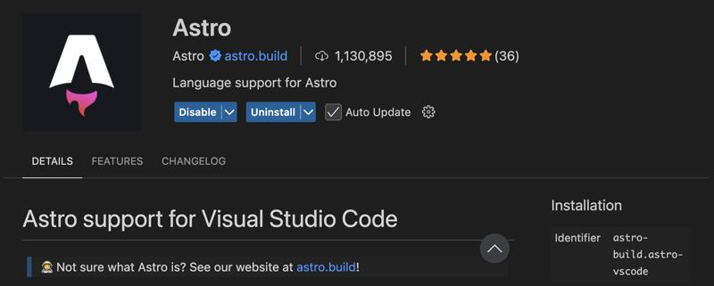

# Creating an Astro project

> Node.js 24.15 LTS + pnpm required. See [SETUP-PNPM.md](../../SETUP-PNPM.md).

## 1. Prerequisites

- Install the **Astro** plugin for VS Code.



## 2. Create a new project

```bash
pnpm create astro@latest
```

- Folder: `.`
- Template: **Minimal / empty**
- Install dependencies: **yes**
- Init Git repo: **yes**

If pnpm shows an `approve-builds` prompt for `sharp`, type `y`. Or run later:

```bash
pnpm approve-builds
```

## 3. Run the dev server

```bash
pnpm dev
```

Open `http://localhost:4321`.

## 4. Project structure

```
blank-project/
  ├── public/             # Static assets (copied to dist/)
  ├── src/
  │   └── pages/          # Routes
  │       └── index.astro
  ├── astro.config.mjs
  ├── package.json
  ├── tsconfig.json
  └── README.md
```

## 5. Build

```bash
pnpm build
```

Output lands in `dist/` (one HTML per page).

## 6. Set up Prettier

Install the **Prettier** plugin for VS Code, then:

```bash
pnpm add -D prettier prettier-plugin-astro
```

`./.prettierrc`

```json
{
  "plugins": ["prettier-plugin-astro"],
  "overrides": [
    {
      "files": "*.astro",
      "options": {
        "parser": "astro"
      }
    }
  ]
}
```

Open the project folder in a fresh VS Code window so the plugin picks it up.

## 7. Anatomy of a `.astro` file

```astro
---
// 1. FRONTMATTER (fences) — runs on the server / at build time
---

<!-- 2. HTML TEMPLATE -->
<h1>Astro</h1>

<style>
  /* 3. STYLES — scoped by default */
  h1 { color: red; }
</style>
```

| Section     | Delimiter           | Runs where      | Used for                            |
| ----------- | ------------------- | --------------- | ----------------------------------- |
| Frontmatter | Between `---`       | Server / build  | Imports, fetch, logic, variables    |
| Template    | Below second `---`  | Generates HTML  | Markup, `{}` expressions, components |
| Styles      | `<style>` block     | Processed at build | Scoped CSS                       |

---

## What's new in Astro 6

- **Node.js 22.12+ required**: Astro 6 drops older Node versions to leverage native JS APIs.
- **Vite 7 integrated**: faster dev server and hot-reload.
- **Native Fonts API**: no more manual `<link>` to Google Fonts — Astro downloads and serves fonts from your domain.

---

## Resources

- [Astro official docs](https://docs.astro.build/en/)
- [Astro install guide](https://docs.astro.build/en/install-and-setup/)
- [Astro VS Code plugin](https://marketplace.visualstudio.com/items?itemName=astro-build.astro-vscode)
- [Islands architecture](https://docs.astro.build/en/concepts/islands/)
