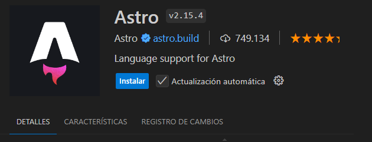

# Preparando el entorno

Lo primero, instalamos el plugin de Astro en Visual Studio Code.

Esto nos va a ser de ayuda, tenemos syntax highlighting, intellisense...

Por cierto, si buscamos Astro en Google no nos sale de primeras, mejor buscar `Astro Framework` o `Astro JS`.

https://astro.build/
