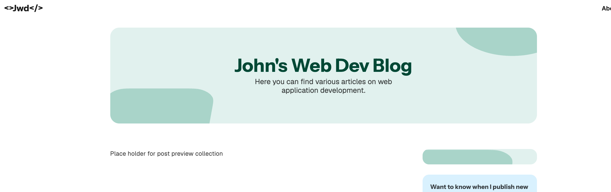

# Real Project — Starter

> Node.js 24.15 LTS + pnpm required. See [SETUP-PNPM.md](../../SETUP-PNPM.md).

A personal dev blog with a posts list, a post detail page, and an "About" page with work experience.

## 1. The starting point



## 2. Install and run

```bash
pnpm install
```

```bash
pnpm dev
```

Open http://localhost:4321/.

## 3. Build-script approval (pnpm 10+)

Already preconfigured in `pnpm-workspace.yaml`:

```yaml
allowBuilds:
  esbuild: true
  sharp: true
```

If you see `[ERR_PNPM_IGNORED_BUILDS]` elsewhere:

```bash
pnpm approve-builds --all
```

## 4. Project structure

- **Assets** — images, fonts, static resources.
- **Styles** — global styles + Tailwind config.
- **Components** — reusable building blocks.
- **Layouts** — page wrappers (with named slots in this project).
- **Pages** — actual routes, composed from layouts + components.
- **Pods** — encapsulated feature islands (own components, services, models).

Tailwind is already wired in `astro.config.mjs`. If TypeScript complains about the plugins array:

```diff
export default defineConfig({
  vite: {
-    plugins: [tailwindcss()],
+    plugins: /** @type {any} */ ([tailwindcss()]),
  },
});
```

`tsconfig.json` defines a `#/` path alias for clean imports.

---

## What's new in Astro 6

- **Node.js 22.12+ required** (24.15 LTS recommended).
- **Vite 7 integrated**: faster dev server and hot-reload.

---

## Resources

- [Astro: Project structure](https://docs.astro.build/en/basics/project-structure/)
- [Astro + Tailwind CSS](https://docs.astro.build/en/guides/styling/#tailwind)
- [Pods pattern (Lemoncode)](https://lemoncode.net/lemoncode-blog/2018/3/16/folder-pattern-in-react)
- [pnpm: blocked install scripts](https://pnpm.io/settings#onlybuiltdependencies)
