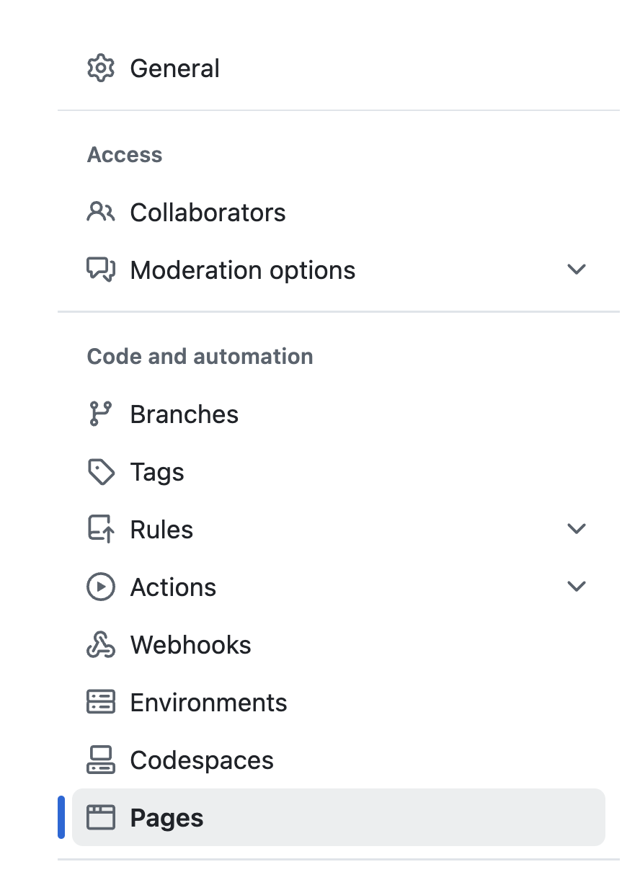
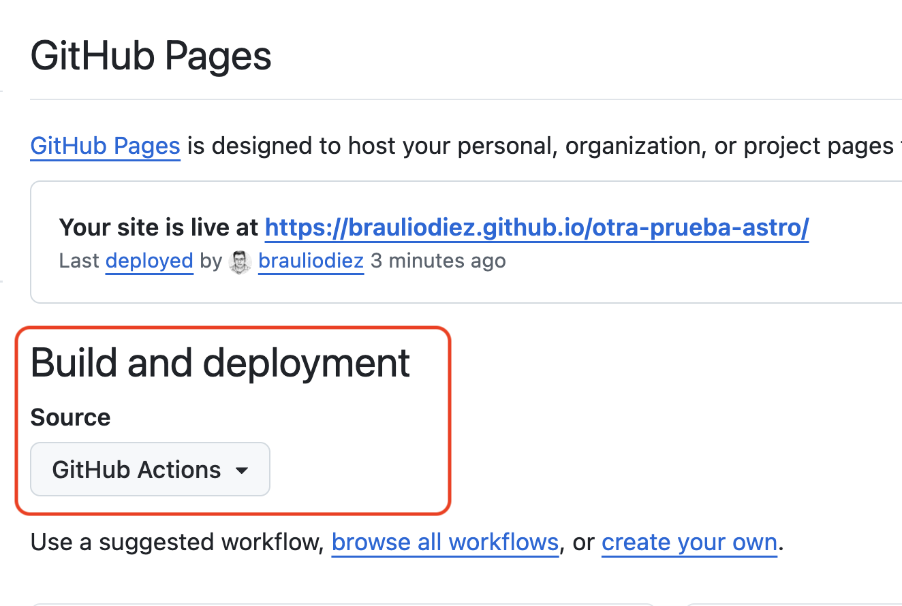

# Desplegando

Vamos a ver lo fácil que es desplegar esto, a fin de cuentas estamos hablando de un proyecto estático.

Puedes desplegar en la nube, Azure, Netifly, Amazon... esto lo veremos en detalle en el módulo de cloud.

Por tirar de algo a lo que todos tenemos acceso, vamos a hacerlo en Github IO.

Vamos a hacer que de manera automática, cuando se haga un push a la rama `main`, se despliegue en Github IO.

Usaremos Github Actions para ello (Esto no es específico de Astro, y lo veremos en detalle en el módulo de _Cloud_)

Para ello creamos un archivo `.github/workflows/deploy.yml`:

> A tener en cuenta, hay unas acciones específicas para Astro y desplegar en Github Pages, pero no las vamos a usar, vamos a hacerlo a mano.

_.github/workflows/deploy.yml_

```yml
name: Deploy to GitHub Pages

on:
  push:
    branches:
      - main

permissions:
  contents: read
  pages: write
  id-token: write

jobs:
  build:
    runs-on: ubuntu-latest
    steps:
      - name: Check out the code
        uses: actions/checkout@v3

      - name: Set up Node.js
        uses: actions/setup-node@v3
        with:
          node-version: 20

      - name: Install dependencies
        run: npm install

      - name: Build the project
        run: npm run build

      - name: Upload to GitHub Pages
        uses: actions/upload-pages-artifact@v1
        with:
          path: ./dist

  deploy:
    needs: build
    runs-on: ubuntu-latest
    permissions:
      pages: write
      id-token: write
    steps:
      - name: Deploy to GitHub Pages
        uses: actions/deploy-pages@v1
```

¿Qué pasos seguimos aquí? Le estoy indicando:

- Que cuando se haga un push a main, se dispare esta acción.

- Definimos los permisos que necesita esta acción (por ejemplo, que tenga permisos de escritura en Github Pages).

- Le decimos que vamos a tener dos jobs:

  - Uno para construir el proyecto.
  - Otro para desplegarlo.

- En el primer job:

  - Decimos que tire de una máquina `Ubuntu`.
  - Le indicamos que se baje el código.
  - Que instale Node.
  - Que instale las dependencias.
  - Que haga un build del proyecto.
  - Que suba el contenido de la carpeta `dist` a un artefacto para dejarlo listo que lo consuma el siguiente job.

- En el segundo job:
  - Le decimos que necesita el primer job (que lo ejecute).
  - Con el resultado del primer job, que suba el contenido a Github Pages.

Vamos a hacer un commit y un push y ver que pasa...

En este caso el deploy nos falla, porque no hemos configurado Github Pages en el repo.

```
Error: Error: Failed to create deployment (status: 404) with build version c66b3eb208d20489468f73217b174641f7b469a3. Ensure GitHub Pages has been enabled: https://github.com/brauliodiez/otra-prueba-astro/settings/pages
```

Nos vamos a los settings y lo configuramos (sección pages >> elegir rama main).



Tenemos que elegir que tire de `Github Actions`



Si no se ha relanzado, podemos probar a lanzarlo manualmente desde el tab de _actions_

Tu página será:

http://\<aliasgithub>.github.io/\<nombre-repo>

https://brauliodiez.github.io/otra-prueba-astro/

Ahora cada vez que hagamos un commit / push a main se lanzará el deploy automático.
