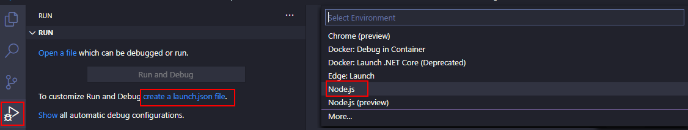

# 03 Depurando nuestras pruebas

La mayoría del tiempo que pasamos los programadores delante de nuestro código es arreglando errors, y
para ello solemos ponernos a depurar (a hacer `debugging`) del código, si lo que estamos programando
en Front End normalmente usamos las herramientas de `debugging` que trae nuestro navegador favorito,
pero esto no nos vale con `Jest` ya que no se ejecuta en el navegador.

¿Qué podemos hacer? Hacer uso de Visual Studio Code, esté editor nos da varias opciones para que podamos
depurar y poner breakpoints.

Tomaremos como punto de partida `02-calculator`.

Resumen de los pasos que vamos a realizar:

- Opción A: utilizar el `JavaScript Debug Terminal`.
  -Opción B: crear una configuración de depuración.

# Manos a la obra

- Ya hemos copiado el ejemplo anterior, vamos a ejecutar desde la línea de
  comandos `npm install` para instalar los paquetes de npm que ya teníamos
  en nuestro _package.json_ en el proyecto anterior:

```bash
npm install
```

## Depurando Jest

`Jest` corre sobre nodejs, así que podemos utilizar `VS Code` para depurar los specs:

### Using JavaScript Debug Terminal

Ya que `jest` es un proceso de `nodejs` podemos usar el `JavaScript Debug Terminal` que viene integrado
en VS Code para depurar.

> [Más info acerca de esto en este enlace](https://www.lemoncode.tv/curso/vs-code-js-debugging/leccion/javascript-debug-terminal)

Y podemos añadir breakpoints en el código (tanto en los `specs` como en el código de aplicación), y desde ese terminal de depuración,
nos vale tanto ejecutar una sólo ejecución:

```bash
npm test

```

O dejarlo en modo `watch` y que vaya parando en los breakpoints en cada ejecución (esto es muy útil cuando estamos desarrollando, si
vemos que algo falla, directamente ponemos un breakpoint y no tenemos que esperar a que se haga el setup se ejecución única)

```bash
npm run test:watch

```

También si queremos podemos decirle ejecute las specs de un fichero en concreto o varios:

Vamos a crear un fichero de prueba que llamaremos _second.spec.ts_ y veremos que sólo indicándole el nombre del fichero se ejecutarán esas pruebas
sólo.

#### ./src/second.spec.ts

```typescript
describe('second specs', () => {
  it('should return true', () => {
    expect(true).toBeTruthy();
  });
});
```

```bash
npm run test:watch second
npm run test:watch second.spec
npm run test:watch spec

```

> También podemos usar la opción `p` en el menú de jest para indicarle un patrón.

### Using launch.json

> Opcional (sólo como referencia)

En versiones antiguas de VSCode configurar la depuración tenía más trabajo, esto lo dejamos aquí sólo para referencia,
por si en tu proyecto tienes algún setup especial en el que necesites trabajar de esta manera.

- Podemos añadir un fchero de configuración `launch.json` en VS Code:



> IMPORTANTE: `.vscode/launch.json` lo tenemos crear en el raíz de nuestro proyecto.

- Este es un ejemplo de configuración de launch.json para single run:

### ./.vscode/launch.json

```json
{
  "version": "0.2.0",
  "configurations": [
    {
      "type": "node",
      "request": "launch",
      "name": "Jest single run",
      "program": "${workspaceRoot}/node_modules/jest/bin/jest.js",
      "args": ["-c", "./config/test/jest.js", "--verbose", "-i", "--no-cache"],
      "console": "integratedTerminal",
      "internalConsoleOptions": "neverOpen"
    }
  ]
}
```

- Ahora podríamos depurar.


- Y también podemos generar una configuración más para ir en modo `watch` es muy parecido a la configuración anterior sólo que añadimos el falg `--watchAll`:

### ./.vscode/launch.json

```diff
{
  "version": "0.2.0",
  "configurations": [
    {
      ...
-   }
+   },
+   {
+     "type": "node",
+     "request": "launch",
+     "name": "Jest watch run",
+     "program": "${workspaceRoot}/node_modules/jest/bin/jest.js",
+     "args": [
+       "-c",
+       "./config/test/jest.js",
+       "--verbose",
+       "-i",
+       "--no-cache",
+       "--watchAll"
+     ],
+     "console": "integratedTerminal",
+     "internalConsoleOptions": "neverOpen"
+   }
  ]
}

```

- Otro ejemplo, sólo lanzar las prueba para el fichero que esté activo en el editor:

### ./.vscode/launch.json

```diff
{
  "version": "0.2.0",
  "configurations": [
    {
      ...
-   }
+   },
+   {
+     "type": "node",
+     "request": "launch",
+     "name": "Jest selected file",
+     "program": "${workspaceRoot}/node_modules/jest/bin/jest.js",
+     "args": [
+       "${fileBasenameNoExtension}",
+       "-c",
+       "./config/test/jest.js",
+       "--verbose",
+       "-i",
+       "--no-cache",
+       "--watchAll"
+     ],
+     "console": "integratedTerminal",
+     "internalConsoleOptions": "neverOpen"
+   }
  ]
}

```

- Más info sobre esto en este [post](https://www.basefactor.com/using-visual-studio-code-to-debug-jest-based-unit-tests)

# ¿Te apuntas a nuestro máster?

Si te ha gustado este ejemplo y tienes ganas de aprender Front End
guiado por un grupo de profesionales ¿Por qué no te apuntas a
nuestro [Máster Front End Online Lemoncode](https://lemoncode.net/master-frontend#inicio-banner)? Tenemos tanto edición de convocatoria
con clases en vivo, como edición continua con mentorización, para
que puedas ir a tu ritmo y aprender mucho.

También puedes apuntarte a nuestro Bootcamp de Back End [Bootcamp Backend](https://lemoncode.net/bootcamp-backend#inicio-banner)

Y si tienes ganas de meterte una zambullida en el mundo _devops_
apúntate nuestro [Bootcamp devops online Lemoncode](https://lemoncode.net/bootcamp-devops#bootcamp-devops/inicio)
