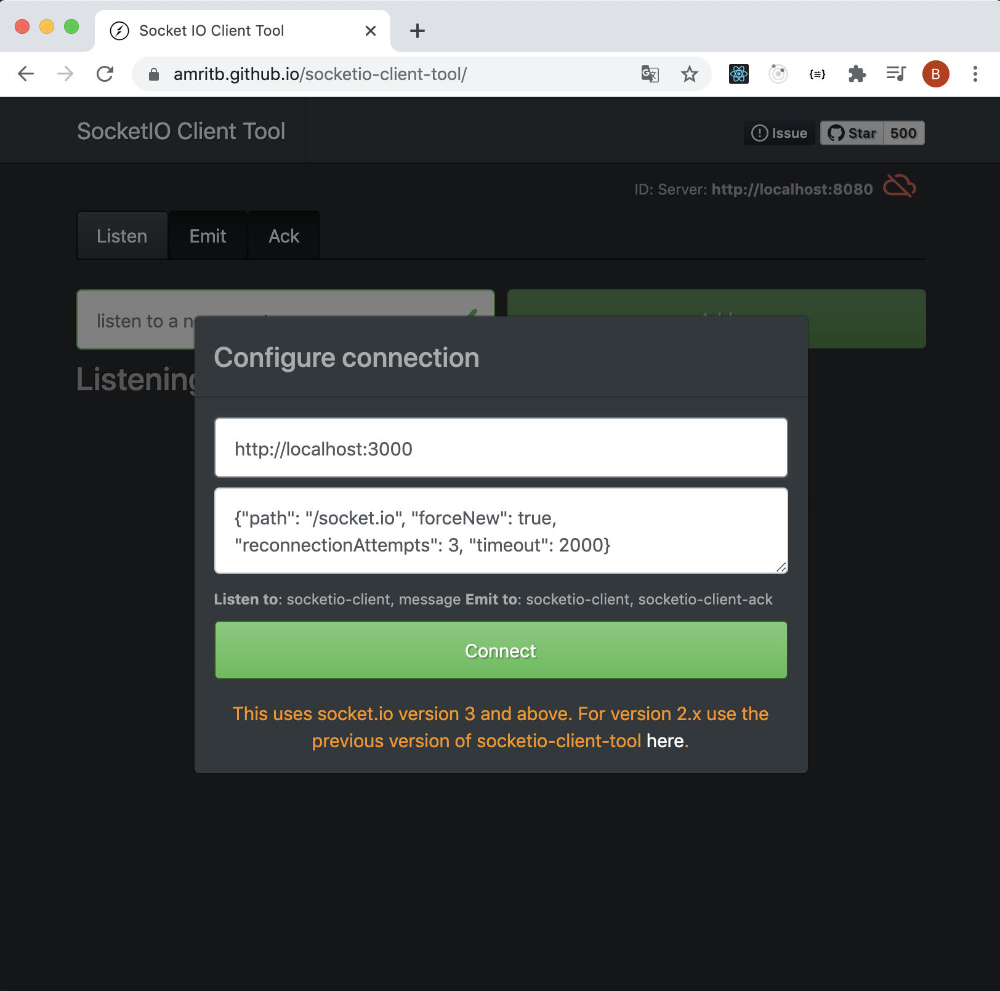
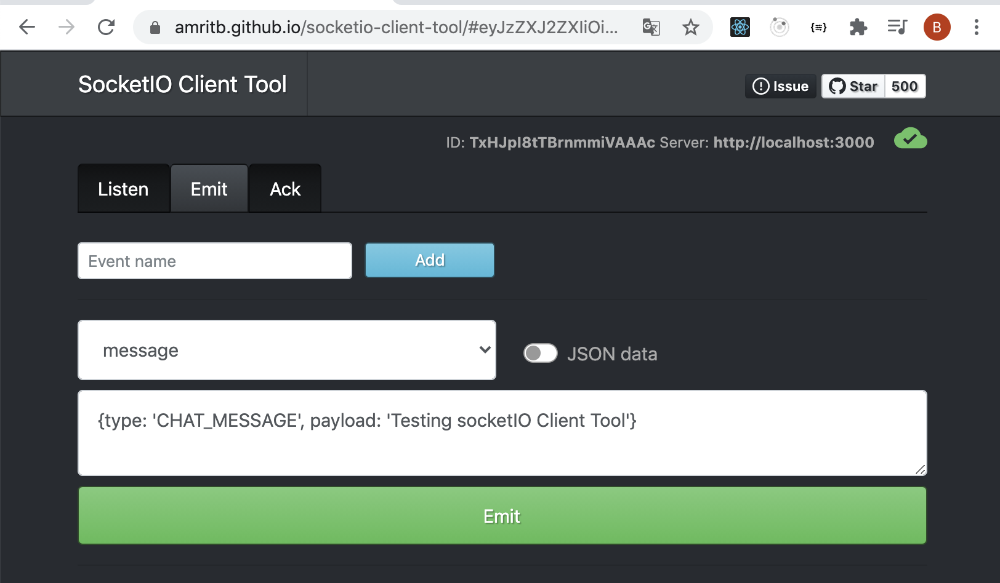

# Hello Socket IO

Vamos a montar un ejemplo mínimo con sockets

# Pasos

- Copiamos el ejemplo anterior de boiler plate.

- Entramos en el back, instalamos paquetes

```bash
npm install
```

- Hacemos lo mismo en el front

```bash
npm install
```

## Back

- Arrancamos por el back, vamos a instalar la librería de _socket.io_ y
  sus typings.

```bash
npm install socket.io --save
```

- Vamos a por el fichero principal y levantar nuestro websocket.

_./back/src/app.ts_

```diff
import { createApp } from './express.server';
import { envConstants } from './env.constants';
import { api } from './api';
import express from 'express';
import path from 'path';
+ import * as http from 'http';
+ import { Server, Socket } from 'socket.io';
+ import cors from 'cors';


const app = createApp();

+ //options for cors midddleware
+ const options: cors.CorsOptions = {
+  allowedHeaders: [
+    'Origin',
+    'X-Requested-With',
+    'Content-Type',
+    'Accept',
+    'X-Access-Token',
+  ],
+  credentials: true,
+  methods: 'GET,HEAD,OPTIONS,PUT,PATCH,POST,DELETE',
+  // IMPORTANT LIMIT HERE YOUR CLIENT APPS DOMAINS
+  origin: '*',
+  preflightContinue: false,
+ };

+ app.use(cors(options));

+ // set up socket.io and bind it to our
+ // http server.
+ // https://socket.io/docs/v3/handling-cors/
+ const socketapp = new http.Server(app);
+ const io = new Server(socketapp, {
+  cors: {
+    origin: '*',
+    methods: ['GET', 'POST'],
+  },
+ });

app.use('/', express.static(path.join(__dirname, 'static')));

app.use('/api', api);

app.listen(envConstants.PORT, () => {
  console.log(`Server ready at http://localhost:${envConstants.PORT}/api`);
});
```

Vamos ahora quedarnos escuchando en el puerto 3000 (esto podría ir a variables
de entorno), añadir al final de app.ts

_./back/src/app.ts_

```typescript
const server = socketapp.listen(envConstants.WS_PORT, function () {
  console.log(`listening on *:${envConstants.WS_PORT}`);
});
```

Y vamos a quedarnos atentos a que un usuario se conecte, en cuanto se
conecte le indicamos que la conexión ha tenido éxito (añadir al final de _app.ts_):

_./back/src/app.ts_

```typescript
// whenever a user connects on port 3000 via
// a websocket, log that a user has connected
io.on("connection", function (socket: Socket) {
  console.log("** connection recieved");
  socket.emit("message", { type: "CONNECTION_SUCCEEDED" });
});
```

> Fijate que con `socket.emit` se lo envío sólo al usuario que se conectó

- Ahora vamos a implementar nuestra aplicación de chat básica, nos quedamos esperando a que un usuario envíe un mensaje de chat, cuando recibamos dicho mensaje lo reenviamos a todos los usuarios

```diff
// whenever a user connects on port 3000 via
// a websocket, log that a user has connected
io.on("connection", function (socket: Socket) {
  console.log("\*\* connection recieved");
  socket.emit("message", { type: "CONNECTION_SUCCEEDED" });
+ socket.on('message', function (body: any) {
+   console.log(body);
+   socket.broadcast.emit('message', body);
+ });
});
```

> Aquí podríamos enviar el mensaje a todo el mundo menos al que envío el mensaje,
> ¿ Cómo podrámos hacer para enviarselo a todo el mundo? ¿Lo pruebas?

Vamos a probar con esta tool (importante contact, y pestaña emit y message, despues payload y como json)

```
https://amritb.github.io/socketio-client-tool/
```

Y el proyecto:

```
https://github.com/amritb/socketio-client-tool/tree/master/react-client-tool
```

Conectamos en dos pestañas del navegador



Podemos ver como nos hemos conectado y recibido el mensaje _CONNECTION_SUCCEEDED_

Podemos enviar un mensaje (tab emit):

- tecleamos _message_ y le damos al botón de _add_ (IMPORTANTE
darle al botón de add para que envie MESSAGE y no socket io client).
- Miramos que este deshabilitado _json data_
- Añadimos el siguiente body del mensaje

```
{type: 'CHAT_MESSAGE', payload: 'Hola desde socket client tool'}
```



## Front

Vamos a por el Front.

Instalamos socket.io la versión para cliente

```bash
npm install socket.io-client --save
```

- Vamos a hacernos una función de ayuda para crear la conexión.

_./front/src/api.ts_

```typescript
import { io, SocketOptions, Socket, ManagerOptions } from "socket.io-client";

// TODO: Add env variable
const baseSocketUrl = "http://localhost:3000";

export const createSocket = (): Socket => {
  const options: Partial<ManagerOptions & SocketOptions> = {
    timeout: 60000,
  };

  return io(baseSocketUrl, options);
};
```

- Vamos ahora a por app.tsx, vamos a crear

```diff
import React from "react";
+ import { Socket } from "socket.io-client";
+ import { createSocket } from "./api";
+ import { wsBodyTypes } from "./consts";

export const App = () => {
+  const [message, setMessage] = React.useState("");
+  const [chatlog, setChatlog] = React.useState("");
+  const [isConnected, setIsConnected] = React.useState(false);
+  const [socket, setSocket] = React.useState<Socket>(null);

  return <h1>Hello</h1>;
};
```

- Siguiente paso vamos a gestionar la conexión

```diff
import React from "react";
import { Socket } from "socket.io";
import { createSocket } from "./api";
import { wsBodyTypes } from "./consts";

export const App = () => {
  const [message, setMessage] = React.useState("");
  const [chatlog, setChatlog] = React.useState("");
  const [isConnected, setIsConnected] = React.useState(false);
  const [socket, setSocket] = React.useState<globalThis.SocketIOClient.Socket>(null);

+  const establishConnection = () => {
+    const socketConnection = createSocket();
+    setSocket(socketConnection);
+    socketConnection.on("message", (body) => {
+      if (body && body.type) {
+        switch (body.type) {
+          case wsBodyTypes.connectionSucceded:
+            setIsConnected(true);
+            console.log("Connection succeded");
+            break;
+          case wsBodyTypes.chatMessage:
+              setChatlog((chatlog) => `${chatlog}\n${body.payload.content}`);
+            break;
+        }
+      }
+    });
+  };


  return <h1>Hello</h1>;
};
```

Vamos a añadir un manejador para cuando se pulse el boton de conectar:

```diff
+  const handleConnect = () => {
+    if (!isConnected) {
+      establishConnection();
+    }
+  };

  return <h1>Hello</h1>;
```

Y vamos a dar un punto de entrada para enviar mensajes:

```diff
+  const sendMessage = (content: string) => {
+    setChatlog(`${chatlog}\n${content}`);
+    socket.emit("message", {
+      type: wsBodyTypes.chatMessage,
+      payload: { content },
+    });
+
+    setMessage("");
+  };

  return <h1>Hello</h1>;
```

- Hora de tocar el HTML, vamos a añadir un botón para conectar, una caja de texto para añadir un mensaje y otro para mostrar el log del chat

```diff
- return <h1>Hello</h1>;
+ return (
+      <>
+          <button onClick={handleConnect} disabled={isConnected}>Join</button>
+      {isConnected && (
+        <div style={{ marginTop: "40px" }}>
+          <label>Message:</label>
+          <input
+            style={{ width: "80%" }}
+            value={message}
+            onChange={(e) => setMessage(e.target.value)}
+          />
+          <button onClick={(e) => sendMessage(message)}>Send</button>
+          <div style={{ display: "flex", flexDirection: "column" }}>
+            <label>ChatLog</label>
+            <textarea
+              style={{ height: "400px" }}
+              value={chatlog}
+              onChange={(e) => setChatlog(e.target.value)}
+              readOnly
+            ></textarea>
+          </div>
+        </div>
+      )}
+      </>
+ )
```

- Vamos a probar

```bash
npm start
```
