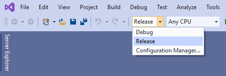
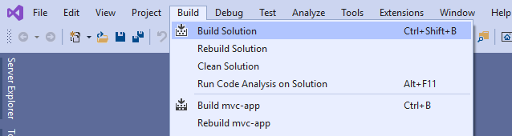
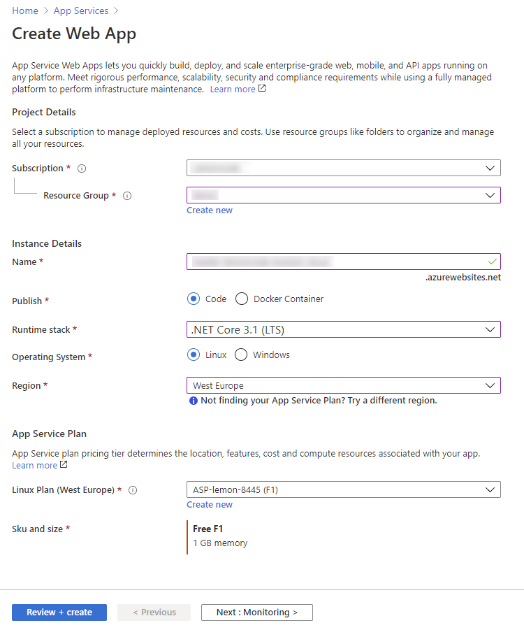
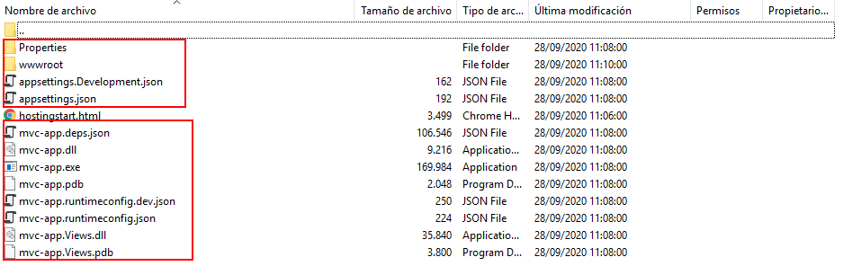

# 02 Azure FTP

In this example we are going to create a production server and upload it to Azure.

We will start from `01-production-bundle`.

# Steps to build it

- Open `./app/app.sln` with Visual Studio 2019

- Select `Release`:

- Build solution:

- Now, we can configure a web server in `Azure` to upload files via FTP.

- Navigate to deploy center.

- And click on FTP:

- We can use whatever ftp client to connect to our server and copy all files from 

- `./app/mvc-app/bin/Release/netcoreapp3.1`: the mvc backend code.
- `./app/mvc-app/wwwroot`: the static files from client side. 

> NOTE: Here we are using [Filezilla](https://filezilla-project.org/)

# About Basefactor + Lemoncode

We are an innovating team of Javascript experts, passionate about turning your ideas into robust products.

[Basefactor, consultancy by Lemoncode](http://www.basefactor.com) provides consultancy and coaching services.

[Lemoncode](http://lemoncode.net/services/en/#en-home) provides training services.

For the LATAM/Spanish audience we are running an Online Front End Master degree, more info: http://lemoncode.net/master-frontend
