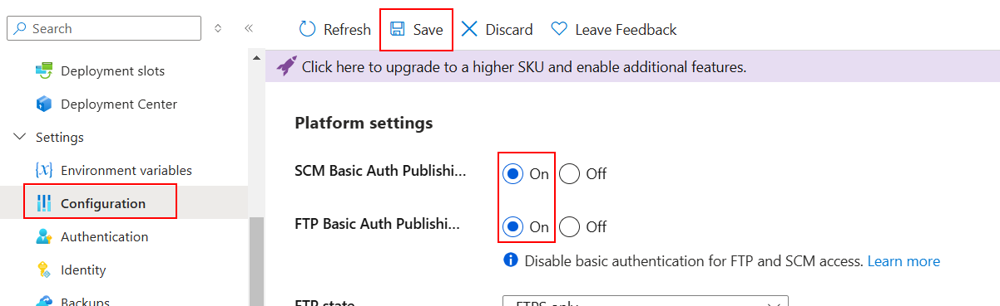
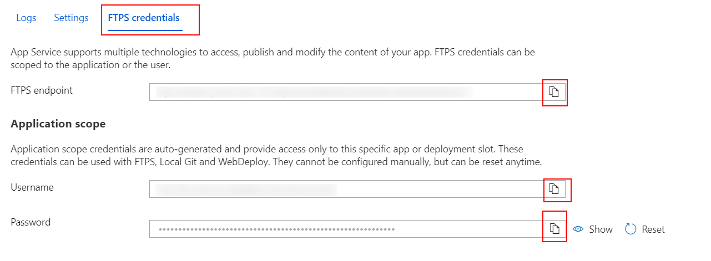
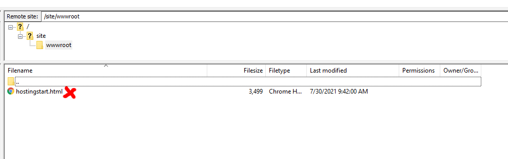
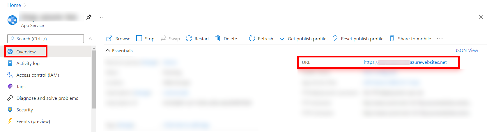

# 02 Azure FTP

In this example we are going to create a production server and upload it to Azure.

We will start from `01-production-bundle`.

# Steps to build it

We have a `dist` folder with app files, but to public this files in a production server, we need some kind of `server` to serve this static files. In this case, we are going to use a `nodejs` server.

Create new `server` folder and:

```bash
cd ./server
```

Create package.json and install `express`:

```bash
npm init -y
npm install express --save
```

Create a simple server using [express](https://github.com/expressjs/express):

_./server/index.js_

```javascript
const express = require('express');
const path = require('path');

const app = express();
const staticFilesPath = path.resolve(__dirname, './public');
app.use('/', express.static(staticFilesPath));

app.get('*', (req, res) => {
  res.sendFile(path.resolve(staticFilesPath, 'index.html'));
});

const PORT = process.env.PORT || 8081;
app.listen(PORT, () => {
  console.log(`App running on http://localhost:${PORT}`);
});

```

We can run it on local:

_./server/package.json_

```diff
...
  "scripts": {
-   "test": "echo \"Error: no test specified\" && exit 1"
+   "start": "node index.js"
  },
```

Before running, we need to copy `./dist` folder content to `./server/public`.

```
|server/
|-- node_modules/
|-- public/
|----- assets/
|----- index.html
|-- index.js
|-- package-lock.json
|-- package.json
```

Run it:

```bash
npm start
```

Now, we can configure a web server in `Azure` to upload files via FTP.


Go to resource.


Enable FTP:



Navigate to `Deployment Center`:


And click on FTP:



We can use whatever ftp client to connect to our server and copy all files from. In this case we will user [Filezilla portable version](https://filezilla-project.org/)

Copy `Host`, `Username` and `Password` values


Remove `hostingstart.html`:



Copy inner `./server` folders and files.


> Important: including `node_modules`.

Open server URL:



# About Basefactor + Lemoncode

We are an innovating team of Javascript experts, passionate about turning your ideas into robust products.

[Basefactor, consultancy by Lemoncode](http://www.basefactor.com) provides consultancy and coaching services.

[Lemoncode](http://lemoncode.net/services/en/#en-home) provides training services.

For the LATAM/Spanish audience we are running an Online Front End Master degree, more info: http://lemoncode.net/master-frontend
